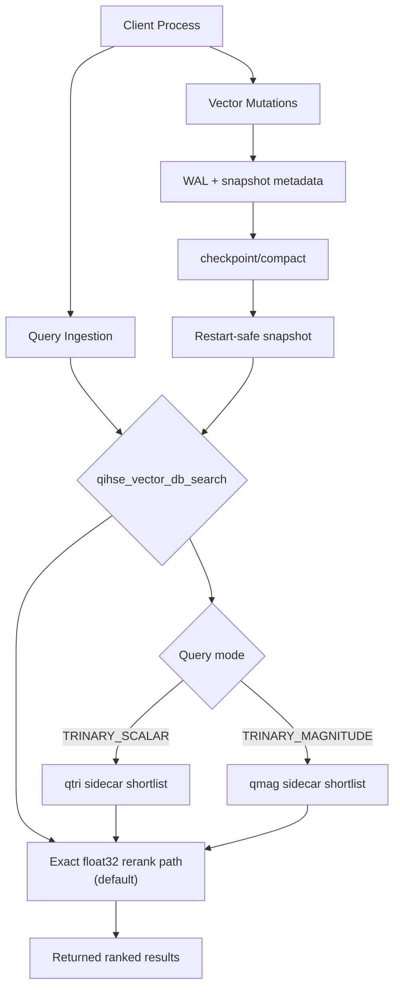
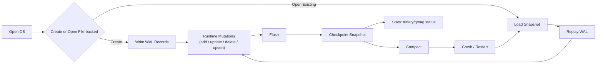

# QIHSE — Quantum Inspire Hilbert Space Expansion Search
## (QIHSE): Vector Search with Exactness Contracts and Performance Escape Hatches

[](LICENSE)

QIHSE (Quantum Inspire Hilbert Space Expansion Search) is built for teams that want ANN performance without surrendering
correctness guarantees. The project is intentionally conservative in its default
behavior and explicit about when it uses aggressive acceleration. In practice, this
means you get a small number of clear knobs instead of implicit magic behavior.

## What makes QIHSE different

QIHSE is not “another ANN wrapper.” It is a native vector DB integration layer with
file-backed lifecycle controls and a query path model designed around two rules:

- **Always know what the engine is optimizing for.**
  Exact float32 search is the default and authoritative result path.
- **Only use approximations when they are explicitly requested and validated.**
  Trinary-based acceleration is opt-in and enforced by explicit sidecar contracts.

This gives you practical speedups in the common sparse/high-selectivity cases while
preserving confidence that correctness has not been silently traded away.

## Unique technical characteristics (plain-language)

### 1) Exactness-first query contract
The default query mode returns results using float32 similarity for final ranking.
That means no hidden approximation layer that can drift under the hood. When you do
request trinary or qmag modes, those are used as candidate selectors before the
same exact rerank happens.

### 1b) Trinary still wins where it should (with significance, not folklore)
The trinary stack is tuned for candidate-pruning wins, then always exact-reranks.

The project now tracks a randomized sweep harness that samples
query-mode/dataset shapes (`scalar`, `weighted`, `magnitude` x 4 datasets) and
reports recall + speedup against full `float32` rerank.

Randomized sweep outcome (10,000 runs, 90,000 pass points):
- `qmag` pass-level win rate: `0.8118` (95% CI `0.8074`–`0.8162`)
- `qmag` full-candidate win rate: `0.5868` (95% CI `0.5701`–`0.6034`)
- `qtri` pass-level win rate: `0.4639` (95% CI `0.4599`–`0.4679`)

That pattern is intentional: magnitude-aware mode has the biggest, repeatable
speedup upside, while scalar/weighted remain conservative fallback candidates with
explicit recall gating.

Concrete local baseline sample (`make bench-vxug-pdf-workload`, single run):
- `float32`: recall@10 `1.0000`
- `qtri`: recall@10 `0.9812`
- `qmag`: recall@10 `1.0000`

### 2) Trinary and magnitude are first-class artifacts
Trinary state is represented as persisted sidecar artifacts (`qtri` / `qmag`) tied to
the vector store layout. QIHSE tracks whether these artifacts are valid, stale,
absent, or corrupt, and surfaces that through the API instead of pretending all is
well.

### 3) Dimension-aware performance policy
The qmag path is gated by a dimension-aware policy that weighs active query dimensions,
`top_k` pressure, and live-row scale. Dense or high-pressure shapes fall back to exact
execution by design. Explicit caller-provided pools remain possible for deliberate
experiments, but the default gate is conservative.

### 4) File-backed recovery that is boringly deterministic
The persistence model is explicit: snapshot, WAL, replay, then continue. On restart,
state is reconstructed before normal query service. This favors predictable recovery
behavior over opaque startup side effects.

### 5) Mutation model with lifecycle clarity
Update/delete/upsert flows are mutation-friendly while keeping WAL-backed behavior
straightforward to reason about. Lifecycle transitions are visible through persistence
stats and checkpoint/compact operations.

### 6) Caller-directed maintenance, no hidden daemon dependency
Maintenance and scheduling calls are available and explicit. There is no requirement
that hidden background threads be assumed for basic correctness; your host controls
the maintenance cadence.

## Build and run

```bash
git clone https://github.com/SWORDIntel/QIHSE.git
cd QIHSE
make all
```

## Mermaid architecture snapshot



## Mermaid persistence lifecycle



## Quick integration picture (compact example)

```c
qihse_vector_db_t db = qihse_vector_db_open(
    QIHSE_VECTOR_DB_AUTO,
    NULL,                      // UMA optional for simple flows
    "data/qihse_db",
    QIHSE_VDB_OPEN_CREATE | QIHSE_VDB_OPEN_FILE_BACKED
);

qihse_vector_query_t q = {
    .query_vector = query,
    .vector_dims = 128,
    .top_k = 10,
    .query_mode = QIHSE_VDB_QUERY_FLOAT32
};
int got = qihse_vector_db_search(db, &q, results, 10);

qihse_vector_db_flush(db);
qihse_vector_db_checkpoint(db);
qihse_vector_db_close(db);
```

Use trinary modes only when sidecars are available and your workload benefits:
`QIHSE_VDB_QUERY_TRINARY_SCALAR` or
`QIHSE_VDB_QUERY_TRINARY_MAGNITUDE`.

For rawest speed (at the cost of recall guarantees), use:

`QIHSE_VDB_QUERY_TRINARY_MAGNITUDE_BYPASS`.

## Core vector DB API surface

- Lifecycle: `qihse_vector_db_open`, `qihse_vector_db_close`, `qihse_vector_db_flush`,
  `qihse_vector_db_checkpoint`, `qihse_vector_db_compact`, `qihse_vector_db_destroy`
- Mutations: `qihse_vector_db_add_vectors`, `qihse_vector_db_update_by_id`,
  `qihse_vector_db_delete_by_id`, `qihse_vector_db_upsert_by_ids`
- Search: `qihse_vector_db_search`, `qihse_vector_db_search_trinary_candidates`
- Runtime diagnostics: `qihse_vector_db_get_persistence_stats`

## Randomized trinary / qmag benchmarks

From the repo root:

```bash
./run-trinary-random-sweep.sh --iterations 1000 --seed 1337 --output-dir results/sweep-1000
```

The same flow is available through `make`:

```bash
make bench-trinary-random-sweep
QIHSE_TRINARY_SWEEP_ITERS=1000 QIHSE_TRINARY_SWEEP_SEED=1337 make bench-trinary-random-sweep
```

For an off-peak full profile, run:

```bash
make bench-trinary-random-sweep QIHSE_TRINARY_SWEEP_ITERS=10000
```

## What to run before promoting a workload

- `make test-persist`
- `make test-trinary-codec`
- `make benchmark`
- `make bench-vxug-pdf-workload` (sample end-to-end flow)
- `make bench-trinary-search-sweep` (acceleration shape behavior)

## Native build helper (one-line entrypoint)

Use the root helper to auto-detect SIMD and build an optimized native binary safely.

```bash
./build-native.sh
make build-native
./build-native.sh --avx2
./build-native.sh --avx512 --allow-unsupported --cflags "-O3 -DNDEBUG"
```

If you need custom flags, create `./.qihse-build-flags` and set:

```text
QIHSE_TARGET_OVERRIDE=avx512
QIHSE_CFLAGS_EXTRA=-march=native -O3 -flto
QIHSE_BUILD_ALLOW_UNSUPPORTED=1
```

## Read this next

- [docs/ONBOARDING.md](docs/ONBOARDING.md) for practical startup/runbook
- [docs/persistence/README.md](docs/persistence/README.md) for durability model
- [docs/qmag-policy.md](docs/qmag-policy.md) for default fast-path behavior
- [docs/usage/](docs/usage/) for focused usage guides
- [docs/security/](docs/security/) for policy and hardening notes

## License

AGPL-3.0-or-later. See [LICENSE](LICENSE).
