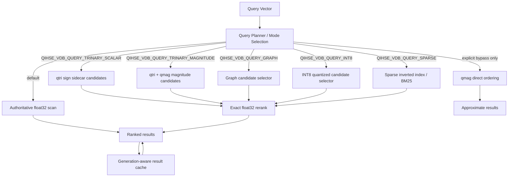
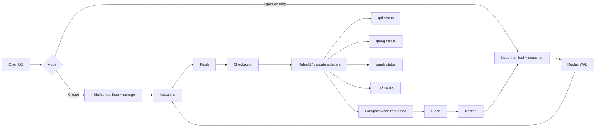
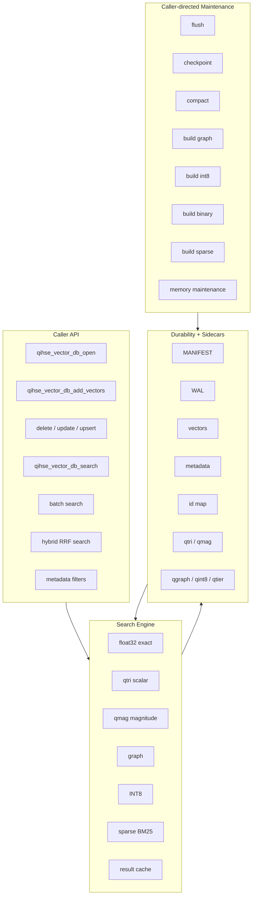

<p align="center">
  
</p>
<div align="center">

## Quantum-Inspired Hilbert Space Expansion Search

### Exactness-first vector search with trinary candidate acceleration, file-backed recovery, and hardware-aware execution.

[](LICENSE)
[](https://en.wikipedia.org/wiki/C_(programming_language))
[](python/qihse.py)
[]()
[]()
[]()

</div>

---

## What this is

**QIHSE** is a native C vector-search engine and technical showcase built around one rule:

> **Approximation is allowed to propose candidates. It is not allowed to silently decide truth.**

Most vector systems optimize for speed first and explain recall loss later. QIHSE reverses that. The default path is authoritative `float32` search. Accelerators such as trinary signatures, magnitude sidecars, graph traversal, INT8 quantization, sparse indexing, caching, and memory-tier placement are explicit execution layers around that contract.

The result is a vector-search architecture that is interesting for three reasons:

| Area | QIHSE position |
|---|---|
| **Correctness** | Exact `float32` ranking is the default, validation baseline, and final authority for normal accelerated paths. |
| **Acceleration** | `qtri` and `qmag` sidecars reduce candidate pressure before exact rerank. Bypass mode exists, but it is explicit and approximate. |
| **Persistence** | WAL, snapshots, manifests, sidecars, index files, and recovery stats are surfaced as first-class state rather than hidden background magic. |
| **Systems work** | The repository includes C APIs, SIMD-aware CPU paths, file-backed storage, mmap/read-only modes, benchmark harnesses, memory hierarchy experiments, and reference workload tooling. |

This is not a cosmetic ANN wrapper. It is an attempt to build a vector database core where the fast paths are visible, measurable, and reversible.

---

## Why it exists

Vector search has a bad habit: it becomes fast by making the wrong answer cheaper.

That may be acceptable for some recommendation systems. It is less acceptable for forensic retrieval, security search, document triage, or any workload where a false nearest-neighbor quietly changes the investigation. QIHSE treats vector search like a systems problem rather than a dashboard feature:

- establish an exact result path first;
- add accelerators as explicit candidate selectors;
- validate sidecars before trusting them;
- expose recovery state;
- benchmark workload shapes instead of claiming universal speedups;
- let the caller decide when approximate bypass is acceptable.

That design is the point of the project.

---

## Core idea in one diagram



The normal accelerated paths do **not** replace exact scoring. They reduce the search space, then hand the shortlist back to the exact scorer.

---

## Query modes

| Mode | Purpose | Final ranking contract |
|---|---|---|
| `QIHSE_VDB_QUERY_FLOAT32` | Default exact search | Authoritative `float32` scoring. Tolerates missing/stale/corrupt sidecars. |
| `QIHSE_VDB_QUERY_TRINARY_SCALAR` | Sign-only trinary shortlist via `vectors.qtri` | Candidate selection, then exact `float32` rerank. Fails if required sidecar is invalid. |
| `QIHSE_VDB_QUERY_TRINARY_MAGNITUDE` | Magnitude-aware shortlist via `vectors.qtri` + `vectors.qmag` | Candidate selection, then exact `float32` rerank. Conservative default policy may fall back to exact search. |
| `QIHSE_VDB_QUERY_TRINARY_MAGNITUDE_BYPASS` | Lowest-latency qmag ordering | Explicit approximate path. No automatic exact fallback. Scores are qmag scores, not cosine scores. |
| `QIHSE_VDB_QUERY_GRAPH` | Graph-index candidate selection | Candidate selector path intended to feed exact rerank. |
| `QIHSE_VDB_QUERY_INT8` | INT8 scalar quantization candidate selection | Candidate selector path intended to feed exact rerank. |
| `QIHSE_VDB_QUERY_SPARSE` | Sparse inverted-index retrieval with BM25-style scoring | Sparse retrieval path for high-dimensional sparse inputs. |

Additional API surface includes batch search, hybrid search with Reciprocal Rank Fusion, metadata filters, query cache controls, graph/index builders, INT8 builders, binary sidecar builders, sparse-index builders, explicit persistence controls, and memory-tier maintenance.

---

## Technical showcase highlights

### 1. Exactness-first search contract

The default query mode is exact `float32`. Accelerators are not smuggled into the query path. The caller chooses them.

This matters because it gives every workload a ground truth. You can benchmark `qmag` against exact search, reject it for dense/high-pressure shapes, or use bypass mode when raw latency matters more than exact ranking.

### 2. Trinary search that acts like an accelerator, not a hallucination engine

QIHSE stores trinary and magnitude sidecars:

- `vectors.qtri` — row-oriented trinary signatures;
- `vectors.qmag` — row-aligned magnitude information;
- transposed qmag caches for dimension-major scoring;
- explicit sidecar status: absent, valid, stale, or corrupt.

The normal trinary paths generate a candidate pool and then rerank against the original `float32` vectors. That is the key design distinction.

### 3. qmag policy gates

The qmag path is deliberately conservative. It considers live-row count, active query dimensions, `top_k` pressure, and effective rerank pressure. If the query shape is likely to erase qmag's advantage or risk shortlist loss, the default qmag policy falls back to exact search.

Caller-provided pools remain possible for experiments, but they are treated as explicit opt-ins.

### 4. File-backed lifecycle with visible state

QIHSE is not just a RAM toy. The file-backed mode uses explicit durability operations and inspectable artifacts:

```text
my-index/
├── MANIFEST
├── wal.qwal
├── vectors.qvec
├── metadata.qmeta
├── index.qidx
├── idmap.qid
├── vectors.qtri
├── vectors.qmag
├── index.qgraph
├── vectors.qint8
└── vectors.qtier
```

The model is intentionally boring: write, flush, checkpoint, compact, reopen, replay WAL if needed, validate sidecars, continue.

Boring recovery is good engineering. Exciting recovery is usually data loss wearing a costume.

### 5. Mutation-aware vector storage

The API exposes insert, delete, update, and upsert flows. Updates are append-oriented: old live rows are tombstoned and replacement rows are added with the same external ID. The ID map, WAL, cache generation, and sidecar state move with those lifecycle transitions.

### 6. Cache invalidation that is not hand-waved

The result cache keys on query contents, `top_k`, metric choice, and generation. Mutations advance the cache generation so stale results do not survive writes.

### 7. Multiple retrieval shapes

QIHSE is not limited to one data model:

- dense `float32` vectors;
- trinary compressed signatures;
- magnitude-aware trinary scoring;
- graph candidate search;
- INT8 scalar quantized candidates;
- binary quantization sidecar support;
- sparse inverted index support;
- cosine, dot-product, and Euclidean scoring contracts.

### 8. Hardware-aware execution

The build system supports native C compilation, optional AVX2/AVX-512 paths, CPU distance backends, and experimental hooks for NPU/GPU-oriented work. The repository is structured for systems-level experimentation rather than API-only demonstration.

### 9. Hierarchical memory experiments

Recent work adds per-vector access tracking and tier metadata through `vectors.qtier`. Hot/cold vector temperature can be used to drive memory maintenance and placement behavior across faster/slower tiers.

This is currently best understood as a systems research lane inside the repository: useful for exploring how retrieval engines behave when access frequency, device placement, and storage hierarchy become part of the query lifecycle.

---

## Persistence lifecycle



Persistence is caller-directed. There is no hidden daemon required for correctness. If a sidecar is missing, stale, or corrupt, QIHSE reports that state instead of pretending the accelerator is fine.

---

## Build

```bash
git clone https://github.com/SWORDIntel/QIHSE.git && cd QIHSE && make all
```

Native helper:

```bash
./scripts/build-native.sh
```

Optional native targets:

```bash
make build-native
./scripts/build-native.sh --avx2
./scripts/build-native.sh --avx512 --allow-unsupported --cflags "-O3 -DNDEBUG"
```

Custom build flags can be placed in `./.qihse-build-flags`:

```text
QIHSE_TARGET_OVERRIDE=avx512
QIHSE_CFLAGS_EXTRA=-march=native -O3 -flto
QIHSE_BUILD_ALLOW_UNSUPPORTED=1
```

Minimum practical local toolchain:

```bash
make dev-setup
```

---

## Minimal C usage

```c
#include "qihse_vector_db.h"

qihse_vector_db_t db = qihse_vector_db_open(
    QIHSE_VECTOR_DB_AUTO,
    NULL,
    "data/qihse_db",
    QIHSE_VDB_OPEN_CREATE | QIHSE_VDB_OPEN_FILE_BACKED
);

qihse_vector_query_t query = {
    .query_vector = query_vec,
    .vector_dims = 128,
    .top_k = 10,
    .similarity_threshold = 0.0f,
    .include_vectors = false,
    .include_metadata = false,
    .query_mode = QIHSE_VDB_QUERY_FLOAT32,
};

qihse_vector_result_t results[10] = {0};
int got = qihse_vector_db_search(db, &query, results, 10);

qihse_vector_db_flush(db);
qihse_vector_db_checkpoint(db);
qihse_vector_db_close(db);
```

Switch to magnitude-aware candidate selection only when sidecars are valid and the workload benefits:

```c
query.query_mode = QIHSE_VDB_QUERY_TRINARY_MAGNITUDE;
query.candidate_pool_size = 0;  // enable conservative default policy
```

Use bypass mode only when you explicitly accept approximate qmag ordering:

```c
query.query_mode = QIHSE_VDB_QUERY_TRINARY_MAGNITUDE_BYPASS;
query.candidate_pool_size = 1024;
```

---

## Benchmark and validation commands

Core correctness and persistence:

```bash
make test-persist
make test-trinary-codec
```

Reference workloads:

```bash
make bench-reference-workloads
make bench-reference-runner-smoke
make validate-reference-workflow
```

Vector-search behavior:

```bash
make bench-micro
make bench-trinary-search-sweep
make bench-trinary-random-sweep
```

VXUG PDF workload sample:

```bash
make bench-vxug-pdf-workload
```

SIFT1M workflow, with deterministic fallback data if the full dataset is not present:

```bash
make bench-sift1m-workload
```

Generate a benchmark chart:

```bash
make bench-micro 2>&1 | tee /tmp/bench_results.txt && python3 scripts/generate_benchmark_chart.py /tmp/bench_results.txt benchmarks/qihse_benchmark_chart.png
```


---

## Current trinary / qmag benchmark snapshot

Representative randomized sweep results currently tracked in the repository:

| Path | Measurement | Result |
|---|---:|---:|
| `qmag` | pass-level win rate | `0.8118` with 95% CI `0.8074–0.8162` |
| `qmag` | full-candidate win rate | `0.5868` with 95% CI `0.5701–0.6034` |
| `qtri` | pass-level win rate | `0.4639` with 95% CI `0.4599–0.4679` |

Representative local VXUG PDF workload sample:

| Mode | recall@10 |
|---|---:|
| `float32` | `1.0000` |
| `qtri` | `0.9812` |
| `qmag` | `1.0000` |

These are workload-specific numbers, not universal marketing claims. The important result is the shape: `qmag` can produce repeatable candidate-pruning wins, while exact search remains the validation anchor.

Run your own sweep:

```bash
./scripts/run-trinary-random-sweep.sh --iterations 1000 --seed 1337 --output-dir results/sweep-1000
```

Or through `make`:

```bash
QIHSE_TRINARY_SWEEP_ITERS=1000 QIHSE_TRINARY_SWEEP_SEED=1337 make bench-trinary-random-sweep
```

---

## API surface map



---

## Repository orientation

| Path | Purpose |
|---|---|
| `include/qihse_vector_db.h` | Public vector DB API surface. |
| `src/qihse_vector_db.c` | Native vector DB implementation. |
| `persistence/` | File format, WAL, snapshots, vector store mechanics. |
| `codecs/` | Trinary codec work. |
| `backends/cpu/` | CPU detection and distance implementations. |
| `memory/` | UMA/HMA, migration policy, topology, memory-tier experiments. |
| `benchmarks/` | Microbenchmarks, reference workloads, VXUG/SIFT workflows. |
| `docs/` | API, onboarding, persistence, policy, usage, architecture notes. |
| `python/qihse.py` | Minimal ctypes adapter for the shared library. |

---

## What this demonstrates

QIHSE is a compact but dense showcase of systems engineering decisions:

- C ABI design around a native vector DB handle;
- explicit query contracts instead of hidden optimizer behavior;
- sidecar validity tracking and stale/corrupt state handling;
- WAL-backed mutation lifecycle;
- append-oriented updates and tombstone-aware live rows;
- cache generation invalidation;
- candidate pruning with exact rerank;
- benchmark-first tuning of acceleration paths;
- hardware-aware compilation lanes;
- memory hierarchy experiments;
- reference workload automation.

The interesting part is not only that it searches vectors. The interesting part is that it treats search speed, correctness, persistence, and hardware placement as one connected engineering problem.

---

## What it is not claiming

- It is not claiming that every qmag query beats exact search.
- It is not claiming approximate bypass is exact.
- It is not claiming benchmark numbers transfer blindly to unrelated datasets.
- It is not presenting itself as a managed cloud service or polished drop-in replacement for every vector database.
- It is not hiding the cost of correctness behind a marketing graph.

The project is stronger when it is honest: QIHSE is a technical showcase and research-grade engine for exactness-first vector retrieval with visible acceleration contracts.

---

## Read next

- [docs/ONBOARDING.md](docs/ONBOARDING.md) — practical startup/runbook.
- [docs/api/README.md](docs/api/README.md) — API reference.
- [docs/persistence/README.md](docs/persistence/README.md) — durability model.
- [docs/qmag-policy.md](docs/qmag-policy.md) — qmag candidate policy rationale.
- [docs/usage/](docs/usage/) — focused usage guides.
- [docs/security/](docs/security/) — security and hardening notes.
- [benchmarks/reference_workloads.json](benchmarks/reference_workloads.json) — reference workload definitions.

---

## License and use

QIHSE is licensed under **AGPL-3.0**. Read [LICENSE](LICENSE) before use.

Personal, research, and compliant self-hosted use is welcome under the license. Commercial, proprietary, closed-source, hosted, or derivative use requires written permission or a separate license first.

I am approachable: contact me before using QIHSE commercially and we can discuss terms. Unauthorized commercial use, relicensing, removal of attribution, or repackaging outside the license is not permitted and will be pursued to the maximum extent of the law.
