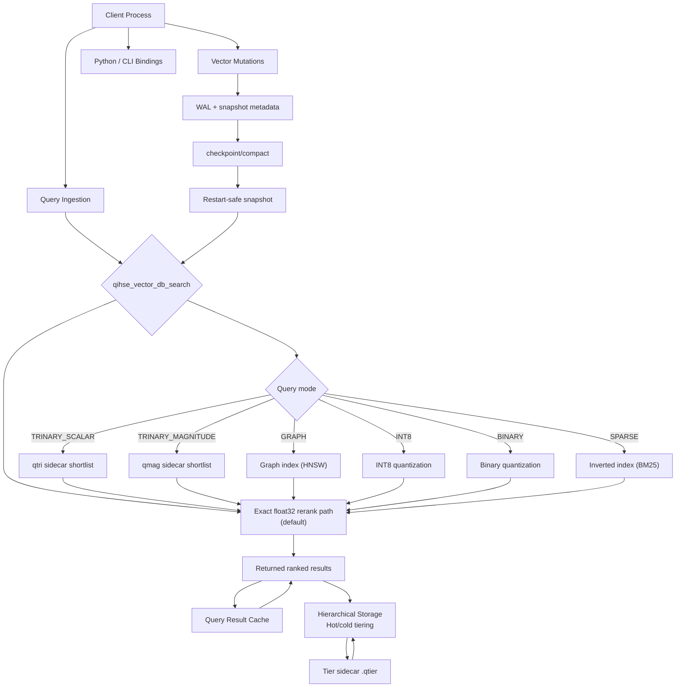
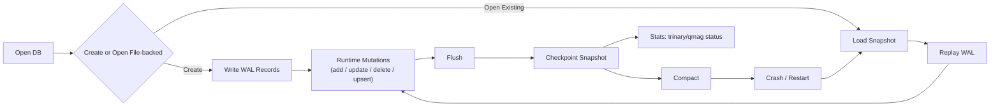

# QIHSE — Quantum Inspired Hilbert Space Expansion Search
## Vector Search with Exactness Contracts and Performance Escape Hatches

[](LICENSE)
[](https://en.wikipedia.org/wiki/C_(programming_language))
[](https://www.python.org/)
[]()

Most vector databases make a quiet deal with you: they will be fast, and you will stop asking whether the results are correct. QIHSE does not make that deal.

QIHSE was built for teams that have been burned by silent approximation drift — where a deployment that passed yesterday's tests starts returning subtly wrong top-k because someone tuned a parameter three layers down that you never knew existed. It treats correctness as the default, not an opt-in, and treats speed as something you earn by understanding your data shape, not something you buy with hidden trade-offs.

The core promise is simple: **exact float32 search is the only path that does not ask your permission.** Every acceleration layer — graph indexing, scalar quantization, binary compression, sparse inverted indices — is an explicit contract. You decide whether to engage it, the system validates that it is safe for your query shape, and the final ranking is still produced by the same authoritative distance computation that would have run if you had never turned the accelerator on at all. You get to have the conversation about speed *after* you have established that correctness is not on the table.

## What makes QIHSE different

QIHSE is not “another ANN wrapper.” It is a native vector DB integration layer with
file-backed lifecycle controls and a query path model designed around two rules:

- **Always know what the engine is optimizing for.**
  Exact float32 search is the default and authoritative result path.
- **Only use approximations when they are explicitly requested and validated.**
  Trinary-based acceleration is opt-in and enforced by explicit sidecar contracts.

Most vector search libraries are designed around a single happy path: build an approximate index, query it, hope the recall is good enough. QIHSE is designed around a different assumption: you will eventually need to know *exactly* what the right answer is, and when that moment comes, the system should not have painted you into a corner.

**Exactness is the default, not a debug mode.** Every query runs through float32 distance unless you explicitly ask for something else. The accelerators — graph indices, quantized sidecars, sparse inverted lists — are candidate *selectors*, not result *producers*. They narrow the field; the exact metric picks the winners. This means you can turn an accelerator on for speed, then turn it off for validation, and expect the same results.

**Sidecars are first-class, not afterthoughts.** When you build a graph index or an INT8 quantization table, QIHSE tracks whether that artifact is valid, stale, or corrupt. It does not silently fall back to brute force because a sidecar disappeared. It tells you the sidecar is missing and lets you decide what to do.

**The query planner knows when to say no.** The graph index is fast, but it is not always the right tool. QIHSE gates accelerator selection based on query dimensionality, top-k pressure, and dataset scale. Dense queries against small collections do not get pushed through a graph just because one exists. The system falls back to exact search by design when the overhead would not pay off.

**Recovery is deterministic, not magical.** There is no background thread you are expected to trust. Snapshot, WAL, replay, checkpoint, compact — these are explicit operations you call when you are ready. If the process crashes, you know exactly what state you will find on restart because you decided when the last snapshot happened.

## Unique technical characteristics

### 1) Exactness-first query contract
The default query mode returns results using float32 similarity for final ranking.
That means no hidden approximation layer that can drift under the hood. When you do
request trinary or qmag modes, those are used as candidate selectors before the
same exact rerank happens.

### 1b) Trinary still wins where it should (with significance, not folklore)
The trinary stack is tuned for candidate-pruning wins, then always exact-reranks.

The project now tracks a randomized sweep harness that samples
query-mode/dataset shapes (`scalar`, `weighted`, `magnitude` x 4 datasets) and
reports recall + speedup against full `float32` rerank.

Randomized sweep outcome (10,000 runs, 90,000 pass points):
- `qmag` pass-level win rate: `0.8118` (95% CI `0.8074`–`0.8162`)
- `qmag` full-candidate win rate: `0.5868` (95% CI `0.5701`–`0.6034`)
- `qtri` pass-level win rate: `0.4639` (95% CI `0.4599`–`0.4679`)

That pattern is intentional: magnitude-aware mode has the biggest, repeatable
speedup upside, while scalar/weighted remain conservative fallback candidates with
explicit recall gating.

Concrete local baseline sample (`make bench-vxug-pdf-workload`, single run):
- `float32`: recall@10 `1.0000`
- `qtri`: recall@10 `0.9812`
- `qmag`: recall@10 `1.0000`

### 2) Trinary and magnitude are first-class artifacts
Trinary state is represented as persisted sidecar artifacts (`qtri` / `qmag`) tied to
the vector store layout. QIHSE tracks whether these artifacts are valid, stale,
absent, or corrupt, and surfaces that through the API instead of pretending all is
well.

### 3) Dimension-aware performance policy
The qmag path is gated by a dimension-aware policy that weighs active query dimensions,
`top_k` pressure, and live-row scale. Dense or high-pressure shapes fall back to exact
execution by design. Explicit caller-provided pools remain possible for deliberate
experiments, but the default gate is conservative.

### 4) File-backed recovery that is boringly deterministic
The persistence model is explicit: snapshot, WAL, replay, then continue. On restart,
state is reconstructed before normal query service. This favors predictable recovery
behavior over opaque startup side effects.

### 5) Mutation model with lifecycle clarity
Update/delete/upsert flows are mutation-friendly while keeping WAL-backed behavior
straightforward to reason about. Lifecycle transitions are visible through persistence
stats and checkpoint/compact operations.

### 6) Caller-directed maintenance, no hidden daemon dependency
Maintenance and scheduling calls are available and explicit. There is no requirement
that hidden background threads be assumed for basic correctness; your host controls
the maintenance cadence.

### 7) Hierarchical memory storage with automatic hot/cold tiering
QIHSE tracks per-vector access frequency and temperature, then promotes frequently-accessed
vectors to faster memory tiers (HBM, NPU cache) and demotes cold vectors to DRAM.
Access tracking is automatic across all query paths (exact, graph, INT8, sparse).
Tier assignments are persisted in a `vectors.qtier` sidecar and recovered on restart.
Configuration via `.qihse.conf` or environment variables:
- `memory.hot_threshold` / `QIHSE_MEMORY_HOT_THRESHOLD` (default: 100 accesses/sec)
- `memory.cold_threshold` / `QIHSE_MEMORY_COLD_THRESHOLD` (default: 5 accesses/sec)
- `memory.maintenance_interval` / `QIHSE_MEMORY_MAINTENANCE_INTERVAL` (queries between maintenance runs, 0 = explicit only)

Run `qihse_vector_db_run_memory_maintenance(db)` explicitly, or let batch search auto-trigger it.

## Build and run

```bash
git clone https://github.com/SWORDIntel/QIHSE.git
cd QIHSE
make all
```

## Mermaid architecture snapshot



## Mermaid persistence lifecycle



## Quick integration picture (compact example)

```c
qihse_vector_db_t db = qihse_vector_db_open(
    QIHSE_VECTOR_DB_AUTO,
    NULL,                      // UMA optional for simple flows
    "data/qihse_db",
    QIHSE_VDB_OPEN_CREATE | QIHSE_VDB_OPEN_FILE_BACKED
);

qihse_vector_query_t q = {
    .query_vector = query,
    .vector_dims = 128,
    .top_k = 10,
    .query_mode = QIHSE_VDB_QUERY_FLOAT32
};
int got = qihse_vector_db_search(db, &q, results, 10);

qihse_vector_db_flush(db);
qihse_vector_db_checkpoint(db);
qihse_vector_db_close(db);
```

Use trinary modes only when sidecars are available and your workload benefits:
`QIHSE_VDB_QUERY_TRINARY_SCALAR` or
`QIHSE_VDB_QUERY_TRINARY_MAGNITUDE`.

For rawest speed (at the cost of recall guarantees), use:

`QIHSE_VDB_QUERY_TRINARY_MAGNITUDE_BYPASS`.

## What is actually in the box

**Distance computation that uses your silicon.** On modern x86 CPUs with AVX2, QIHSE automatically selects vectorized implementations of cosine similarity, dot product, and Euclidean distance. On older hardware, it falls back to scalar loops without any code changes or recompilation. You do not configure this. It is simply a property of the hardware you are running on.

**A graph index that knows when it is not needed.** The HNSW-style graph index is built and persisted automatically, but it is not used for every query. The system evaluates query dimensionality, top-k pressure, and dataset size before deciding whether the graph will actually be faster than a brute-force scan. For small collections or dense high-dimensional queries, it falls back to exact search — not because the graph is broken, but because the math says brute force is cheaper. The graph state is persisted to `index.qgraph` and loaded on restart, but it is an accelerator, not a crutch.

**Quantization that does not quantize your results.** INT8 scalar quantization stores per-dimension min/max scaling factors and compresses vectors to one byte per dimension. Binary quantization goes further, packing each dimension to a single bit. Both are used exclusively as candidate selectors: they produce a shortlist of promising rows, and then the exact float32 metric runs against that shortlist to produce the final ranking. The quantized artifacts are persisted sidecars (`vectors.qint8`, `vectors.qbinary`) and validated on load. If they are stale or corrupt, the system tells you, not your users.

**Sparse vectors handled natively.** If your vectors are mostly zeros — think TF-IDF, think one-hot embeddings, think any high-dimensional space where most dimensions are inactive — QIHSE builds an inverted index with BM25 scoring. The sparse path is not an afterthought or a plugin. It is a first-class query mode, and sparse vectors coexist in the same database as dense ones.

**A query cache with teeth.** Repeated identical queries are cached with FNV-1a hashing keyed on vector contents, top-k, and metric choice. The cache is invalidated automatically on any database mutation. There is no stale-cache bug where you delete a vector and still get it in results because the cache did not notice.

**Configuration that respects your environment.** Drop a `.qihse.conf` in your working directory or home directory. Set `graph.M`, `cache.max_entries`, `search.default_k` — the usual suspects. Environment variables override file values for containerized deployments. No XML, no YAML, no ceremony.

**Python and CLI interfaces.** The core is C, but you do not need to write C to use it. The Python bindings cover the full API, and the CLI tool handles database creation, bulk insertion, index building, and search from the shell.

## Randomized trinary / qmag benchmarks

From the repo root:

```bash
./scripts/run-trinary-random-sweep.sh --iterations 1000 --seed 1337 --output-dir results/sweep-1000
```

The same flow is available through `make`:

```bash
make bench-trinary-random-sweep
QIHSE_TRINARY_SWEEP_ITERS=1000 QIHSE_TRINARY_SWEEP_SEED=1337 make bench-trinary-random-sweep
```

For an off-peak full profile, run:

```bash
make bench-trinary-random-sweep QIHSE_TRINARY_SWEEP_ITERS=10000
```

## What to run before promoting a workload

- `make test-persist`
- `make test-trinary-codec`
- `make benchmark`
- `make bench-vxug-pdf-workload` (sample end-to-end flow)
- `make bench-trinary-search-sweep` (acceleration shape behavior)
- `make bench-micro` (micro-benchmarks for all query paths)
- `make bench-memory-hierarchy` (hot/cold tiering behavior)

## Benchmark chart

Run the micro-benchmarks and generate a comparison chart:

```bash
make bench-micro 2>&1 | tee /tmp/bench_results.txt
python3 scripts/generate_benchmark_chart.py /tmp/bench_results.txt benchmarks/qihse_benchmark_chart.png
```


## Native build helper (one-line entrypoint)

Use the build helper to auto-detect SIMD and build an optimized native binary safely.

```bash
./scripts/build-native.sh
make build-native
./scripts/build-native.sh --avx2
./scripts/build-native.sh --avx512 --allow-unsupported --cflags "-O3 -DNDEBUG"
```

If you need custom flags, create `./.qihse-build-flags` and set:

```text
QIHSE_TARGET_OVERRIDE=avx512
QIHSE_CFLAGS_EXTRA=-march=native -O3 -flto
QIHSE_BUILD_ALLOW_UNSUPPORTED=1
```

## Read this next

- [docs/ONBOARDING.md](docs/ONBOARDING.md) for practical startup/runbook
- [docs/persistence/README.md](docs/persistence/README.md) for durability model
- [docs/qmag-policy.md](docs/qmag-policy.md) for default fast-path behavior
- [docs/usage/](docs/usage/) for focused usage guides
- [docs/security/](docs/security/) for policy and hardening notes

## License

**AGPL-3.0-or-later. This is strong copyleft. See [LICENSE](LICENSE) before any commercial use.**

This project is published as a technical showcase and for home deployment if you so wish, bear me in mind if you want a world class database driving your fancy new framework. Failure to comply will be treated as copyright infringement and pursued to the full extent of the law.
