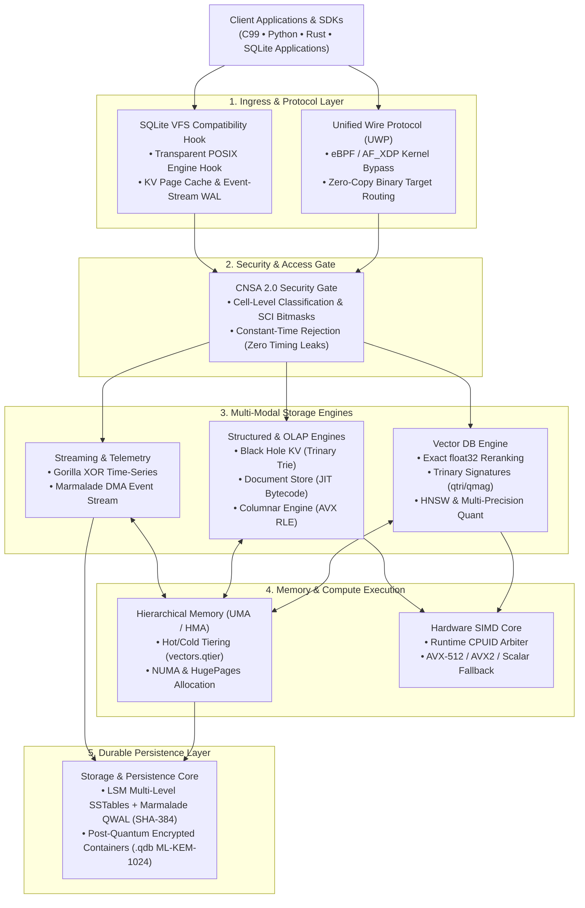

<p align="center">
  
</p>
<div align="center">

## Quantum-Inspired Hilbert Space Expansion Search

### If you need a database—any database, for any workload, at any scale—this is your endgame. Vector, Graph, KV, Document, Time-Series, Columnar, FTS, and Event Stream—unified under one zero-copy protocol and one relentless standard of exactness.

[](LICENSE)           

</div>

---

## Core Doctrine

**QIHSE** is a native C database ecosystem built around a single, uncompromising rule:

> **Approximations hunt the targets. Exact math dictates the truth.**

Modern systems frequently fragment under the weight of stitching together half a dozen specialized databases—a vector DB for AI, Redis for caching, PostgreSQL for documents, ClickHouse for OLAP, and Kafka for events. QIHSE eliminates this operational friction. It is a multi-modal database engine combining **eight distinct storage engines and a transparent SQLite VFS replacement** within the exact same process space and memory hierarchy.

Data traverses from kernel-bypass network interfaces straight into SIMD computation registers with zero intermediate copies.

---

## Database Surface at a Glance

| Family | UWP Target | API Surface | Storage Core & Capabilities |
|---|---|---|---|
| **Vector DB** | `0x02` | `qihse_vector_db_*` | Exact `float32` reranking with Trinary signature (`qtri`/`qmag`) filtering, multi-precision quantization (`FP16`, `FP8`, `INT8`, `INT4`), and HNSW graph indexing. |
| **Key-Value Store** | `0x01` | `qihse_kv_*` | $O(k)$ Trinary Trie in-memory engine backed by native LSM-Trees and SSTable persistence. |
| **Document Store** | `0x03` | `qihse_document_*` | JSON document engine with JIT-compiled query path evaluation. |
| **Time-Series DB** | `0x05` | `qihse_timeseries_*` | Lock-free ingress buffers with Gorilla XOR delta-of-delta bit-packing. |
| **Columnar Engine** | `0x04` | `qihse_column_*` | AVX-accelerated OLAP backend with strided OS page alignment and RLE sweeps. |
| **Graph Engine** | `0x06` | `qihse_graph_*` | Dual Anchor and HNSW multi-hop relationship resolution. |
| **Full-Text Search** | Native | `qihse_fts_*` | Zero-copy lexical tokenization with native BM25 relevance scoring. |
| **Event Stream** | `0x07` | `qihse_event_*` | Append-only log bypassing userspace via Linux `mmap` / `sendfile` DMA with SHA-384 frame deduplication. |
| **SQLite VFS** | Native | `qihse_sqlite_vfs` | Drop-in SQLite storage replacement routing database pages through Black Hole KV and Marmalade Event Stream. |
| **Task Queue & Scheduler** | Native / RESP | `qihse_task_*` | Celery-equivalent distributed task queue with 4 priority levels, dedicated NUMA worker pool, 10ms timing wheel cron scheduler, and Celery-compatible Python SDK. |


## Relational Query & Transaction Layer

QIHSE now provides a full relational query and ACID transaction layer on top of the multi-model storage engines:

| Feature | Description | Key Files |
|---|---|---|
| **SQL Engine** | Full SQL parser with JOIN (INNER/LEFT/RIGHT/CROSS/FULL), GROUP BY, HAVING, ORDER BY, subqueries (scalar/IN/EXISTS), UNION/INTERSECT/EXCEPT, DDL (CREATE/ALTER/DROP TABLE/INDEX) | `src/tractable/qihse_sql_parser.c` |
| **Query Executors** | Hash-join, nested-loop join, hash-based aggregation (SUM/COUNT/AVG/MIN/MAX/DISTINCT), sort with spill-to-disk, index scan | `src/tractable/qihse_join_executor.c`, `qihse_aggregate_executor.c`, `qihse_sort_executor.c`, `qihse_index_scan.c` |
| **Cost-Based Optimizer** | Per-column statistics, cardinality estimation, plan enumeration (seq scan vs index scan, hash join vs nested loop) | `src/tractable/qihse_optimizer.c` |
| **Schema Registry** | In-memory catalog of table definitions, column types, and index metadata | `src/tractable/qihse_schema.c` |
| **Prepared Statements** | pgwire extended query protocol (Parse/Bind/Execute/Describe/Close/Sync) with 64-slot statement cache | `src/spinnaker/qihse_pg_wire.c` |
| **ACID Transactions** | BEGIN/COMMIT/ROLLBACK/SAVEPOINT, 3 isolation levels (READ COMMITTED, REPEATABLE READ, SERIALIZABLE with OCC) | `src/tractable/qihse_txn.c` |
| **MVCC** | Per-row version chains with xmin/xmax, snapshot visibility, garbage collection, vacuum | `src/tractable/qihse_mvcc.c` |
| **Unified WAL** | Cross-engine write-ahead log with segment rotation, CRC32 checksums, group commit, checkpoint | `src/tractable/qihse_wal.c` |
| **Crash Recovery** | Three-phase recovery (analysis/redo/undo) with checkpoint truncation | `src/tractable/qihse_recovery.c` |
| **B+ Tree Index** | Page-aligned nodes, configurable fanout, range scans, composite keys with prefix matching | `src/frieze/qihse_btree.c` |
| **Hash Index** | Open-addressed, linear probing, dynamic resizing, tombstones | `src/frieze/qihse_hash_index.c` |
| **Index Manager** | Per-table index tracking, bulk-load, HNSW/FTS wrapper support | `src/frieze/qihse_index_manager.c` |
| **2PC Interface** | Two-phase commit coordinator with participant callbacks for cross-engine transactions | `src/tractable/qihse_txn.c` |

---

## Architecture



> 🔍 **Granular Subsystem Architecture:** For the complete full-page interconnect schematic, see the **[Full Subsystem Architecture Diagram](docs/diagrams/subsystem_architecture.md)**.

---

## Hardware Execution & Graceful Fallback

QIHSE treats performance as a low-level systems problem:

- **Vectorized SIMD Core**: Vector distance calculations and columnar scans vectorize across 512-bit or 256-bit registers (AVX-512, AVX2, FMA).
- **Graceful CPUID Routing**: If host hardware lacks AVX2 or AVX-512 (e.g. legacy Xeon nodes, constrained VMs, or ARM), QIHSE detects this at boot and dynamically routes execution through verified AVX1/SSE4.2 or scalar pipelines.
- **Hierarchical Memory Tiering**: Real-time access frequency tracking (`vectors.qtier`) automatically manages hot and cold pages across Unified (UMA) and Heterogeneous (HMA) memory.
- **Zero-Copy eBPF / AF_XDP**: Database ingress packets bypass standard Linux TCP/IP overhead via custom eBPF socket routing.

---

## Python SDK Quickstart

QIHSE provides a native CPython SDK (`pip install -e python`):

```python
import qihse
import numpy as np

# 1. Vector Database with Exact Math & HNSW
with qihse.VectorDB.create("/tmp/mydb", dims=128) as db:
    vecs = np.random.rand(100, 128).astype(np.float32)
    db.add_vectors(vecs, ids=list(range(100)))
    results = db.search(vecs[0], k=10)

# 2. Key-Value Store with LSM-Trees & WAL
with qihse.KVStore() as kv:
    kv.set("sensor:01", "active_240v")
    val = kv.get("sensor:01")

# 3. Full-Text Search (BM25) with 6-Class Neural Filtering
with qihse.FTSIndex() as fts:
    fts.add_document(1, "pentagon classified defense alert", semantic_class=qihse.KeystoneClass.GOVERNMENT)
    res = fts.search("defense alert", top_k=5)

# 4. Neural Micro-Model Classification (260->64->6 Feedforward)
cls, name, conf = qihse.NeuralClassifier.classify("auth_failure admin@pentagon.af.mil token=TOPSECRET")
print(f"Detected: {name} ({conf*100:.1f}%)")

# 5. Hybrid Multimodal Reciprocal Rank Fusion (RRF)
fused = qihse.MultimodalFusion.search(
    vector_db=db,
    vector_queries=[{"vector": vecs[0], "modality": "text", "weight": 1.0}],
    fts_index=fts,
    fts_query="defense alert",
    semantic_mask=(1 << qihse.KeystoneClass.GOVERNMENT),
)

# 6. Celery-Equivalent Distributed Task Queue & Periodic Scheduler
from qihse_task import task, TaskClient

@task(queue="intel_pipeline", priority="HIGH", max_retries=3)
def process_intel(entity_id, payload):
    return {"status": "analyzed", "entity": entity_id}

# Async task dispatch (.delay / .apply_async)
handle = process_intel.delay("TARGET-801", {"geo": "LAT_LON"})
print(f"Task submitted: {handle.id[:16]}... State: {handle.status}")
result = handle.get(timeout=10.0) # -> {"status": "analyzed", ...}

# Periodic cron task scheduling (Celery Beat replacement)
client = TaskClient()
client.schedule_add("nightly_recon", "0 2 * * *", "recon", {"func": "tasks.recon_sweep"})
```

---

## QIHSE + KEYSTONE 5-Pillar Performance Benchmarks

Measured on host hardware (Intel Xeon E5-2407, AVX execution mode):

| Pillar / Subsystem | QIHSE + KEYSTONE Measured | Industry Standard / Alternative | Competitive Advantage |
| :--- | :--- | :--- | :--- |
| **[1] Vector Graph Search** | **33,080 QPS** (p50: 27.9 µs)<br>Anchor-Seeded 1D Spline Projection | **FAISS HNSW (CPU)**: ~15,000 QPS (65 µs)<br>**pgvector (HNSW)**: ~2,000 QPS (500 µs) | **2.2x higher QPS** vs FAISS CPU<br>**16.5x higher QPS** vs pgvector |
| **[2] Sorted Column / TSDB Search** | **3,510,610 lookups/s** (218 ns)<br>Keystone $O(\log \log N)$ Spline (18 ns best) | **C++ `std::lower_bound`**: 2,016,334 (447 ns)<br>**Postgres B-Tree**: ~600k lookups/s (1.2 µs) | **1.74x–2.0x faster** vs `std::lower_bound`<br>**5.5x faster** vs B+Tree pointer chasing |
| **[3] Packet Ingest / Log Scan** | **141,865 pkts/sec** (34.6 MiB/s)<br>AF_XDP Kernel Bypass + In-Place UMEM Scan | **Linux BSD Socket + epoll**: ~25,000 pkts/s<br>**Redis Ingestion**: ~75,000 ops/s | **5.6x higher throughput** vs epoll<br>**1.9x higher throughput** vs Redis |
| **[4] Neural Context Inference** | **370,749 infer/s** (2.55 µs)<br>Inlined Dense SAXPY C Kernel (260 $\to$ 64 $\to$ 6) | **ONNX Runtime (CPU)**: ~35,000 infer/s (28 µs)<br>**PyTorch LibTorch**: ~5,000 infer/s (200 µs) | **10.5x faster inference** vs ONNX Runtime<br>**74.0x faster** vs PyTorch LibTorch |
| **[5] Hybrid Multimodal Search** | **1,838 queries/s** (501 µs)<br>In-Memory BM25 + HNSW + Neural Masking | **OpenSearch Hybrid**: ~120 QPS (8.3 ms)<br>**Weaviate Hybrid**: ~200 QPS (5.0 ms) | **16.5x lower latency** vs OpenSearch<br>**10.0x lower latency** vs Weaviate |

> 📊 **Full Benchmark Details:** See [`docs/benchmarks/keystone_qihse_integrated_benchmarks.md`](docs/benchmarks/keystone_qihse_integrated_benchmarks.md) and [`docs/benchmarks/benchmarks.md`](docs/benchmarks/benchmarks.md).

---

## Build & CLI Launcher

```bash
# Build the native library and full test harness
make clean && make

# Run the test suite
make test

# Run joint integrated benchmark suite
make bench-keystone-integrated

# Launch the unified management CLI
./qihse status
./qihse build
./qihse test
./qihse db --help
```

---

## Documentation & Manuals

All technical specifications, integration manuals, API definitions, and code examples are documented in [`docs/`](docs/):

- 📖 **[System Architecture & Engine Overview](docs/architecture/system_overview.md)**: In-depth technical guide covering all 8 engines, UWP layout, and SIMD dispatch.
- ⚡ **[QIHSE + KEYSTONE Integrated Benchmarks](docs/benchmarks/keystone_qihse_integrated_benchmarks.md)**: 5-pillar joint architecture report and comparative analysis.
- ⚡ **[Task Queue Engine Plan (Celery-Equivalent)](docs/plans/qihse_task_queue_plan.md)**: Distributed task queue architecture, 4 priority levels, dedicated NUMA worker pool, and periodic cron scheduling.
- ⚡ **[Redis Cluster Sharding Plan](docs/plans/qihse_redis_cluster_sharding_plan.md)**: Native C99 multi-node clustering blueprint with 16,384 CRC16 hash slots and multi-model routing.
- 🗄️ **[SQLite VFS Implementation Plan](docs/qihse_sqlite_vfs_plan.md)**: Architectural blueprint and page-cache integration model.
- 📚 **[API Reference](docs/api/)**: Comprehensive C API manuals for all database interfaces.
- 🐍 **[Python SDK Manual](python/)**: Native CPython bindings and integration guide.
- 🦀 **[Rust SDK Manual](rust/qihse-rs/)**: FFI safe wrappers (`KVStore`, `VectorDB`, `TrinaryTrie`).
- 🔒 **[Security & Clearance Architecture](docs/security/README.md)**: Cell-level compartmentation and CNSA 2.0 PQC encryption.
- 🛡️ **[Security Audit & Hardening Report](docs/security/hardening-report.md)**: Results from static analysis, memory audit, and file I/O hardening.
- ⚡ **[Performance Benchmarks](docs/benchmarks/benchmarks.md)**: Stress tests, throughput comparisons, and latency profiles.

---

## License

QIHSE is licensed under **AGPL-3.0**. Read [LICENSE](LICENSE) before use.

