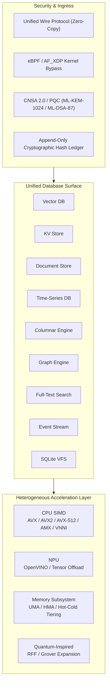

<p align="center">
  
</p>
<div align="center">

## Quantum-Inspired Hilbert Space Expansion Search

### If you need a database—any database, for any workload, at any scale—this is your endgame. Vector, Graph, KV, Document, Time-Series, Columnar, FTS, and Event Stream—unified under one zero-copy protocol and one relentless standard of exactness.

[](LICENSE)           

</div>

---

## Core Doctrine

**QIHSE** is a native C database ecosystem built around a single, uncompromising rule:

> **Approximations hunt the targets. Exact math dictates the truth.**

Modern systems frequently fragment under the weight of stitching together half a dozen specialized databases—a vector DB for AI, Redis for caching, PostgreSQL for documents, ClickHouse for OLAP, and Kafka for events. QIHSE eliminates this operational friction. It is a multi-modal database engine combining **eight distinct storage engines and a transparent SQLite VFS replacement** within the exact same process space and memory hierarchy.

Data traverses from kernel-bypass network interfaces straight into SIMD computation registers with zero intermediate copies.

---

## Database Surface at a Glance

| Family | UWP Target | API Surface | Storage Core & Capabilities |
|---|---|---|---|
| **Vector DB** | `0x02` | `qihse_vector_db_*` | Exact `float32` reranking with Trinary signature (`qtri`/`qmag`) filtering, multi-precision quantization (`FP16`, `FP8`, `INT8`, `INT4`), and HNSW graph indexing. |
| **Key-Value Store** | `0x01` | `qihse_kv_*` | $O(k)$ Trinary Trie in-memory engine backed by native LSM-Trees and SSTable persistence. |
| **Document Store** | `0x03` | `qihse_document_*` | JSON document engine with JIT-compiled query path evaluation. |
| **Time-Series DB** | `0x05` | `qihse_timeseries_*` | Lock-free ingress buffers with Gorilla XOR delta-of-delta bit-packing. |
| **Columnar Engine** | `0x04` | `qihse_column_*` | AVX-accelerated OLAP backend with strided OS page alignment and RLE sweeps. |
| **Graph Engine** | `0x06` | `qihse_graph_*` | Dual Anchor and HNSW multi-hop relationship resolution. |
| **Full-Text Search** | Native | `qihse_fts_*` | Zero-copy lexical tokenization with native BM25 relevance scoring. |
| **Event Stream** | `0x07` | `qihse_event_*` | Append-only log bypassing userspace via Linux `mmap` / `sendfile` DMA with SHA-384 frame deduplication. |
| **SQLite VFS** | Native | `qihse_sqlite_vfs` | Drop-in SQLite storage replacement routing database pages through Black Hole KV and Marmalade Event Stream. |

---

## Architecture



---

## Hardware Execution & Graceful Fallback

QIHSE treats performance as a low-level systems problem:

- **Vectorized SIMD Core**: Vector distance calculations and columnar scans vectorize across 512-bit or 256-bit registers (AVX-512, AVX2, FMA).
- **Graceful CPUID Routing**: If host hardware lacks AVX2 or AVX-512 (e.g. legacy Xeon nodes, constrained VMs, or ARM), QIHSE detects this at boot and dynamically routes execution through verified AVX1/SSE4.2 or scalar pipelines.
- **Hierarchical Memory Tiering**: Real-time access frequency tracking (`vectors.qtier`) automatically manages hot and cold pages across Unified (UMA) and Heterogeneous (HMA) memory.
- **Zero-Copy eBPF / AF_XDP**: Database ingress packets bypass standard Linux TCP/IP overhead via custom eBPF socket routing.

---

## Build & CLI Launcher

```bash
# Build the native library and full test harness
make clean && make

# Run the test suite
make test

# Launch the unified management CLI
./qihse status
./qihse build
./qihse test
./qihse db --help
```

---

## Documentation & Manuals

All technical specifications, integration manuals, API definitions, and code examples are documented in [`docs/`](docs/):

- 📖 **[System Architecture & Engine Overview](docs/architecture/system_overview.md)**: In-depth technical guide covering all 8 engines, UWP layout, and SIMD dispatch.
- 🗄️ **[SQLite VFS Implementation Plan](docs/qihse_sqlite_vfs_plan.md)**: Architectural blueprint and page-cache integration model.
- 📚 **[API Reference](docs/api/)**: Comprehensive C API manuals for all database interfaces.
- 🐍 **[Python SDK Manual](sdks/python/)**: Native CPython bindings and integration guide.
- 🦀 **[Rust SDK Manual](rust/qihse-rs/)**: FFI safe wrappers (`KVStore`, `VectorDB`, `TrinaryTrie`).
- 🔒 **[Security & Clearance Architecture](docs/security/README.md)**: Cell-level compartmentation and CNSA 2.0 PQC encryption.
- 🛡️ **[Security Audit & Hardening Report](docs/security/hardening-report.md)**: Results from static analysis, memory audit, and file I/O hardening.
- ⚡ **[Performance Benchmarks](docs/benchmarks/benchmarks.md)**: Stress tests, throughput comparisons, and latency profiles.

---

## License

QIHSE is licensed under **AGPL-3.0**. Read [LICENSE](LICENSE) before use.
