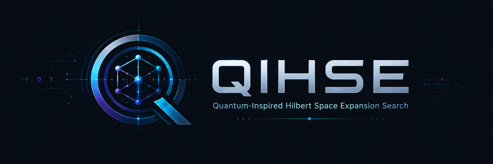
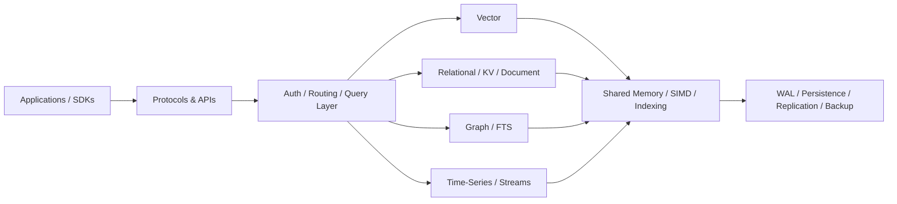

<p align="center">
  
</p>

<div align="center">

# QIHSE

### Quantum-Inspired Hilbert Space Expansion Search

**A native-C, multi-model database runtime for vector, relational, graph, key-value, document, time-series, full-text, and event-stream workloads.**

[](LICENSE)


-yellow?logo=shield)

[Getting Started](docs/GETTING_STARTED.md) · [Features](docs/FEATURES.md) · [Compatibility](docs/COMPATIBILITY.md) · [Architecture](docs/architecture/) · [Benchmarks](docs/benchmarks/) · [Security](docs/security/)

</div>

---

## What is QIHSE?

QIHSE is an attempt to solve a common infrastructure problem: one application increasingly needs several different kinds of database at once.

A modern stack may use one system for vectors, another for relational data, another for caching, another for graph traversal, another for analytics, and another for event streams. Each additional service adds its own protocol, persistence model, operational tooling, security boundary, and failure modes.

QIHSE takes the opposite approach. It implements multiple data models inside one native runtime and shares the low-level pieces between them: memory management, persistence, indexing, query execution, networking, authentication, observability, and hardware acceleration.

> **Approximations hunt the targets. Exact math dictates the truth.**

For vector search, that means approximate structures can narrow the candidate set while exact computation remains available for final ranking and verification.

Despite the name, QIHSE runs on conventional hardware. Its "quantum-inspired" components are algorithmic techniques, not a requirement for quantum computing hardware.

---

## What does it contain?

The core database surface is intentionally broad, but **QIHSE is modular rather than all-or-nothing**. Applications can use one engine, protocol surface, SDK, index, or hardware backend without enabling the entire runtime. Heterogeneous acceleration, clustering, UWP networking, self-optimization, and additional compatibility layers are optional capabilities rather than prerequisites.

| Data model | What QIHSE provides |
|---|---|
| **Vector** | HNSW and trinary candidate filtering with exact `float32` reranking |
| **Key-value** | Trinary trie with LSM/SSTable persistence |
| **Document** | Native JSON/document storage and query paths |
| **Time-series** | Lock-free ingestion with compressed time-series storage |
| **Columnar** | SIMD-oriented analytical scans and column storage |
| **Graph** | Native graph storage, Cypher execution, graph algorithms, graph+vector search |
| **Full-text** | Native lexical indexing and BM25 scoring |
| **Event stream** | Append-oriented event/log storage |

On top of those engines, QIHSE also contains:

- a relational SQL layer with joins, aggregation, indexes, transactions, MVCC, WAL, and recovery;
- replication, backup/restore, connection pooling, CDC, metrics, and tracing;
- PostgreSQL, Redis, MongoDB, Neo4j/Bolt, Elasticsearch-style, ClickHouse-style, and InfluxDB-style compatibility layers;
- Python, Rust, and C SDKs;
- a task queue and scheduler;
- a SQLite VFS integration path;
- hardware-aware scalar/SIMD execution paths and optional AF_XDP/eBPF networking.

The detailed subsystem inventory lives in **[docs/FEATURES.md](docs/FEATURES.md)**. Protocol and client compatibility is documented separately in **[docs/COMPATIBILITY.md](docs/COMPATIBILITY.md)**.

---

## How the pieces fit together



The important part is the shared runtime. The individual engines are not intended to behave like unrelated services merely placed in the same repository.

For implementation detail, start with the **[architecture documentation](docs/architecture/)** or the current **[technical whitepaper](docs/architecture/qihse_whitepaper_v1.1.md)**.

---

## Try it

QIHSE targets Linux and has a unified launcher for the common development workflows.

```bash
git clone https://github.com/SWORDIntel/QIHSE.git
cd QIHSE
./qihse dev-setup
./qihse build
./qihse test
./qihse status
```

Useful launcher commands:

```bash
./qihse isa-info       # show detected CPU execution paths
./qihse db --help      # database CLI
./qihse server         # build/run the test server
./qihse python         # Python with QIHSE importable
./qihse demo           # bundled SDK demo
./qihse bench          # benchmark workflow
```

The Makefile remains available directly:

```bash
make clean && make
make test
```

See **[Getting Started](docs/GETTING_STARTED.md)** for build dependencies, SDK usage, benchmark entry points, and links into the subsystem documentation.

---

## Python example

The Python bindings expose the native engine without requiring a separate database service for local use.

```python
import numpy as np
import qihse

with qihse.VectorDB.create("/tmp/example-qihse", dims=128) as db:
    vectors = np.random.rand(100, 128).astype(np.float32)
    db.add_vectors(vectors, ids=list(range(100)))

    results = db.search(vectors[0], k=10)
    print(results)
```

Python compatibility clients for other database interfaces are under [`sdks/python/`](sdks/python/). Rust and C interfaces live under [`sdks/rust/`](sdks/rust/) and [`sdks/c/`](sdks/c/).

---

## Existing database clients

QIHSE is designed to support both its native interfaces and compatibility paths for existing applications.

Current compatibility work includes:

- **PostgreSQL / pgwire** — relational SQL and extended query flows;
- **Redis / RESP** — common key/value data structures, transactions, pub/sub, and cluster-oriented paths;
- **MongoDB** — BSON, CRUD, query operators, and aggregation paths;
- **Neo4j / Bolt / Cypher** — graph protocol and query compatibility;
- **Elasticsearch-style HTTP** — document/search/aggregation APIs;
- **ClickHouse-style HTTP** — analytical query and ingestion interfaces;
- **InfluxDB-style HTTP** — line protocol and InfluxQL-oriented paths;
- **PgBouncer-style pooling** — session, transaction, and statement pooling modes.

Compatibility is not the same thing as claiming every upstream edge case is identical. Validate the commands, transaction semantics, error behavior, and failure modes your application actually depends on.

See **[Protocol and Client Compatibility](docs/COMPATIBILITY.md)** for the supported surface.

---

## Performance model

QIHSE treats performance as a systems problem rather than only an indexing problem.

The codebase combines:

- candidate-reduction structures with exact verification;
- CPU feature detection and multiple execution paths;
- SIMD-accelerated vector and analytical kernels where supported;
- topology-aware memory work;
- native persistence and indexing;
- optional kernel-bypass networking paths;
- integrated benchmark and regression tooling.

Benchmark numbers are deliberately kept out of this front page because they are only meaningful with hardware, dataset, compiler, ISA, and workload context.

Measured results, methodology, and comparative experiments are in **[`docs/benchmarks/`](docs/benchmarks/)**, including the **[QIHSE + KEYSTONE integrated benchmark report](docs/benchmarks/keystone_qihse_integrated_benchmarks.md)**.

---

## Security status

QIHSE is under active security hardening. The current state should be read as an engineering status, not as a certification claim.

As of **August 2026**:

- an internal review of the UWP wire protocol identified **24 findings**: 5 critical, 7 high, 7 medium, and 5 low;
- the critical and high findings from that review have been remediated;
- authentication and authorization are enforced across the reviewed protocol paths;
- TLS 1.3 support is implemented for certificate-configured UWP deployments;
- a ChaCha20-Poly1305 mode exists for selected symmetric-key/trusted-network use cases;
- regression coverage includes sanitizer, concurrency, TLS, ACL, protocol-state, and fuzz testing;
- `.qdb` container workflows can use post-quantum cryptographic primitives where configured.

### Important limitations

- **Cleartext transport is still the default unless TLS is explicitly configured.**
- There has been **no third-party security audit**.
- There is **no FIPS 140-3 validation or CNSA 2.0 certification**.
- PQC functionality in the container format does not by itself make the whole system CNSA-compliant.

Read the **[UWP audit](docs/security/UWP_AUDIT_2026-08.md)**, **[cryptographic design](docs/security/UWP_CRYPTO_DESIGN.md)**, and **[security documentation](docs/security/)** before exposing QIHSE to an untrusted network.

---

## Repository map

```text
core/                 core runtime, authentication, helpers
algorithms/           search and indexing algorithms
src/                   database engines, protocols, query execution
persistence/           WAL, containers, file formats, SQLite VFS
backends/              CPU/GPU/NPU execution backends
memory/                memory topology and placement
quantization/          vector quantization paths
sdks/                  Python, Rust, and C interfaces
docs/                  architecture, security, benchmarks, deployment, plans
tests/                 unit, integration, regression, stress, and protocol tests
benchmarks/             benchmark programs and workloads
```

For a task-oriented index, use the **[documentation hub](docs/README.md)**.

---

## Documentation

| If you want to… | Start here |
|---|---|
| Build and run QIHSE | [Getting Started](docs/GETTING_STARTED.md) |
| Understand the database engines | [Features](docs/FEATURES.md) |
| Integrate an existing DB client | [Compatibility](docs/COMPATIBILITY.md) |
| Understand the overall design | [Architecture](docs/architecture/) |
| Understand SQL/query execution | [SQL Engine](docs/architecture/sql_engine.md) |
| Understand transactions/MVCC | [Transactions & MVCC](docs/architecture/transactions_mvcc.md) |
| Understand graph/Cypher | [Graph Engine](docs/architecture/graph_engine.md) |
| Understand replication/backup | [Replication & Backup](docs/architecture/replication_backup.md) |
| Review protocol hardening | [Security](docs/security/) |
| Reproduce performance tests | [Benchmarks](docs/benchmarks/) |
| Read the deepest technical treatment | [Technical Whitepaper v1.1](docs/architecture/qihse_whitepaper_v1.1.md) |

The full documentation index is **[`docs/README.md`](docs/README.md)**.

---

## Project scope

QIHSE is a large, experimental systems project with production-oriented components. Some parts are mature and heavily tested; others are active research or compatibility work.

That distinction matters. A feature being present in the repository does not automatically mean it has the operational maturity, external validation, or edge-case compatibility of the established database it resembles.

For deployment decisions, validate the exact subsystem you intend to use and review its current tests, security state, and documentation.

---

## License

QIHSE is licensed under **AGPL-3.0**. See [LICENSE](LICENSE).