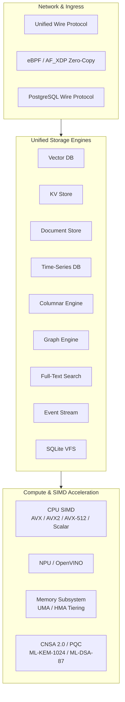

<p align="center">
  
</p>
<div align="center">

# QIHSE

### Quantum-Inspired Hilbert Space Expansion Database Engine

[](LICENSE)       

</div>

---

## Overview

**QIHSE** is a high-performance multi-model database engine written in native C99. It combines eight specialized storage engines under a single memory hierarchy and unified zero-copy wire protocol (UWP), avoiding the operational latency of microservice-based database stacks.

The engine includes native vector search, an LSM-tree key-value store, a JIT-compiled document engine, Gorilla-compressed time-series telemetry, AVX-accelerated columnar OLAP, multi-hop graph traversal, BM25 full-text search, append-only event streams, and a native SQLite VFS backend.

---

## Storage Engines & Subsystems

| Subsystem | Primary Engine | Access Method | Key Features |
|---|---|---|---|
| **Vector DB** | `qihse_vector_db_*` | UWP (`0x02`) / C / Python / Rust | Exact `float32` reranking, trinary (`qtri`/`qmag`) filtering, multi-precision quantization (`FP16`, `FP8`, `INT8`, `INT4`), HNSW indexing |
| **Key-Value Store** | `qihse_kv_*` | UWP (`0x01`) / C / Python / Rust | $O(k)$ Trinary Trie in-memory index with LSM-tree memtables and SSTable persistence |
| **Document Store** | `qihse_document_*` | UWP (`0x03`) / C / Python | JSON documents with JIT-compiled query path evaluation |
| **Time-Series DB** | `qihse_timeseries_*` | UWP (`0x05`) / C / Python | Lock-free ingress buffers with Gorilla XOR delta-of-delta bit-packing |
| **Columnar Engine** | `qihse_column_*` | UWP (`0x04`) / C | Vectorized OLAP scans, strided OS page alignment, RLE / dictionary encoding |
| **Graph Engine** | `qihse_graph_*` | UWP (`0x06`) / C | Dual Anchor + HNSW multi-hop relationship resolution |
| **Full-Text Search** | `qihse_fts_*` | Native C API | Zero-copy lexical tokenization with native BM25 relevance scoring |
| **Event Stream** | `qihse_event_*` | UWP (`0x07`) / C | DMA append-only log via Linux `mmap` / `sendfile` with SHA-384 frame deduplication |
| **SQLite VFS** | `qihse_sqlite_vfs` | `file:db.db?vfs=qihse` | Drop-in SQLite storage replacement backed by Black Hole KV cache and Marmalade Event Stream |

---

## Architecture



---

## Hardware Dispatch & Portability

QIHSE runs on any standard Linux x86_64 host or virtualized container. At initialization, runtime CPUID capability detection routes execution to the fastest available instruction set:

- **AVX-512 / VNNI / AMX**: Maximum vector throughput on modern server hardware.
- **AVX2 / FMA**: High-throughput 256-bit SIMD math.
- **AVX1 / SSE4.2**: Backward compatibility for older multi-core x86_64 CPUs.
- **Scalar Fallback**: Guaranteed bit-exact execution on non-AVX architectures.

---

## SQLite VFS Integration

QIHSE provides a fully compliant C SQLite Virtual File System (`sqlite3_vfs`). It allows existing applications using SQLite to transparently route database pages and WAL frames through QIHSE's high-speed KV store and append-only event stream:

### Usage in C
```c
#include "persistence/qihse_sqlite_vfs.h"

// Register the VFS
qihse_vfs_register(0);

// Open database via URI
sqlite3* db;
sqlite3_open_v2("file:data.db?vfs=qihse", &db,
                SQLITE_OPEN_READWRITE | SQLITE_OPEN_CREATE | SQLITE_OPEN_URI,
                NULL);
```

### Usage in Python
```python
import sqlite3
from pathlib import Path

# Dynamically load the QIHSE VFS extension into SQLite
dummy = sqlite3.connect(":memory:")
dummy.enable_load_extension(True)
dummy.load_extension("/path/to/qihse_vfs")

# All operations on this connection use QIHSE storage
conn = sqlite3.connect("file:app.db?vfs=qihse", uri=True)
```

---

## Quick Start

### Prerequisites
```bash
# Ubuntu / Debian
sudo apt install build-essential libssl-dev libnuma-dev libbpf-dev \
                 libxdp-dev liburing-dev libsqlite3-dev \
                 luajit libluajit-5.1-dev libpython3-dev python3-dev
```

### Build & Test
```bash
# Build libqihse.so and the SQLite VFS extension
make clean && make lib qihse_vfs.so

# Run the native test suite
make test

# Run the SQLite VFS integration test
make test-sqlite-vfs && ./test-sqlite-vfs
```

### Command-Line Launcher
```bash
./qihse status
./qihse build
./qihse test
./qihse db --help
./qihse python
```

---

## Code Examples

### Vector Search in C
```c
#include <qihse_vector_db.h>
#include <stdio.h>

int main() {
    qihse_vector_db_t* db = qihse_vector_db_create(
        QIHSE_VECTOR_DB_AUTO, NULL, "/tmp/qihse_demo");
    if (!db) return 1;

    float vector[128] = {0};
    uint64_t id = 1;
    qihse_vector_db_add_vectors(db, vector, 1, 128, &id, NULL, NULL);

    qihse_vector_query_t q = {
        .query_vector = vector,
        .vector_dims = 128,
        .top_k = 10,
        .query_mode = QIHSE_VDB_QUERY_FLOAT32,
        .distance_metric = QIHSE_DISTANCE_COSINE
    };
    qihse_vector_result_t results[10];
    qihse_vector_db_search(db, &q, results, 10);

    qihse_vector_db_close(db);
    return 0;
}
```

### Key-Value Store in Rust
```rust
use qihse_rs::KVStore;

fn main() {
    let kv = KVStore::new().unwrap();
    kv.set("session:1042", "authenticated", 0, 0);
    assert_eq!(kv.get("session:1042"), Some("authenticated".into()));
}
```

---

## Documentation

Detailed technical documentation and subsystem guides are located in the [`docs/`](docs/) directory:

- **[System Architecture](docs/architecture/system_overview.md)**: Deep dive into all 8 storage engines and memory models.
- **[SQLite VFS Implementation Plan](docs/qihse_sqlite_vfs_plan.md)**: Native VFS design, page caching, and crash recovery.
- **[API Reference](docs/api/)**: C API specifications for all engine surfaces.
- **[Python SDK Guide](sdks/python/)**: Native CPython binding reference and usage examples.
- **[Rust FFI SDK](rust/qihse-rs/)**: Safe Rust wrapper reference.
- **[Security Architecture](docs/security/README.md)**: Cell-level clearance, constant-time filtering, and CNSA 2.0 PQC cryptography.
- **[Security Hardening Report](docs/security/hardening-report.md)**: Security audit results, bounded I/O mitigations, and syscall analysis.

---

## License

QIHSE is licensed under the **AGPL-3.0 License**. See [LICENSE](LICENSE) for details.
