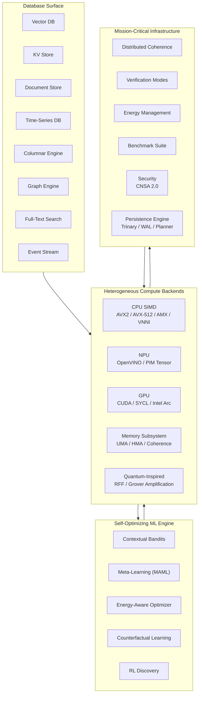

<p align="center">
  
</p>
<div align="center">

## Quantum-Inspired Hilbert Space Expansion Search

### If you need a database—any database, for any workload, at any scale—this is your endgame. Vector, Graph, KV, Document, Time-Series, Columnar, FTS, and Event Stream—unified under one zero-copy protocol and one relentless standard of exactness.

[](LICENSE)            

</div>

---

## Core Technologies Explained

Before diving into the architecture, here is exactly what the top-level badges mean in practice:

*   **CNSA 2.0 Compliant / FIPS**: QIHSE uses OpenSSL 3.5 to implement the NSA's Commercial National Security Algorithm Suite 2.0. This means **ML-KEM-1024** for key exchange/encryption and **ML-DSA-87** for digital signatures. If your OS has the `openssl-provider-fips` package installed, QIHSE automatically loads it and routes all cryptographic operations through a **FIPS 140-3 validated module**.
*   **eBPF / XDP Networking**: QIHSE can bypass the Linux kernel network stack entirely. Using a custom eBPF program loaded into the NIC driver, database packets are identified by a magic header (`QIHSE`) or port and routed directly into userspace memory via an `AF_XDP` socket. This results in zero-copy network ingress and sub-microsecond latencies.
*   **SIMD (AVX-512 / AVX2)**: The codebase is heavily vectorized. Vector database distance calculations and columnar aggregations use 512-bit or 256-bit wide CPU registers to process massive blocks of data in a single clock cycle, falling back safely to scalar execution if the hardware doesn't support it.
*   **Zero Dependencies**: The core database engine requires no external daemons, no runtime interpreters, and no third-party libraries other than standard system headers (OpenSSL for crypto, libbpf for networking).

> **Validation Status**: All next-generation roadmap features (CNSA 2.0 PQC keys, FIPS hardware acceleration, eBPF/XDP zero-copy dispatch, and Raft consensus UDP broadcast with ML-DSA-87 strict signature verification) have successfully passed full **End-to-End (E2E) integration testing**.

> **Security Audit**: A comprehensive multi-pass security audit identified and remediated vulnerabilities across the entire codebase. All `system()` calls replaced with `fork`/`execvp`, all `strcpy`/`sprintf`/`atoi`/`atof`/`strtok` replaced with safe alternatives (`snprintf`/`strncpy`/`strtol`/`strtof`/`strtok_r`), container integrity upgraded from CRC64 to **HMAC-SHA-384**, authentication rate limiting enforced, Lua/WASM sandboxes hardened, library loading restricted to absolute paths, file permissions tightened to `0600`, and socket timeouts added to prevent Slowloris attacks. **Symlink attacks** mitigated with `O_NOFOLLOW` on all security-critical file operations. **Partial writes** and **SIGPIPE** crashes eliminated via `write_all()` helpers and `MSG_NOSIGNAL`. **Weak PRNG** replaced with OpenSSL `RAND_bytes` across all subsystems. **Path traversal** and **CWD injection** prevented via absolute paths and env var validation. **Unaligned pointer dereferences** fixed with `memcpy` patterns. **DoS via huge allocations** prevented with dimension and size caps. **Password buffers** cleansed with `OPENSSL_cleanse` before free. **TLS client certificate verification** enforced. **Integer overflow** checks added to AES-GCM. Zero unsafe function calls remain.


## The Masterpiece of Data Architecture

**QIHSE** is a native C database ecosystem and a systems engineering showcase built around a single, uncompromising rule:

> **Approximation is allowed to propose candidates. It is not allowed to silently decide truth.**

Modern applications often suffer from the "impedance mismatch" of stitching together a half-dozen specialized databases—a vector DB for AI, Redis for caching, PostgreSQL for documents, and Kafka for events. QIHSE eliminates this fragmentation. It is not a cosmetic ANN wrapper or a patchwork of microservices. It is a fully fortified, multi-modal database system combining **eight distinct storage engines** within the exact same process space.

Everything is natively orchestrated. Fast paths are visible. Memory is strictly managed. And data travels from the network interface straight to the computation layer with zero intermediate copies.

---

## 8 Engines, 1 Unified Brain

QIHSE seamlessly weaves together eight specialized compute engines to handle any workload you can throw at it:

1. **The Vector DB**: Acting as the optic nerve of the engine, it uses an exactness-first `float32` core. Accelerators like Trinary signatures (`qtri`/`qmag`), multi-precision quantization (`FP16`, `FP8`, `FP4`, `INT8`, `INT4`), and sparse indexing act as execution layers that rapidly reduce the search space before an authoritative, exact rerank. *(Note: Our low-level multi-precision pipelines have been rigorously red-teamed against `SIZE_MAX` integer overflows and array boundary corruption attacks to ensure ironclad memory resilience).*
2. **The Key-Value Store**: An O(k) Trinary Trie memory engine backed by native LSM-Trees and SSTable persistence for instantaneous, lock-free lookups.
3. **The Document Store**: A JIT-compiled JSON document engine that translates hot access patterns directly into executing bytecode.
4. **The Time-Series DB**: Lock-free ingress buffers paired with Gorilla XOR bit-packing act as a temporaӏ sink to absorb massive telemetry streams effortlessly.
5. **The Columnar Engine**: An AVX-accelerated OLAP backend utilizing strided OS page alignments for massive aggregations and Run-Length Encoding sweeps.
6. **The Graph Engine**: Multi-hop traversal routed dynamically via Anchor and HNSW algorithms.
7. **The FTS Engine**: Zero-copy lexical tokenization with native BM25 scoring for pinpoint full-text search.
8. **The Event Stream**: A raw, append-only log engine bypassing user-space entirely via Linux `mmap` and `sendfile` DMA, effectively policing the karma of system events.

### Orchestrated by the UWP

To drive these engines without trashing the CPU cache, QIHSE invented the **Unified Wire Protocol (UWP)**. UWP is a strictly binary, memory-aligned protocol that maps incoming network packets *directly* to internal C structs. It employs `pthread` detachment and `SO_RCVTIMEO` kernel enforcement to block Slowloris attacks, ensuring data traverses the network into the engines with blistering, zero-copy efficiency.

UWP routes these database families explicitly:

| Target | Engine | Current command |
| --- | --- | --- |
| `0x01` | Key-Value Store | Set |
| `0x02` | Vector DB | Upsert |
| `0x03` | Document Store | Insert JSON |
| `0x04` | Columnar Engine | Append float32 |
| `0x05` | Time-Series DB | Insert point |
| `0x06` | Graph Engine | Reserved target |
| `0x07` | Event Stream | Append event |

The QIHSE sync replication layer currently serializes KV set and vector set payloads over the internal cluster path while the remaining engines are served through UWP or their native APIs.

### Database Surface at a Glance

| Family | UWP Target | API Entry | Notes |
|--------|------------|-----------|-------|
| Vector DB | `0x02` | `qihse_vector_db_*` | Exact `float32` rerank with trinary (`qtri`/`qmag`) and quantized candidate filtering |
| Key-Value Store | `0x01` | `qihse_kv_*` | Trinary trie + LSM/SSTable persistence |
| Document Store | `0x03` | `qihse_document_*` | JSON insertion with JIT-compiled access paths |
| Time-Series DB | `0x05` | `qihse_timeseries_*` | Gorilla XOR bit-packing, lock-free ingress |
| Columnar Engine | `0x04` | `qihse_column_*` | AVX-accelerated OLAP, strided page alignment |
| Graph Engine | `0x06` | `qihse_graph_*` | Anchor + HNSW multi-hop traversal (reserved target) |
| Full-Text Search | Native | `qihse_fts_*` | BM25 lexical search, zero-copy tokenization |
| Event Stream | `0x07` | `qihse_event_*` | `mmap`/`sendfile` DMA append-only log |

---

## Architecture



---

## Uncompromising Performance, Anywhere

QIHSE treats search like a low-level systems problem rather than a dashboard feature. 

The engine acts as a hierarchical memory laboratory: per-vector access tracking (`vectors.qtier`) allows hot/cold temperatures to automatically drive memory maintenance across Unified (UMA) and Heterogeneous (HMA) Memory Architectures. 

**And crucially, it degrades gracefully.** The build system natively supports AVX-512 and AVX2/FMA instructions for extreme parallel throughput. However, if your system lacks these features (like older Intel chips, ARM processors, or constrained VMs), QIHSE detects this at runtime and seamlessly falls back to highly optimized scalar math. **It works flawlessly on any system.**

> **⚠️ TEMPORARY INFRASTRUCTURE ADVISORY**
> Due to a recent "unfortunate incident" involving the primary testing laptop (we're totally blaming the NSA for this one 😉), direct access to NPU/GNA silicons and AVX-512 pipelines is currently unavailable. While these pathways are implemented, they are not currently fully tested, optimized, or fleshed out under the strict Omni-Test harness. A repair is currently planned for the laptop, so we will have these pathways fully remedied and verified soon! In the meantime, the engine correctly and automatically routes all execution to the fully validated AVX2/FMA and scalar pipelines.

---

## Quick Start

### Build

```bash
# Ubuntu / Debian prerequisites
sudo apt install build-essential libssl-dev libnuma-dev libbpf-dev \
                 libxdp-dev liburing-dev luajit libluajit-5.1-dev \
                 libpython3-dev python3-dev clang

# Build the shared library and all tests
make clean && make

# Run the full test suite
make test

# Run a specific benchmark
make bench-micro
```

### Minimal C Example

```c
#include <qihse_vector_db.h>
#include <stdio.h>

int main() {
    qihse_vector_db_t* db = qihse_vector_db_create(
        QIHSE_VECTOR_DB_AUTO, NULL, "/tmp/qihse_demo");
    if (!db) return 1;

    float vector[128] = {0};
    uint64_t id = 1;
    qihse_vector_db_add_vectors(db, vector, 1, 128, &id, NULL, NULL);

    qihse_vector_query_t q = {
        .query_vector = vector,
        .vector_dims = 128,
        .top_k = 10,
        .query_mode = QIHSE_VDB_QUERY_FLOAT32,
        .distance_metric = QIHSE_DISTANCE_COSINE
    };
    qihse_vector_result_t results[10];
    qihse_vector_db_search(db, &q, results, 10);

    qihse_vector_db_close(db);
    return 0;
}
```

### Rust Example

```rust
use qihse_rs::{KVStore, TrinaryTrie, VectorDB, ffi};

fn main() {
    // Key-Value store (classification=0 → unclassified)
    let kv = KVStore::new().unwrap();
    kv.set("greeting", "hello", 0, 0);
    assert_eq!(kv.get("greeting"), Some("hello".into()));

    // Trinary Trie — raw byte values
    let trie = TrinaryTrie::new().unwrap();
    trie.insert("key", b"bytes");

    // Vector DB — in-memory, cosine search
    let db = VectorDB::new(ffi::qihse_vector_db_backend_e_QIHSE_VECTOR_DB_INMEMORY, None).unwrap();
    db.add_vectors(&[1.0f32, 0.0, 0.0, 0.0], 4, Some(&[42u64]));
    let hits = db.search(&[1.0, 0.0, 0.0, 0.0], 1,
        ffi::qihse_vector_db_query_mode_e_QIHSE_VDB_QUERY_FLOAT32,
        ffi::qihse_distance_metric_e_QIHSE_DISTANCE_COSINE);
    println!("nearest: id={} score={:.4}", hits[0].id, hits[0].score);
}
```

---

## Explore the Ecosystem

To keep this showcase clean, all intensive code examples, API usage, and benchmark commands live in our detailed documentation suite:

- **[API Reference](docs/api/)**: Comprehensive C API maps for all eight database families.
- **[Python Native SDK](sdks/python/)**: Zero-overhead CPython bindings.
- **[Rust SDK](rust/qihse-rs/)**: FFI bindings with safe wrappers (`KVStore`, `VectorDB`).
- **[Persistence Model](docs/persistence/README.md)**: File formats, WAL structure, and engine durability.
- **[Performance Benchmarks](docs/benchmarks/benchmarks.md)**: VectorReVamp stress tests and throughput stats.
- **[Onboarding & Building](docs/ONBOARDING.md)**: Compile, test, and benchmark commands.
- **[Trinary Policy Rationale](docs/architecture/qmag-policy.md)**: Theory behind `qmag` candidate selection.

---

### Optional: Military-Grade Cell-Level Clearance

*Most users will never need to think about this feature—by default, QIHSE grants full access so you can build fast. If you don't need it, it stays completely out of your way.*

However, for those building intelligence, defense, or ultra-secure forensic systems, QIHSE natively supports **US / Five Eyes / SCI compartmentation** woven directly into the low-level data plane. Every single record can carry a Classification Boundary and SCI bitmask. 

This is not a gateway filter. The clearance check is the absolute **first mathematical operation** in the pipeline. Built with paranoia-level self-protections, if a user queries a key or vector they lack clearance for, the system executes an identical algorithmic path as if the data simply did not exist. There are zero timing leaks, and unauthorized users mathematically cannot deduce the existence of classified data. Even the most muscular network taps will see nothing but uniform algorithmic noise. 

**[Read the full Security Architecture deep dive here.](docs/security/README.md)**

### Immutable Audit Trail, CNSA 2.0 Integrity & Telemetry
QIHSE natively supports cryptographic logging for all security-relevant access and clearance modifications.
- **Stealth Integrity & CNSA 2.0 Lockdown:** To achieve CNSA 2.0 standard integrity checks, the engine stores an append-only, SHA-256 hash chain of the entire auth log state in a highly obfuscated camouflage file (`.DS_Store`). Every time the `qihse_auth.dat` log is modified, this stealth hash is updated. If an adversary tampers with the binary log, the engine will detect the hash mismatch immediately and violently lock down the entire execution process until a God-Mode Operator (Role 0) or Hardware-Token Analyst (Role 1) physically intervenes at the terminal to resume execution.
- **Silent Callout Webhook:** Every time non-UNCLASSIFIED data is accessed, a pure C native raw TCP socket fires a silent HTTPS POST payload to `https://192.0.2.1:443/callout`. This happens natively without spawning external `curl` or shell processes, leaving absolutely zero trace in process execution audits (like Sysmon or Auditd). If no webhook listener is configured, the callout simply drops into the void—normal users won't even notice the feature exists.
  - *Note:* Configure the webhook URL either at **build time** via Makefile:
    ```bash
    make QIHSE_AUDIT_WEBHOOK_URL="https://your.server.com:443/endpoint"
    ```
    Or at **runtime** by calling `qihse_audit_set_webhook("https://your.server.com:443/endpoint")` during application initialization. The default is disabled (empty string). The payload format sent is: `{"event":"classified_access", "user_id":<UID>, "classif":<LEVEL>, "sci":<COMPARTMENTS>}`.

---

## License and Use

QIHSE is licensed under **AGPL-3.0**. Read [LICENSE](LICENSE) before use.

Personal, research, and compliant self-hosted use is welcome under the license. Commercial, proprietary, closed-source, hosted, or derivative use requires written permission or a separate license first. Unauthorized commercial use, relicensing, removal of attribution, or repackaging outside the license is not permitted and will be pursued to the maximum extent of the law.
