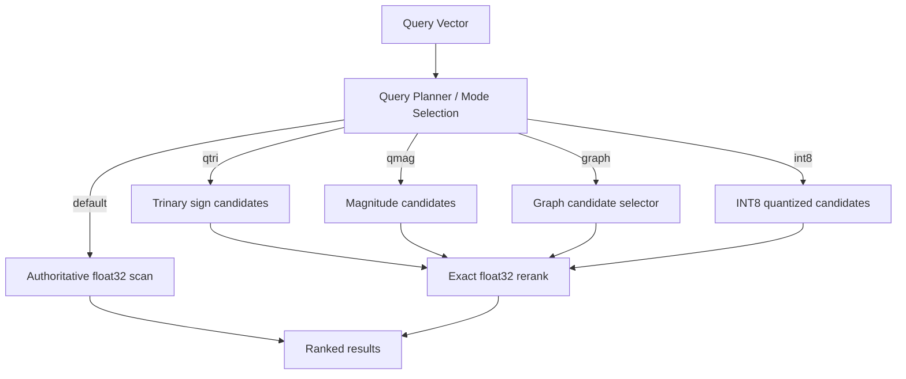

  

## Quantum-Inspired Hilbert Space Expansion Search

### The only database ecosystem you will ever need. Vector, Graph, KV, Document, Time-Series, Columnar, FTS, and Event Stream—unified under one zero-copy protocol and one relentless standard of exactness.

)

---

## What is QIHSE?

**QIHSE** is a native C database ecosystem and systems engineering showcase built around a single, uncompromising rule:

> **Approximation is allowed to propose candidates. It is not allowed to silently decide truth.**

Originally conceived as an exactness-first vector search engine, QIHSE has evolved into a fully fortified, multi-modal database system. It combines eight distinct storage engines under a unified memory and network architecture, designed for forensic retrieval, security search, and high-performance mission-critical workloads. 

This is not a cosmetic ANN wrapper. It is a systems-level architecture where fast paths are visible, memory is strictly managed, and security is natively embedded into the data plane.

---

## The Multi-Modal Ecosystem

QIHSE avoids the impedance mismatch of stitching together multiple databases by implementing 8 discrete, specialized compute engines within the same process space.

1. **Vector DB**: The exactness-first `float32` core. Accelerators like Trinary signatures (`qtri`/`qmag`), INT8 quantization, and sparse indexing are explicit execution layers that reduce candidate pressure before exact reranking.
2. **Key-Value Store**: An O(k) Trinary Trie memory engine backed by native LSM-Trees and SSTable persistence for instantaneous, lock-free lookups.
3. **Columnar OLAP**: An AVX-512 accelerated columnar engine utilizing strided OS page alignments to perform massive aggregations and Run-Length Encoding (RLE) sweeps.
4. **Time-Series DB**: Lock-free ingress buffers paired with Gorilla XOR bit-packing for massive temporal data ingestion and sliding-window aggregations.
5. **JIT Document Store**: A Hot/Cold tiered JSON document engine that compiles access patterns directly into JIT bytecode.
6. **Full-Text Search (FTS)**: Zero-copy lexical tokenization with native BM25 scoring.
7. **Graph DB**: Multi-hop traversal via Anchor/HNSW routing algorithms.
8. **Event Stream**: A zero-copy append-only log engine utilizing native Linux `mmap` and `sendfile` DMA.

### Orchestrated by the Unified Wire Protocol (UWP)

To drive these eight engines over the network without trashing the CPU cache, QIHSE utilizes the **Unified Wire Protocol (UWP)**. 

UWP is a strictly binary, memory-aligned protocol that maps network packets directly to internal struct definitions. It employs `pthread` detachment, `SO_RCVTIMEO` kernel enforcement to block Slowloris attacks, and strict 64-bit boundaries to prevent overflow exploits. Data traverses from the NIC to the storage engines with zero intermediate copies.

---

## System-Wide Cell-Level Authorization

Security in QIHSE is not an afterthought handled by an API gateway. It is woven fundamentally into the low-level data layer, mirroring **US / Five Eyes / SCI** operational requirements.

Every single record across all 8 storage engines natively carries:
- A mandatory **Classification Boundary** (e.g., `UNCLASSIFIED`, `SECRET`, `TOP_SECRET`)
- An **SCI Compartment Bitmask**

Operations dynamically filter and mask records based on the querying `qihse_user_t`'s clearance level *before* any aggregations, distance calculations, or graph traversals are executed. If a user does not have the clearance for a time-series data point or a vector embedding, it mathematically ceases to exist in their execution pipeline.

By default, the system gracefully falls back to granting full access if no authentication context is provided, ensuring seamless out-of-the-box evaluation.

---

## Core Vector Search Philosophy

Most vector systems optimize for speed first and explain recall loss later. QIHSE treats vector search like a systems problem rather than a dashboard feature.

The normal accelerated paths do **not** replace exact scoring. They reduce the search space, then hand the shortlist back to the exact scorer. QIHSE exposes its durability operations (WAL, snapshots, manifests, sidecars) as inspectable artifacts, giving you total visibility into the retrieval lifecycle.

---

## Performance & Hardware Awareness

The build system supports native C compilation, AVX2/AVX-512 paths, CPU distance backends, and experimental hooks for NPU/GPU-oriented work. **Crucially, QIHSE degrades gracefully:** if your system lacks AVX2, AVX-512, or FMA instructions (e.g., older Intel chips, ARM processors, or resource-constrained VMs), the engine automatically detects this at runtime and falls back to highly optimized scalar math. It runs everywhere.

QIHSE acts as a hierarchical memory laboratory: per-vector access tracking and tier metadata (`vectors.qtier`) allow hot/cold vector temperature to drive memory maintenance and placement behavior across Unified Memory Architecture (UMA) and Heterogeneous Memory Architecture (HMA) environments.

Representative `qmag` benchmark sweeps reveal candidate-pruning wins with a **95% CI pass-level win rate of 0.81**, while preserving exact search as the validation anchor.

---

## Documentation Showcase

We have moved all intensive code examples, API usage, and benchmark commands out of the main README to keep it focused. Explore the ecosystem through our detailed documentation suite:

- **[API Reference](docs/api/README.md)**: Comprehensive C API maps for Vector DB, UWP, KV Store, and Document components.
- **[Security Architecture](docs/security/README.md)**: Deep dive into the Cell-Level Authorization system, CNSA 2.0 compliance, and key management.
- **[Persistence Model](docs/persistence/README.md)**: File formats, WAL structure, and engine durability.
- **[Onboarding & Building](docs/ONBOARDING.md)**: Instructions for compiling, running test suites, and executing benchmark harnesses (`make test-persist`, `make bench-micro`, etc.).
- **[Trinary Policy Rationale](docs/qmag-policy.md)**: The theory behind `qmag` candidate selection.

### Optional: Military-Grade Clearances
Most users will never need to think about QIHSE's security layer—by default, the database grants full access so you can build fast. However, if your use case requires it, QIHSE natively supports US / Five Eyes / SCI compartmentation down to the cell level. **If you need it, it's there. If you don't, it stays out of your way.** Read more in the [Security Architecture](docs/security/README.md) documentation.

---

## License and Use

QIHSE is licensed under **AGPL-3.0**. Read [LICENSE](LICENSE) before use.

Personal, research, and compliant self-hosted use is welcome under the license. Commercial, proprietary, closed-source, hosted, or derivative use requires written permission or a separate license first. Unauthorized commercial use, relicensing, removal of attribution, or repackaging outside the license is not permitted and will be pursued to the maximum extent of the law.
