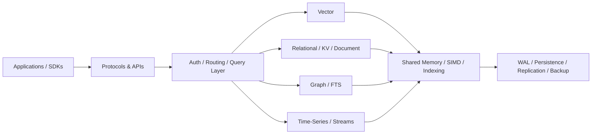

<p align="center">
  
</p>

<div align="center">

# QIHSE

### Quantum-Inspired Hilbert Space Expansion Search

**A native-C, multi-model database runtime for vector, relational, graph, key-value, document, time-series, full-text, and event-stream workloads.**

[](LICENSE)


-yellow?logo=shield)

[Getting Started](docs/GETTING_STARTED.md) · [Features](docs/FEATURES.md) · [Compatibility](docs/COMPATIBILITY.md) · [Architecture](docs/architecture/) · [Benchmarks](docs/benchmarks/) · [Security](docs/security/)

</div>

---

> **Status: partial.** QIHSE is a large systems project with production-oriented
> components: some subsystems are implemented and test-verified, others are
> experimental, partial, or planned. Each document in the documentation tree
> states its own status; the vocabulary and its rules are defined in
> [docs/README.md](docs/README.md#documentation-status-labels), and the API
> surface is catalogued in [docs/API_REFERENCE.md](docs/API_REFERENCE.md).

## What is QIHSE?

QIHSE is an attempt to solve a common infrastructure problem: one application increasingly needs several different kinds of database at once.

A modern stack may use one system for vectors, another for relational data, another for caching, another for graph traversal, another for analytics, and another for event streams. Each additional service adds its own protocol, persistence model, operational tooling, security boundary, and failure modes.

QIHSE takes the opposite approach. It implements multiple data models inside one native runtime and shares the low-level pieces between them: memory management, persistence, indexing, query execution, networking, authentication, observability, and hardware acceleration.

> **Approximations hunt the targets. Exact math dictates the truth.**

For vector search, that means approximate structures can narrow the candidate set while exact computation remains available for final ranking and verification.

Despite the name, QIHSE runs on conventional hardware. Its "quantum-inspired" components are algorithmic techniques, not a requirement for quantum computing hardware.

---

## What does it contain?

The core database surface is intentionally broad, but **QIHSE is modular rather than all-or-nothing**. Applications can use one engine, protocol surface, SDK, index, or hardware backend without enabling the entire runtime. Heterogeneous acceleration, clustering, UWP networking, self-optimization, and additional compatibility layers are optional capabilities rather than prerequisites.

| Data model | What QIHSE provides |
|---|---|
| **Vector** | HNSW and trinary candidate filtering with exact `float32` reranking |
| **Key-value** | Trinary trie with LSM/SSTable persistence |
| **Document** | Native JSON/document storage and query paths |
| **Time-series** | Lock-free ingestion with compressed time-series storage |
| **Columnar** | SIMD-oriented analytical scans and column storage |
| **Graph** | Native graph storage, Cypher execution, graph algorithms, graph+vector search |
| **Full-text** | Native lexical indexing and BM25 scoring |
| **Event stream** | Append-oriented event/log storage |

On top of those engines, QIHSE also contains:

- a relational SQL layer with joins, aggregation, indexes, transactions, MVCC, WAL, and recovery;
- replication, backup/restore, connection pooling, CDC, metrics, and tracing;
- PostgreSQL, Redis, MongoDB, Neo4j/Bolt, Elasticsearch-style, ClickHouse-style, and InfluxDB-style compatibility layers;
- Python, Rust, and C SDKs;
- a task queue and scheduler;
- a SQLite VFS integration path;
- hardware-aware scalar/SIMD execution paths and optional AF_XDP/eBPF networking.

The detailed subsystem inventory lives in **[docs/FEATURES.md](docs/FEATURES.md)**. Protocol and client compatibility is documented separately in **[docs/COMPATIBILITY.md](docs/COMPATIBILITY.md)**.

---

## How the pieces fit together


```mermaid
flowchart LR
    A[Applications / SDKs] --> B[Protocols & APIs]
    B --> C[Auth / Routing / Query Layer]
    C --> D[Vector]
    C --> E[Relational / KV / Document]
    C --> F[Graph / FTS]
    C --> G[Time-Series / Streams]
    D --> H[Shared Memory / SIMD / Indexing]
    E --> H
    F --> H
    G --> H
    H --> I[WAL / Persistence / Replication / Backup]
```

The important part is the shared runtime. The individual engines are not intended to behave like unrelated services merely placed in the same repository.

For implementation detail, start with the **[architecture documentation](docs/architecture/)** or the current **[technical whitepaper](docs/architecture/qihse_whitepaper_v1.1.md)**.

---

## Quickstart (BUILD / TEST / RUN)

QIHSE targets Linux and has a unified launcher for the common development
workflows. The commands below were verified on this branch; the full
operational detail (flags, ports, env vars, known flakes) lives in
**[docs/OPERATIONS.md](docs/OPERATIONS.md)**.

**BUILD**

```bash
./qihse dev-setup   # toolchain check (gcc, make, python3)
./qihse build       # liboqs + oqs-provider + libqihse.so + tools
./qihse status      # confirm the library built and loads
./qihse isa-info    # show detected CPU execution paths
```

**TEST**

```bash
make test           # full sequential aggregate, ends with the gold suite
make test-gold      # the versioned workload pack alone (GOLD_STRICT=1 = strict)
```

`make test` takes roughly 40–50 minutes. Run one aggregate at a time — several
targets share scratch state at the repository root. Fast individually
verified targets include `make test-sql-dml-exec`, `make test-bolt`,
`make test-controller-sdk-py`, and `make test-pqc-handshake`. Current known
red: the gold suite fails one workload (`controller-api`, a stale
lease-renew expectation — see
[OPERATIONS.md §2.4](docs/OPERATIONS.md#24-the-gold-validation-suite)), which
also ends `make test` non-zero.

**RUN** — a single cluster node on loopback (RESP + cluster bus):

```bash
make cluster-daemon
./qihse-cluster-daemon \
    --index 0 --bind 127.0.0.1 --port 7100 --bus-port 17100 \
    --node 0:127.0.0.1:7100:17100 --slot-range 0-16383 \
    --operator-password 'change-me-12+chars' --dir ./build/node0
# then, in another shell: AUTH / SET / GET / FTS.BUILD / FTS.SEARCH over RESP
```

A standalone RESP server is `make redis-server` (`qihse-redis-server`,
`--help` for flags — with `--require-auth` the credential comes from
`QIHSE_OPERATOR_PASSWORD`). Other verified entry points:

```bash
./qihse db --help      # vector-DB CLI (create/insert/build-graph/search/stats)
./qihse keygen [dir]   # ML-KEM-1024 + ML-DSA-87 key pairs
```

`./qihse bench` wraps the reference-benchmark workflow (not verified here —
it clones external paper corpora; see
[benchmarks documentation](docs/benchmarks/benchmarks.md)).

Known launcher breakage: `./qihse demo` currently fails (module mismatch);
see [OPERATIONS.md §6](docs/OPERATIONS.md#6-known-issues-and-workarounds).

See **[Getting Started](docs/GETTING_STARTED.md)** for build dependencies, SDK usage, benchmark entry points, and links into the subsystem documentation.

---

## Python example

The Python bindings expose the native engine without requiring a separate database service for local use. The full Python and C surface is catalogued in the **[API Reference](docs/API_REFERENCE.md)**.

```python
import numpy as np
import qihse

with qihse.VectorDB.create("./build/example-qihse", dims=128) as db:
    vectors = np.random.rand(100, 128).astype(np.float32)
    db.add_vectors(vectors, ids=list(range(100)))
    db.build_graph()   # required for the default GRAPH (HNSW) query mode

    results = db.search(vectors[0], k=10)
    print(results)
```

Run it with `PYTHONPATH=python LD_LIBRARY_PATH=. python3 example.py`; without
`build_graph()`, pass `mode=qihse.QueryMode.FLOAT32` to search exactly without
a graph index.

Python compatibility clients for other database interfaces are under [`sdks/python/`](sdks/python/), and C compatibility clients are under [`sdks/c/`](sdks/c/). The older Rust compatibility SDK lives under [`sdks/rust/`](sdks/rust/) (untested surface); the tested Rust SDK is the federation controller client at [`rust/qihse-rs/`](rust/qihse-rs/) — `cargo test` there runs its suite against a mock controller.

---

## Existing database clients

QIHSE is designed to support both its native interfaces and compatibility paths for existing applications.

Current compatibility work includes:

- **PostgreSQL / pgwire** — relational SQL and extended query flows;
- **Redis / RESP** — common key/value data structures, transactions, pub/sub, and cluster-oriented paths;
- **MongoDB** — BSON, CRUD, query operators, and aggregation paths;
- **Neo4j / Bolt / Cypher** — graph protocol and query compatibility;
- **Elasticsearch-style HTTP** — document/search/aggregation APIs;
- **ClickHouse-style HTTP** — analytical query and ingestion interfaces;
- **InfluxDB-style HTTP** — line protocol and InfluxQL-oriented paths;
- **PgBouncer-style pooling** — session, transaction, and statement pooling modes.

Compatibility is not the same thing as claiming every upstream edge case is identical. Validate the commands, transaction semantics, error behavior, and failure modes your application actually depends on.

See **[Protocol and Client Compatibility](docs/COMPATIBILITY.md)** for the supported surface.

---

## Performance model

QIHSE treats performance as a systems problem rather than only an indexing problem.

The codebase combines:

- candidate-reduction structures with exact verification;
- CPU feature detection and multiple execution paths;
- SIMD-accelerated vector and analytical kernels where supported;
- topology-aware memory work;
- native persistence and indexing;
- optional kernel-bypass networking paths;
- integrated benchmark and regression tooling.

Benchmark numbers are deliberately kept out of this front page because they are only meaningful with hardware, dataset, compiler, ISA, and workload context.

Measured results, methodology, and comparative experiments are in **[`docs/benchmarks/`](docs/benchmarks/)**, including the **[QIHSE + KEYSTONE integrated benchmark report](docs/benchmarks/keystone_qihse_integrated_benchmarks.md)**.

---

## Security

Security review and hardening are ongoing parts of QIHSE development.

An internal UWP review in **August 2026** identified security issues across authentication, access control, transport, and protocol handling, including critical and high-severity findings. The critical and high-severity findings identified in that review were remediated, and regression coverage was added around the affected areas.

Current defaults and reviewed controls include:

- authentication and authorization across all database and wire-protocol paths;
- **certificate-backed TLS 1.3 required by default for the UWP network listener**;
- cleartext and legacy clear transports available only through explicit `QIHSE_UWP_ALLOW_INSECURE=1` opt-in;
- **CNSA 2.0 / FIPS-aligned password-verifier profile using PBKDF2-HMAC-SHA-384** (128-bit random salt, strict 600,000 production iteration floor, and fail-closed FIPS mode);
- **discrete object ACL flags (`READ`, `WRITE`, `ADMIN`)** enforced on all mutation paths;
- **authoritative opaque user security context** with $O(1)$ indexed resolution and reader-writer locking (`pthread_rwlock_t`) preventing caller-side privilege tampering while eliminating thread contention on query reads;
- **high-throughput zero-churn pipelines**: dynamic aggregate rehashing, $O(1)$ set-associative query caching, zero-heap UWP framing fast-paths, and vectorized atomic `writev` WAL appends;
- **post-quantum cryptography built by default** via `liboqs` and `oqs-provider`, with `ML-DSA-87` digital signatures and `ML-KEM-1024` key encapsulation;
- automated security gates including **AddressSanitizer (ASan)**, **UndefinedBehaviorSanitizer (UBSan)**, concurrency stress tests, and fuzzing in CI.

Security reviews apply to specific revisions and configurations. Later commits can change the attack surface, so a review of one revision does not automatically establish the security of every future revision. Security-sensitive deployments should pin and validate the exact commit and configuration they deploy.

Detailed findings, audit history, cryptographic design, remaining limitations, and certification status are maintained in **[docs/security/](docs/security/)** rather than duplicated on the front page.

---

## Repository map

```text
core/                 core runtime, authentication, helpers
algorithms/           search and indexing algorithms
src/                   database engines, protocols, query execution
persistence/           WAL, containers, file formats, SQLite VFS
backends/              CPU/GPU/NPU execution backends
memory/                memory topology and placement
quantization/          vector quantization paths
sdks/                  Python, Rust, and C interfaces
docs/                  architecture, security, benchmarks, deployment, plans
tests/                 unit, integration, regression, stress, and protocol tests
benchmarks/             benchmark programs and workloads
```

For a task-oriented index, use the **[documentation hub](docs/README.md)**.

---

## Documentation

Docs map — every document an operator, developer, or agent needs:

| If you want to… | Start here |
|---|---|
| Build, test, and run every tool (verified commands, flags, ports, env vars, known flakes) | [Operations Manual](docs/OPERATIONS.md) |
| Build and run QIHSE for the first time | [Getting Started](docs/GETTING_STARTED.md) |
| Call the C API, Python SDK, or set configuration | [API Reference](docs/API_REFERENCE.md) |
| Understand the database engines | [Features](docs/FEATURES.md) |
| Integrate an existing DB client | [Compatibility](docs/COMPATIBILITY.md) |
| Understand the overall design | [Architecture](docs/architecture/) |
| Understand SQL/query execution | [SQL Engine](docs/architecture/sql_engine.md) |
| Understand transactions/MVCC | [Transactions & MVCC](docs/architecture/transactions_mvcc.md) |
| Understand graph/Cypher | [Graph Engine](docs/architecture/graph_engine.md) |
| Understand replication/backup | [Replication & Backup](docs/architecture/replication_backup.md) |
| Review protocol hardening | [Security](docs/security/) |
| Reproduce performance tests | [Benchmarks](docs/benchmarks/) |
| Deploy QIHSE | [Deployment](docs/deployment/) (partially stale; it says so itself) |
| Work on the codebase / gold suite design | [Development](docs/development/) |
| Run XDP networking in production | [AF_XDP Operational Guide](docs/manual/deployment/AF_XDP_OPERATIONAL_GUIDE.md) |
| Read the deepest technical treatment | [Technical Whitepaper v1.1](docs/architecture/qihse_whitepaper_v1.1.md) |
| See what is being built and in what order | [Roadmap](ROADMAP.md) |
| Read the federation design of record (landed; residual boundaries documented) | [Federation Upgrade Plan](docs/plans/qihse_federation_upgrade_plan.md) |

The full documentation index is **[`docs/README.md`](docs/README.md)**.

**Session-note files** (historical working notes, kept intact at the repository
root — summarized here so you do not have to read them):

| File | What it is, in one line |
|---|---|
| [FIXES.md](FIXES.md) | 2026-era fix log for the native Python ctypes test failures (stale WAL replay, QDD false positives, reopen bugs) — historical. |
| [LOCAL_FIX_NOTES.md](LOCAL_FIX_NOTES.md) | Handoff note from the `security/keystone-regression-hardening-20260908` branch: CI state and the then-failing Python SDK job. |
| [ZCODE_SESSION_RECOVERY.md](ZCODE_SESSION_RECOVERY.md) | Reconstructed agent-session context (2026-09-17) after the session database was lost — forensic artifact, not project docs. |
| [SESSION_DELIVERY_UPGRADES.md](SESSION_DELIVERY_UPGRADES.md) | Design/landing notes for the session-delivery upgrades U1–U9 (2026-09-11); as-built detail lives in `docs/architecture/session_delivery.md`. |

## Agent quickstart

If you are an AI agent working in this repository, orient in this order:

1. **[AGENTS.md](AGENTS.md)** — non-negotiable invariants: no classified read
   without a security context; no principal creates or modifies a principal
   above itself; every new protocol adapter ships a low-clearance/high-data
   negative test in CI; relative paths only; bounded stack frames in record
   decoders. Code that violates these is wrong even when it passes tests.
2. **This README** — what QIHSE is, the docs map above, and the verified
   BUILD/TEST/RUN quickstart.
3. **[docs/OPERATIONS.md §0](docs/OPERATIONS.md)** — quick index: the
   credentials table (operator username/password rules, demo default) and a
   task → command → credential table for every tool; machine-readable copy
   in [docs/tools.json](docs/tools.json). Start here before running anything.
   The full manual follows in §1–§7 (targets, daemons, smoke drills, known
   flakes).
4. [docs/API_REFERENCE.md](docs/API_REFERENCE.md) §Conventions before calling
   any C function; [ROADMAP.md](ROADMAP.md) and [docs/plans/](docs/plans/)
   are owned by active sessions — do not rewrite their status/checkbox
   semantics.

Practical rules learned the hard way: never run two `make test` aggregates
concurrently; delete stale `build/<prefix>_*` scratch dirs when a teardown
assert trips; `make -f Makefile` bypasses the `GNUmakefile` TLS overlay and
is not the tested configuration.

---

## Project scope

QIHSE is a large, experimental systems project with production-oriented components. Some parts are mature and heavily tested; others are active research or compatibility work.

That distinction matters. A feature being present in the repository does not automatically mean it has the operational maturity, external validation, or edge-case compatibility of the established database it resembles.

For deployment decisions, validate the exact subsystem you intend to use and review its current tests, security state, and documentation.

---

## License

QIHSE is licensed under **AGPL-3.0**. See [LICENSE](LICENSE).
