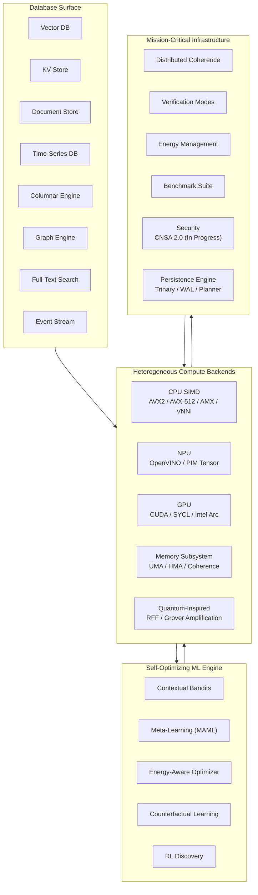

# QIHSE Documentation Hub

This directory contains the complete technical documentation for **QIHSE (Quantum-Inspired Hilbert Space Expansion)** — a native-C, multi-modal database ecosystem combining vector, graph, KV, document, time-series, columnar, full-text, and event-stream engines under one zero-copy protocol.

For project overview, build instructions, and quick-start examples, see the [root README](../README.md).

---

## Architecture

## Database Surface

| Family | UWP Target | API Prefix | Notes |
|--------|------------|------------|-------|
| Vector DB | `0x02` | `qihse_vector_db_*` | Exact `float32` rerank with trinary (`qtri`/`qmag`) and quantized candidate filtering |
| Key-Value Store | `0x01` | `qihse_kv_*` | Trinary trie + LSM/SSTable persistence, bulk load mode, recursive trie iterator (`qihse_trinary_trie_foreach`) |
| Document Store | `0x03` | `qihse_document_*` | JSON insertion with JIT-compiled access paths |
| Time-Series DB | `0x05` | `qihse_timeseries_*` | Gorilla XOR bit-packing, lock-free ingress |
| Columnar Engine | `0x04` | `qihse_column_*` | AVX-accelerated OLAP, strided page alignment |
| Graph Engine | `0x06` / `0x0A` | `qihse_graph_*`, `qihse_cypher_*` | Vertex/edge store, Cypher parser/executor, graph algorithms (BFS, DFS, Dijkstra, A*, PageRank, SCC), graph+vector fusion |
| Full-Text Search | Native | `qihse_fts_*` | BM25 lexical search, zero-copy tokenization |
| Event Stream | `0x07` | `qihse_event_*` | `mmap`/`sendfile` DMA append-only log |
| Bolt Protocol | `0x0A` | `qihse_bolt_*` | Neo4j Bolt 4.x with PackStream serialization |
| Streaming Replication | `0x0D` | `qihse_repl_*` | Primary/replica WAL shipping, replication slots |
| Read Replicas | `0x0D` | `qihse_read_replica_*` | Health-checked pool with round-robin routing |
| Backup & Restore | Native | `qihse_backup_*` | Full/incremental backups with checksums |
| Parallel Query | Native | `qihse_parallel_*` | Multi-worker parallel scan/join/aggregate |
| Connection Pooler | `0x0E` | `qihse_pooler_*` | Session/transaction/statement pooling, 16 SHOW commands, 10 control commands, authentication, statistics |
| CDC | `0x0F` | `qihse_cdc_*` | Change Data Capture — pub/sub event streaming with LSN tracking |
| MongoDB Wire | `0x10` | `qihse_mongo_wire_*` | BSON serialization + MongoDB wire protocol server with CRUD, query operators, aggregation pipeline, admin commands, in-memory catalog |
| HTTP/REST API | `0x11` | `qihse_http_api_*` | HTTP server with route registration, JSON responses |
| ClickHouse HTTP | `0x12` | `qihse_clickhouse_http_*` | ClickHouse-compatible HTTP query interface with MergeTree engines, materialized views, dictionaries, ARRAY JOIN, PREWHERE, SAMPLE, SETTINGS, system tables |
| Elasticsearch API | `0x13` | `qihse_es_api_*` | ES-compatible query DSL, aggregations, mappings, index management, cat API, cluster/nodes, scroll, PIT, scripts, templates |
| InfluxDB API | `0x14` | `qihse_influx_api_*` | InfluxQL parser, line protocol ingestion, HTTP API (/query, /write, /health, /ping) |
| Prometheus Metrics | Native | `qihse_metrics_*` | Counter/gauge/histogram/summary, `/metrics` export |
| OpenTelemetry | Native | `qihse_tracing_*` | Distributed tracing with span management, JSON export |
| Compaction & TTL | Native | `qihse_compaction_*` | Background SSTable compaction, TTL expiration sweeps |
| SQL Extensions | Native | `qihse_sql_extensions_*` | `VECTOR_SEARCH()`, `TIME_BUCKET()`, `MATCH()` table functions, ClickHouse SQL extensions (MergeTree, MV, dictionaries) |

---

## Where to Start

**I want to…** | **Go to…**
---|---
Build and run tests | [Onboarding & Building](ONBOARDING.md)
Persist vectors across restarts | [Persistence Guide](persistence/README.md)
Integrate from Python | [Python SDK](../sdks/python/)
Integrate from Rust | [Rust SDK](../rust/qihse-rs/) — `KVStore`, `TrinaryTrie`, `VectorDB`, `TimeSeriesDB`, `DocumentStore`
Understand trinary/qmag filtering | [QMAG Policy](architecture/qmag-policy.md)
Deploy to production | [Deployment](deployment/)
Review security architecture | [Security](security/README.md)
Run benchmarks | [Benchmarks](benchmarks/benchmarks.md)

---

## Documentation Index

### [📚 API Reference](api/)
Complete C API documentation — function signatures, error codes, data types, and usage patterns for all eight database families.

### [🗄️ Persistence](persistence/)
File formats (`vectors.qtri`, `vectors.qmag`), WAL structure, checkpoint/replay semantics, and exact-query fallback behavior.

### [👥 User Guide](user/)
Prerequisites, configuration options, tuning guidelines, and advanced usage patterns.

### [🛠️ Usage How-Tos](usage/)
Operational runbooks: vector DB mutation flows, memory maintenance loops, benchmark workflows.

### [🏗️ Architecture & Plans](architecture/)
- [Cluster Sharding Engine](architecture/cluster_sharding.md) — Redis-compatible 16,384-slot sharding, UDP gossip bus, Raft failover, RRF scatter-gather
- [PostgreSQL Wire Protocol Sharded Catalogs](architecture/pgwire_sharded_catalogs.md)
- [Automated Zero-Downtime Cluster Rebalancing](architecture/cluster_rebalancing.md)
- [Distributed Multi-Engine Planner](architecture/distributed_query_planner.md)
- [SQL Engine & Query Processing](architecture/sql_engine.md) — Full SQL parser, JOIN/GROUP BY/ORDER BY/subqueries, query executors, cost-based optimizer, schema registry, prepared statements
- [ACID Transactions & MVCC](architecture/transactions_mvcc.md) — Transaction manager, MVCC version chains, unified WAL, crash recovery, 2PC
- [Secondary Indexes](architecture/secondary_indexes.md) — B+ tree, hash index, composite keys, index manager, index scan executor
- [General DB Engine Replacement Roadmap](plans/qihse_general_db_engine_roadmap.md) — 9-phase roadmap to replace PostgreSQL/Redis/MongoDB/ClickHouse/ES/Neo4j/InfluxDB (Phase 9: Database Equivalency Commands COMPLETE)
- [Full PostgreSQL & Neo4j Replacement Plan](plans/qihse_pg_neo4j_full_replacement_plan.md) — UWP 0x08-0x0E, Bolt protocol, Cypher, SDKs
- [Graph Engine & Cypher](architecture/graph_engine.md) — Vertex/edge store, Cypher parser, graph algorithms, vector fusion
- [Replication & Backup](architecture/replication_backup.md) — Streaming replication, read replicas, backup/restore
- [Bolt Protocol](architecture/bolt_protocol.md) — Neo4j Bolt 4.x wire protocol with PackStream
- [Operational & Protocol Layer](architecture/operational_protocols.md) — CDC, MongoDB wire, HTTP/REST, ClickHouse HTTP, ES API, InfluxDB API, metrics, tracing, compaction, SQL extensions, database equivalency commands

- [AF_XDP Kernel-Bypass Operational Guide](manual/deployment/AF_XDP_OPERATIONAL_GUIDE.md)
- [Redis Cluster Sharding Plan](plans/qihse_redis_cluster_sharding_plan.md) — COMPLETE
- [SQLite VFS Implementation Plan](qihse_sqlite_vfs_plan.md)
- [TRITON Lua Injector](architecture/lua_injector.md)
- [QMAG Policy](architecture/qmag-policy.md)
- [Technical Whitepaper](architecture/qihse_whitepaper_v1.0.md)

### [📊 Benchmarks](benchmarks/)
Stress test specifications, regression detection methodology, and enterprise validation procedures.

### [🔒 Security](security/)
CNSA 2.0 alignment (in progress), cryptographic operations, access control, audit logging, and threat mitigation. Transport encryption is not yet implemented.

### [🚀 Deployment & Commercial](deployment/)
Single-node and cluster deployment, cloud guides (AWS, Azure), monitoring, backup/recovery, and commercial analysis.

### [🦀 Rust SDK](../rust/qihse-rs/)
Safe FFI wrappers: `KVStore`, `TrinaryTrie`, `VectorDB`, `TimeSeriesDB`, `DocumentStore`. Build with `make lib && cd rust/qihse-rs && cargo build`.

### [🔧 Development](development/)
Build system details, code standards, testing procedures, and the project finalization plan.
