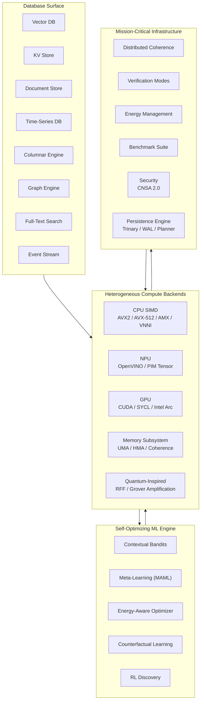

# QIHSE Documentation Hub

This directory contains the complete technical documentation for **QIHSE (Quantum-Inspired Hilbert Space Expansion)** — a native-C, multi-modal database ecosystem combining vector, graph, KV, document, time-series, columnar, full-text, and event-stream engines under one zero-copy protocol.

For project overview, build instructions, and quick-start examples, see the [root README](../README.md).

---

## Architecture

## Database Surface

| Family | UWP Target | API Prefix | Notes |
|--------|------------|------------|-------|
| Vector DB | `0x02` | `qihse_vector_db_*` | Exact `float32` rerank with trinary (`qtri`/`qmag`) and quantized candidate filtering |
| Key-Value Store | `0x01` | `qihse_kv_*` | Trinary trie + LSM/SSTable persistence, bulk load mode, recursive trie iterator (`qihse_trinary_trie_foreach`) |
| Document Store | `0x03` | `qihse_document_*` | JSON insertion with JIT-compiled access paths |
| Time-Series DB | `0x05` | `qihse_timeseries_*` | Gorilla XOR bit-packing, lock-free ingress |
| Columnar Engine | `0x04` | `qihse_column_*` | AVX-accelerated OLAP, strided page alignment |
| Graph Engine | `0x06` | `qihse_graph_*` | Anchor + HNSW multi-hop traversal (reserved target) |
| Full-Text Search | Native | `qihse_fts_*` | BM25 lexical search, zero-copy tokenization |
| Event Stream | `0x07` | `qihse_event_*` | `mmap`/`sendfile` DMA append-only log |

---

## Where to Start

**I want to…** | **Go to…**
---|---
Build and run tests | [Onboarding & Building](ONBOARDING.md)
Persist vectors across restarts | [Persistence Guide](persistence/README.md)
Integrate from Python | [Python SDK](../sdks/python/)
Integrate from Rust | [Rust SDK](../rust/qihse-rs/) — `KVStore`, `TrinaryTrie`, `VectorDB`, `TimeSeriesDB`, `DocumentStore`
Understand trinary/qmag filtering | [QMAG Policy](architecture/qmag-policy.md)
Deploy to production | [Deployment](deployment/)
Review security architecture | [Security](security/README.md)
Run benchmarks | [Benchmarks](benchmarks/benchmarks.md)

---

## Documentation Index

### [📚 API Reference](api/)
Complete C API documentation — function signatures, error codes, data types, and usage patterns for all eight database families.

### [🗄️ Persistence](persistence/)
File formats (`vectors.qtri`, `vectors.qmag`), WAL structure, checkpoint/replay semantics, and exact-query fallback behavior.

### [👥 User Guide](user/)
Prerequisites, configuration options, tuning guidelines, and advanced usage patterns.

### [🛠️ Usage How-Tos](usage/)
Operational runbooks: vector DB mutation flows, memory maintenance loops, benchmark workflows.

### [🏗️ Architecture & Plans](architecture/)
- [Redis Cluster Sharding Plan](plans/qihse_redis_cluster_sharding_plan.md)
- [SQLite VFS Implementation Plan](qihse_sqlite_vfs_plan.md)
- [TRITON Lua Injector](architecture/lua_injector.md)
- [QMAG Policy](architecture/qmag-policy.md)
- [Technical Whitepaper](architecture/qihse_whitepaper_v1.0.md)

### [📊 Benchmarks](benchmarks/)
Stress test specifications, regression detection methodology, and enterprise validation procedures.

### [🔒 Security](security/)
CNSA 2.0 compliance, cryptographic operations, access control, audit logging, and threat mitigation.

### [🚀 Deployment & Commercial](deployment/)
Single-node and cluster deployment, cloud guides (AWS, Azure), monitoring, backup/recovery, and commercial analysis.

### [🦀 Rust SDK](../rust/qihse-rs/)
Safe FFI wrappers: `KVStore`, `TrinaryTrie`, `VectorDB`, `TimeSeriesDB`, `DocumentStore`. Build with `make lib && cd rust/qihse-rs && cargo build`.

### [🔧 Development](development/)
Build system details, code standards, testing procedures, and the project finalization plan.
