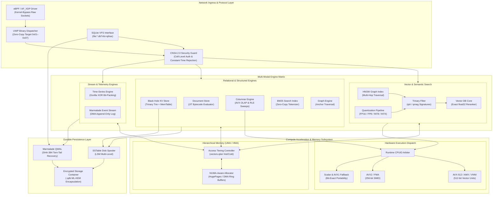

# QIHSE System Architecture & Engine Overview

QIHSE is a native C99 multi-model database engine designed for high-throughput, low-latency workloads. It unifies eight distinct storage engines under a single process space and memory hierarchy, eliminating the operational overhead of managing fragmented database infrastructure.

---

## 1. Storage Engine Surface

QIHSE provides eight specialized storage engines alongside an integrated SQLite VFS compatibility layer:

| Engine | Primary Abstraction | Implementation Details |
|---|---|---|
| **Vector DB** | Dense vector search | Exact `float32` reranking with Trinary signature (`qtri`/`qmag`) filtering, multi-precision quantization (`FP16`, `FP8`, `INT8`, `INT4`), and HNSW graph traversal. |
| **Key-Value Store** | $O(k)$ key-value indexing | Trinary Trie in-memory index backed by LSM-Tree memtables and SSTable disk persistence. |
| **Document Store** | JSON document storage | JIT-compiled path evaluators translating frequent access patterns directly into bytecode. |
| **Time-Series DB** | Append-only telemetry | Lock-free ingress ring buffers with Gorilla XOR delta-of-delta bit-packing. |
| **Columnar Engine** | Vectorized OLAP | AVX2/AVX-512 accelerated columnar scans with Run-Length Encoding (RLE) and dictionary compression. |
| **Graph Engine** | Multi-hop relationships | Dual Anchor and HNSW traversal for fast path resolution across large relational graphs. |
| **Full-Text Search** | Lexical indexing | Zero-copy tokenization with native BM25 relevance scoring. |
| **Event Stream** | Append-only commit log | Kernel-bypass DMA I/O via `mmap` and `sendfile` with SHA-384 frame deduplication. |
| **SQLite VFS** | Relational compatibility | Drop-in `sqlite3_vfs` backend utilizing the Black Hole KV store and Marmalade Event Stream. |

---

## 2. Unified Wire Protocol (UWP)

The Unified Wire Protocol (UWP) is a binary, memory-aligned protocol that routes network packets directly into engine-specific C data structures with zero intermediate allocations.

```
+-------------------+-------------------+-----------------------------------+
| Target ID (1 Byte)| Command (1 Byte)  | Payload (Aligned struct / bytes)  |
+-------------------+-------------------+-----------------------------------+
```

### Protocol Target Mapping

| Target ID | Target Engine | Operations |
|---|---|---|
| `0x01` | Key-Value Store | Set, Get, Delete, Expire |
| `0x02` | Vector DB | Upsert, Search, Delete, Flush |
| `0x03` | Document Store | Insert JSON, Query, Update |
| `0x04` | Columnar Engine | Append Column, Batch Scan |
| `0x05` | Time-Series DB | Insert Points, Range Query |
| `0x06` | Graph Engine | Insert Edge, Multi-Hop Traverse |
| `0x07` | Event Stream | Append Record, Stream Replay |

---

## 3. Hardware Acceleration & Dynamic Dispatch

QIHSE uses runtime CPUID capability detection to select the most efficient vector math implementation without requiring separate compilation targets:

- **AVX-512 / VNNI / AMX**: Selected automatically on modern Intel/AMD architectures for high-throughput distance calculations and columnar scans.
- **AVX2 / FMA**: Selected on systems with 256-bit SIMD support.
- **AVX1 / SSE4.2**: Graceful fallback on older x86_64 host hardware.
- **Scalar / Portable**: Guaranteed bit-exact fallback on non-x86 or constrained virtualized environments.

Memory maintenance operates across both Unified Memory Architectures (UMA) and Heterogeneous Memory Architectures (HMA) with automatic tiering based on access temperature (`vectors.qtier`).

---

## 4. Security & Access Control

For defense and intelligence installations requiring cell-level access controls:

- **Compartmented Access**: Optional classification level and SCI compartment bitmasks on individual keys and vectors.
- **Constant-Time Rejection**: Unauthorized access requests execute algorithmic paths indistinguishable from missing keys to prevent timing analysis.
- **CNSA 2.0 Cryptography**: Optional transparent page-level encryption via AES-256-GCM, ML-KEM-1024 key encapsulation, and ML-DSA-87 signature validation.
- **Audit Hash Chains**: Append-only cryptographic ledger tracking access modifications and security events.

---

## 5. Comprehensive Subsystem Architecture

The following diagram maps the entire subsystem topology, from low-level eBPF packet ingress and protocol decoding down through memory tiering, SIMD execution units, and durable persistence layers:


