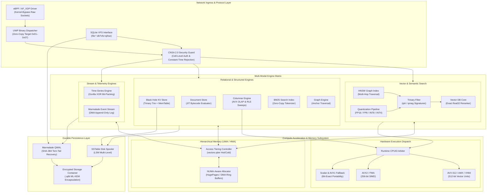

# QIHSE Subsystem Architecture Diagram

A full-page schematic mapping the QIHSE database topology from kernel-bypass network ingress down to memory tiering, runtime SIMD dispatch arbiters, and durable persistence layers.

---

[← Return to System Overview](../architecture/system_overview.md) | [← Return to README](../../README.md)
