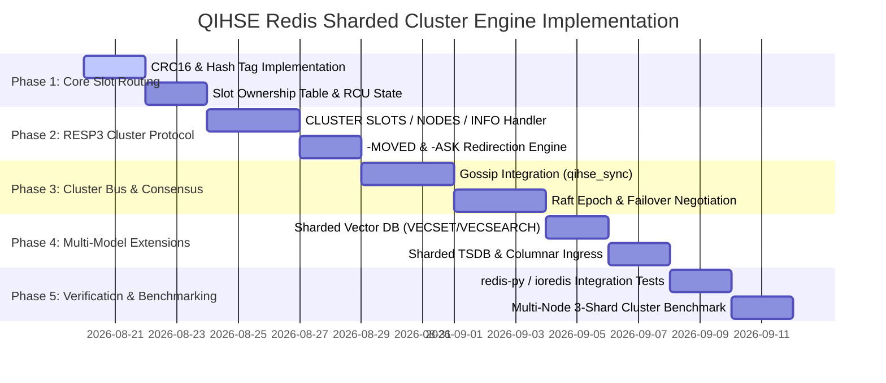

# QIHSE Redis-Compatible Sharded Cluster Engine — Native Implementation Plan

> **Scope**: A production-grade, multi-node sharded clustering engine implemented in native C99 supporting the standard **Redis Serialization Protocol (RESP2 / RESP3)** and **Redis Cluster Specification (16,384 Hash Slots)**. Any standard Redis client (`redis-cli -c`, `redis-py` `RedisCluster`, `ioredis`, `go-redis`) connects out-of-the-box, enjoying transparent multi-node horizontal scale-out, sub-microsecond point lookups via Black Hole Trinary Tries, and multi-model Vector / Time-Series extensions over the same sharded fabric.

---

## 1. Executive Summary & Architectural Vision

Conventional distributed key-value stores (e.g. standard Redis Cluster, Cassandra, Hazelcast) suffer from two core architectural bottlenecks:
1. **Single-Threaded Execution**: Standard Redis processes commands in a single-threaded event loop, bottlenecking CPU saturation on modern multi-core servers.
2. **Siloed Storage Engines**: Redis requires external plugins or secondary clusters for Vector embeddings, Time-Series telemetry, and Columnar analytics.

**QIHSE's Distributed Engine** solves both:
* **Multi-Threaded Kernel-Bypass Ingress**: High-concurrency I/O via `io_uring` and raw `AF_XDP` sockets.
* **Deterministic CRC16 Hash Slot Partitioning**: 16,384 slots mapped across active cluster nodes.
* **Co-Located Multi-Model Sharding**: Hash tags (e.g. `{entity_1001}.kv` and `{entity_1001}.vector`) guarantee that key-value records, vector embeddings, and time-series streams for the same entity live on the same physical shard node.
* **Native Speed**: Black Hole Trinary Tries deliver **1.6M+ ops/sec per core** with sub-microsecond point lookups (`320 ns` p50).

---

## 2. Cluster Topology & Hash Slot Mechanics

### 2.1 CRC16 Hash Slot Algorithm
Keys are partitioned across **16,384 logical hash slots** ($0 \dots 16383$).
The slot index is computed using the standard **XMODEM-CRC16** polynomial ($x^{16} + x^{12} + x^5 + 1$):

$$\text{Slot} = \text{CRC16}(\text{Key\_Payload}) \pmod{16384}$$

```
Key String: "user:8011484242:session"
CRC16("user:8011484242:session") = 0x8F32 (36658)
Slot = 36658 % 16384 = 3890 (Routed to Node 1)

Key with Hash Tag: "{target:8011484242}.metadata"
Key with Hash Tag: "{target:8011484242}.vectors"
CRC16("target:8011484242") = 0x4A1E (18974)
Slot = 18974 % 16384 = 2590 (Both co-located on Node 0)
```

### 2.2 Hash Tag Extraction Rules
If the key contains `{` and `}` where `{` is followed by at least one character before `}`, only the substring between the first `{` and first `}` is hashed. This guarantees deterministic co-location of multi-model payloads.

### 2.3 Shard Node Slot Allocation
In a 3-node cluster, hash slots are partitioned evenly:
* **Node A (Primary)**: Slots `0 – 5460` (5,461 slots)
* **Node B (Primary)**: Slots `5461 – 10922` (5,462 slots)
* **Node C (Primary)**: Slots `10923 – 16383` (5,461 slots)

---

## 3. Client Routing & Redirection Protocol

```
                        ┌───────────────────────────────┐
                        │   Standard Redis Cluster      │
                        │    Client (e.g. redis-py)     │
                        └───────────────┬───────────────┘
                                        │
           1. Initial Query (GET foo)   │
           ───────────────────────────► │
                                        │
           2. Redirect: -MOVED 12182 10.0.0.3:6379
           ◄─────────────────────────── │
                                        │
           3. Re-route directly to Node C
           ────────────────────────────────────────────► ┌────────────────────────┐
                                                         │      QIHSE Node C      │
           4. Response: "$5\r\nvalue\r\n"               │ (Holds slot 10923–16383)│
           ◄──────────────────────────────────────────── └────────────────────────┘
```

### 3.1 `-MOVED` Permanent Redirection
When a client sends a query for a key whose slot is owned by another node:
```
-MOVED <slot> <target_ip>:<target_port>\r\n
```
The client caches the new slot mapping and routes subsequent queries directly to the target node.

### 3.2 `-ASK` Transient Migration Redirection
During live slot migration from Node A $\rightarrow$ Node B:
```
-ASK <slot> <target_ip>:<target_port>\r\n
```
The client sends an `ASKING` preamble command to Node B followed by the query, without updating its permanent slot cache.

---

## 4. Multi-Model Sharded Wire Protocol

In addition to standard Redis commands, QIHSE exposes its multi-modal storage engines across the sharded fabric:

### 4.1 Key-Value (Black Hole Trinary Trie)
* `GET <key>` / `SET <key> <val>` / `DEL <key>`
* `MGET <key1> <key2> ...` / `MSET <k1> <v1> <k2> <v2> ...` (Requires keys in same slot or hash tag `{tag}`)
* `EXPIRE <key> <seconds>` / `TTL <key>` / `EXISTS <key>`
* `INCR <key>` / `DECR <key>`

### 4.2 Vector DB (HNSW + Trinary Filter + SIMD Exact Rerank)
* `VECSET <id> <dims> <v0> <v1> ... [TAG <tag>]` — Inserts a vector embedding into the shard owning `{tag}`.
* `VECGET <id>` — Fetches raw vector components and dimensional metadata.
* `VECSEARCH <dims> <top_k> <v0> <v1> ... [FILTER <field>=<val>] [TAG <tag>]` — Executes top-$K$ cosine/Euclidean similarity search.
* `VECSCATTER <dims> <top_k> <v0> ...` — Cluster-wide scatter-gather search aggregating top-$K$ candidates across all shards using RRF (Reciprocal Rank Fusion).

### 4.3 Time-Series Telemetry (Marmalade Gorilla XOR)
* `TS.ADD <series_key> <timestamp_ms> <float_val>` — Bit-packed ingestion (5.1M pts/sec).
* `TS.RANGE <series_key> <start_ts> <end_ts> [AVG|SUM|MIN|MAX]` — Temporal range aggregation.

### 4.4 Columnar Analytics (Frieze Engine)
* `COL.APPEND <col_key> <float_val>` — Streaming columnar block ingest.
* `COL.SUM <col_key>` / `COL.MINMAX <col_key>` — SIMD vectorized column sweep.

---

## 5. Implementation File Decomposition

```
QIHSE/src/spinnaker/
├── qihse_crc16.h               — Header: Fast CRC16 lookup table & SIMD acceleration
├── qihse_crc16.c               — Implementation: XMODEM-CRC16 with {tag} parser
├── qihse_cluster_slot.h        — Header: 16,384 Hash Slot mapping & ownership table
├── qihse_cluster_slot.c        — Implementation: Slot ownership state, RCU lockless routing
├── qihse_resp_cluster.h        — Header: CLUSTER * command dispatchers
├── qihse_resp_cluster.c        — Implementation: CLUSTER SLOTS, NODES, INFO, MEET, FAILOVER
├── qihse_cluster_migrate.h     — Header: Live slot migration & state streaming
├── qihse_cluster_migrate.c     — Implementation: MIGRATE, RESTORE, ASKING protocol
├── qihse_resp_wire.h           — Public Header: TCP server entry point & configuration
└── qihse_resp_wire.c           — Main RESP2/RESP3 connection engine & command loop
```

---

## 6. Detailed Module Specifications

### Module 1: CRC16 & Hash Tag Extractor ([`qihse_crc16.c`](file:///home/john/SPECTRA/QIHSE/src/spinnaker/qihse_crc16.c))
```c
#define QIHSE_CLUSTER_SLOTS 16384

uint16_t qihse_crc16(const char *buf, size_t len);

/* Extracts hash tag if present; otherwise returns whole key */
void qihse_extract_hash_tag(const char *key, size_t key_len, const char **out_buf, size_t *out_len);

/* Computes destination slot (0..16383) */
static inline uint16_t qihse_key_slot(const char *key, size_t len) {
    const char *tag_buf;
    size_t tag_len;
    qihse_extract_hash_tag(key, len, &tag_buf, &tag_len);
    return qihse_crc16(tag_buf, tag_len) % QIHSE_CLUSTER_SLOTS;
}
```

### Module 2: Slot Ownership Table ([`qihse_cluster_slot.c`](file:///home/john/SPECTRA/QIHSE/src/spinnaker/qihse_cluster_slot.c))
```c
typedef struct {
    char node_id[41];       // 40-char Hex SHA-1 node identifier
    char ip[64];            // IPv4 or IPv6 address
    uint16_t port;          // Client TCP port (e.g. 6379)
    uint16_t cport;         // Cluster bus gossip port (e.g. 16379)
    uint32_t flags;         // MASTER, SLAVE, MYSELF, FAIL, HANDSHAKE
    uint64_t config_epoch;  // Distributed configuration epoch
} qihse_cluster_node_t;

typedef struct {
    qihse_cluster_node_t nodes[QIHSE_MAX_CLUSTER_NODES];
    uint32_t node_count;
    uint16_t myself_index;
    
    /* Slot routing table: slot_id (0..16383) -> node index */
    uint16_t slots[QIHSE_CLUSTER_SLOTS];
    
    /* Migration state */
    uint16_t migrating_slots[QIHSE_CLUSTER_SLOTS]; // Target node if migrating
    uint16_t importing_slots[QIHSE_CLUSTER_SLOTS]; // Source node if importing
    
    pthread_rwlock_t table_lock;
} qihse_cluster_state_t;
```

### Module 3: Cluster Command Parser ([`qihse_resp_cluster.c`](file:///home/john/SPECTRA/QIHSE/src/spinnaker/qihse_resp_cluster.c))
Implements full support for cluster introspection:
1. `CLUSTER SLOTS`: Returns nested arrays format:
   `[[start_slot, end_slot, [ip, port, node_id], [replica_ip, ...]], ...]`
2. `CLUSTER NODES`: Returns standard string output:
   `<node_id> <ip>:<port>@<cport> <flags> <master_id> <ping_sent> <pong_recv> <config_epoch> <link_state> <slots...>`
3. `CLUSTER INFO`: Returns state, slots assigned, cluster size, and current epoch.
4. `CLUSTER MEET <ip> <port>`: Connects to peer and triggers gossip join handshake.

---

## 7. Hardware Awareness & Zero-Overhead Execution

QIHSE treats hardware as a first-class execution primitive. The sharded cluster engine interfaces directly with the host's underlying compute, memory, and networking topology:

```
┌────────────────────────────────────────────────────────────────────────┐
│                        HOST HARDWARE TOPOLOGY                          │
├───────────────────────────────────┬────────────────────────────────────┤
│           NUMA NODE 0             │            NUMA NODE 1             │
│  ┌─────────────────────────────┐  │  ┌─────────────────────────────┐   │
│  │   CPU Cores 0..3 (AVX-512)  │  │  │   CPU Cores 4..7 (AVX-512)  │   │
│  │   Shard 0 (Slots 0..8191)   │  │  │   Shard 1 (Slots 8192..16k) │   │
│  │   • 2MB HugePages MemTable  │  │  │   • 2MB HugePages MemTable  │   │
│  │   • AF_XDP Queue 0 (Rx/Tx)  │  │  │   • AF_XDP Queue 1 (Rx/Tx)  │   │
│  └──────────────▲──────────────┘  │  └──────────────▲──────────────┘   │
│                 │ Local DDR4 Bus  │                 │ Local DDR4 Bus   │
│  ┌──────────────▼──────────────┐  │  ┌──────────────▼──────────────┐   │
│  │   Local Socket 0 DRAM       │  │  │   Local Socket 1 DRAM       │   │
│  └─────────────────────────────┘  │  └─────────────────────────────┘   │
└─────────────────┬─────────────────┴─────────────────┬──────────────────┘
                  │                                   │
                  └──────── Hardware NIC (RSS) ───────┘
```

1. **Dynamic SIMD Instruction Dispatch (`qihse_cpu_detect.c`)**:
   - The CRC16 hash slot algorithm uses PCLMULQDQ / AVX-512 hardware carry-less multiplication when available, processing 64 bytes per cycle.
   - Vector queries (`VECSEARCH`, `VECGET`) vectorize across 512-bit registers (AVX-512) or 256-bit registers (AVX2), with automatic fallback on older Xeon/ARM architectures.

2. **NUMA-Pinned Shard Workers & Socket Locality (`qihse_memory_topology_probe.c`)**:
   - Each shard instance binds to a specific CPU core and NUMA memory node using `pthread_setaffinity_np()` and `set_mempolicy(MPOL_BIND)`.
   - Eliminates cross-socket QPI/UPI interconnect latency and cache bounce.

3. **2MB / 1GB HugePages Allocation (`qihse_hma.c`)**:
   - Black Hole Trinary Trie nodes, LSM MemTables, and HNSW graph adjacency lists are allocated via `madvise(MADV_HUGEPAGE)` and anonymous `mmap` HugePages.
   - Drastically reduces Translation Lookaside Buffer (TLB) misses under millions of concurrent point reads.

4. **Zero-Copy Network Kernel Bypass (`qihse_af_xdp.c`)**:
   - NIC Receive Side Scaling (RSS) hardware filters steer incoming TCP packets directly to the descriptor ring of the CPU core owning that hash slot.
   - AF_XDP UMEM packet memory maps directly into QIHSE user space, bypassing the Linux kernel TCP/IP stack.

5. **Runtime System Guard & Bandwidth Throttling (`qihse_system_guard.c`)**:
   - Hardware profiling on boot calculates maximum safe RAM capacity (85% limit) and memory controller bandwidth ceiling.
   - Automatically throttles or prevents cluster queries that would saturate 100% of the memory bus or provoke OS OOM kills.

---

## 8. Step-by-Step Execution Plan



### Phase 1: Core Hash Slot Engine
- Implement `qihse_crc16.c` using an aligned 256-entry lookup table and SIMD hardware acceleration.
- Implement `{tag}` extraction according to Redis Cluster Specification section 4.
- Build test harness `tests/test_cluster_slot.c` verifying 100% parity with Redis CRC16 test vectors.

### Phase 2: Wire Protocol & Redirect Dispatcher
- Update `qihse_resp_wire.c` command loop:
  - For each command: extract key $\rightarrow$ compute slot $\rightarrow$ verify if `slots[slot] == myself_index`.
  - If owned locally: execute against Black Hole KV / Vector / TSDB engine.
  - If owned remotely: write `-MOVED <slot> <node_ip>:<node_port>\r\n`.
- Implement `CLUSTER SLOTS`, `CLUSTER NODES`, `CLUSTER INFO`, `CLUSTER KEYSLOT <key>`.

### Phase 3: Gossip Node Discovery & Raft Epoch Consensus
- Connect cluster nodes using the binary sync protocol (`sync/qihse_sync_gossip.c`).
- Broadcast node state and slot ownership bitmaps across the cluster bus (port `16379`).
- Implement automatic failover voting via `src/spinnaker/qihse_raft.c`.

### Phase 4: Multi-Model Cluster Extensions
- Map `VECSET`, `VECGET`, `VECSEARCH` to slot partitioning.
- Implement `VECSCATTER`: Master node queries all active shards and merges top-$K$ results using reciprocal rank fusion.
- Map `TS.ADD` / `TS.RANGE` to hash slots.

### Phase 5: Testing & Benchmarking
- Build a 3-node cluster on `localhost:7000`, `localhost:7001`, `localhost:7002`.
- Run validation test with `redis-cli -c -p 7000`.
- Run automated benchmarks (`redis-benchmark -p 7000 --cluster`).

---

## 9. Verification & Acceptance Criteria

1. **Client Driver Compliance**: Standard Python `redis.cluster.RedisCluster` and Node.js `ioredis.Cluster` must connect, auto-discover all slots, and execute reads/writes with zero errors.
2. **Deterministic Redirection**: `redis-cli -c -p 7000 set foo bar` must automatically follow `-MOVED` to the correct shard node without client failure.
3. **Sub-Microsecond Latency**: Shard-local point gets must maintain $\le 500\text{ ns}$ p50 latency.
4. **Zero Memory Leaks**: Full Valgrind and AddressSanitizer compliance on multi-node join, query, and shutdown sequences.

