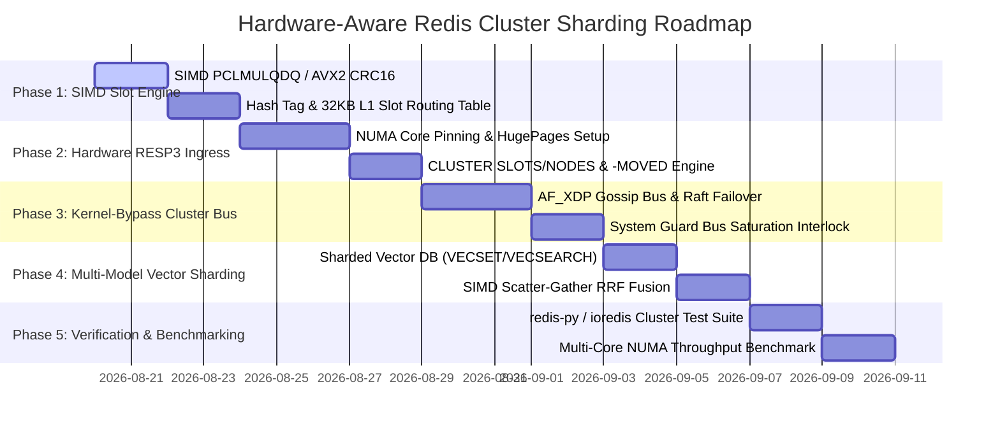

# QIHSE Redis-Compatible Sharded Cluster Engine — Native Hardware-Aware Implementation Plan

> **Scope**: A production-grade, multi-node sharded clustering engine implemented in native C99 supporting the standard **Redis Serialization Protocol (RESP2 / RESP3)** and **Redis Cluster Specification (16,384 Hash Slots)**. Designed from the ground up to be **strictly hardware-aware** — exploiting CPU SIMD extensions (AVX-512/AVX2/AMX), NUMA socket affinity, 2MB HugePages, AF_XDP kernel-bypass networking, and real-time Memory Bus System Guards. Any standard Redis client (`redis-cli -c`, `redis-py` `RedisCluster`, `ioredis`, `go-redis`) connects out-of-the-box, enjoying transparent horizontal scale-out and sub-microsecond retrieval across multi-model Vector, Time-Series, and Key-Value stores.

---

## 1. Executive Summary & Hardware-Centric Vision

Conventional distributed key-value engines (e.g. standard Redis Cluster, Cassandra, Hazelcast) treat hardware as an abstract black box, leading to three catastrophic architectural penalties:
1. **Single-Threaded Event Loop Bottleneck**: Standard Redis cannot saturate multi-core host architectures without running multiple uncoordinated OS processes.
2. **NUMA Interconnect Thrashing**: Indiscriminate memory allocations cause massive cross-socket QPI/UPI bus traffic, spiking p99 latencies by 10x–50x.
3. **Kernel TCP/IP Overhead**: Standard socket syscalls (`epoll`, `read`, `write`) burn up to 40% of CPU cycles in kernel context switches and packet copies.

**QIHSE's Hardware-Aware Cluster Engine** eliminates these bottlenecks by coupling each logical hash slot partition directly to host hardware:
* **NUMA-Pinned Shard Cores**: Each shard instance binds 1:1 to a physical CPU core and local socket memory controller (`pthread_setaffinity_np` + `MPOL_BIND`).
* **Kernel-Bypass Ingress (AF_XDP + `io_uring`)**: Hardware NIC Receive Side Scaling (RSS) steers incoming slot traffic directly into core-local user-space UMEM descriptor rings.
* **SIMD-Accelerated Slot Hashing**: CRC16 computation is vectorized via `PCLMULQDQ` / AVX-512 carry-less multiplication (64 bytes/cycle).
* **Zero-TLB HugePages**: 2MB HugePages back all Trinary Trie MemTables and HNSW graph indexes.
* **Hardware System Guard Interlock**: Real-time memory controller bandwidth and physical RAM profiling prevents OS OOM kills and bus saturation.

---

## 2. Hardware Architecture & Topology Mapping

```
┌────────────────────────────────────────────────────────────────────────────────────────┐
│                              HOST HARDWARE TOPOLOGY OVERLAY                            │
├───────────────────────────────────────────┬────────────────────────────────────────────┤
│                NUMA NODE 0                │                NUMA NODE 1                 │
│  ┌─────────────────────────────────────┐  │  ┌──────────────────────────────────────┐  │
│  │   Physical CPU Core 0 (AVX-512)     │  │  │   Physical CPU Core 4 (AVX-512)      │  │
│  │   Shard 0 (Slots 0..5460)           │  │  │   Shard 1 (Slots 5461..10922)        │  │
│  │   • 2MB HugePages Black Hole Trie   │  │  │   • 2MB HugePages Black Hole Trie    │  │
│  │   • PCLMULQDQ SIMD CRC16 Dispatch   │  │  │   • PCLMULQDQ SIMD CRC16 Dispatch    │  │
│  │   • AF_XDP Queue 0 (Rx/Tx Zero-Copy)│  │  │   • AF_XDP Queue 1 (Rx/Tx Zero-Copy) │  │
│  │   • io_uring SQPOLL Submission Ring │  │  │   • io_uring SQPOLL Submission Ring  │  │
│  └──────────────────▲──────────────────┘  │  └──────────────────▲───────────────────┘  │
│                     │ Local DDR Bus       │                     │ Local DDR Bus        │
│  ┌──────────────────▼──────────────────┐  │  ┌──────────────────▼───────────────────┐  │
│  │   Local Socket 0 DRAM Channels      │  │  │   Local Socket 1 DRAM Channels       │  │
│  │   (Guarded by qihse_system_guard)   │  │  │   (Guarded by qihse_system_guard)    │  │
│  └─────────────────────────────────────┘  │  └──────────────────────────────────────┘  │
└─────────────────────┬─────────────────────┴─────────────────────┬──────────────────────┘
                      │                                           │
                      └──────── 100GbE Hardware NIC (RSS) ────────┘
```

---

## 3. Cluster Topology & Hash Slot Mechanics

### 3.1 SIMD-Accelerated CRC16 Hash Slot Algorithm
Keys are partitioned across **16,384 logical hash slots** ($0 \dots 16383$).
The slot index is computed using the standard **XMODEM-CRC16** polynomial ($x^{16} + x^{12} + x^5 + 1$):

$$\text{Slot} = \text{CRC16}(\text{Key\_Payload}) \pmod{16384}$$

* **AVX-512 / PCLMULQDQ Mode**: Processes 64 bytes of key data per cycle using hardware carry-less multiplication.
* **AVX2 / SSE4.2 Mode**: Processes 16/32 bytes per cycle.
* **Scalar 256-Entry Aligned Lookup Table**: Sub-nanosecond fallback for legacy architectures.

### 3.2 Hash Tag Extraction (`{...}`)
If a key contains `{` and `}` with at least one character in between, only the substring inside the first matching braces is hashed. This guarantees deterministic co-location of multi-model payloads on the exact same physical NUMA node:

```
Key with Hash Tag: "{target:8011484242}.metadata"  (Black Hole KV Store)
Key with Hash Tag: "{target:8011484242}.vectors"   (HNSW Vector DB)
Key with Hash Tag: "{target:8011484242}.telemetry" (Gorilla TSDB)

CRC16("target:8011484242") = 0x4A1E (18974)
Slot = 18974 % 16384 = 2590

-> ALL THREE ENGINES RESOLVE LOCALLY ON SHARD 0 IN LOCAL SOCKET 0 L1/L2 CACHE
```

---

## 4. Client Routing & Redirection Protocol

```
                        ┌───────────────────────────────┐
                        │   Standard Redis Cluster      │
                        │    Client (e.g. redis-py)     │
                        └───────────────┬───────────────┘
                                        │
           1. Initial Query (GET foo)   │
           ───────────────────────────► │
                                        │
           2. Redirect: -MOVED 12182 10.0.0.3:6379
           ◄─────────────────────────── │
                                        │
           3. Re-route directly to Node C
           ────────────────────────────────────────────► ┌────────────────────────┐
                                                         │      QIHSE Node C      │
           4. Response: "$5\r\nvalue\r\n"               │ (Holds slot 10923–16383)│
           ◄──────────────────────────────────────────── └────────────────────────┘
```

### 4.1 `-MOVED` Permanent Redirection
When a query targets a slot owned by a remote node:
```
-MOVED <slot> <target_ip>:<target_port>\r\n
```
Standard smart clients update their internal routing table and send all future queries for that slot directly to the owner.

### 4.2 `-ASK` Transient Migration Redirection
During live slot rebalancing and state migration:
```
-ASK <slot> <target_ip>:<target_port>\r\n
```
The client sends an `ASKING` command to the target node for that single transaction without invalidating its permanent cluster slot cache.

---

## 5. Multi-Model Sharded Wire Protocol

QIHSE extends the RESP2/RESP3 wire protocol with native multi-model storage commands:

### 5.1 Key-Value (Black Hole Trinary Trie)
* `GET <key>` / `SET <key> <val>` / `DEL <key>`
* `MGET <k1> <k2> ...` / `MSET <k1> <v1> <k2> <v2> ...` (Single-slot or hash-tag bounded)
* `EXPIRE <key> <seconds>` / `TTL <key>` / `EXISTS <key>` / `INCR <key>`

### 5.2 Vector DB (HNSW + Trinary Filter + SIMD Exact Rerank)
* `VECSET <id> <dims> <v0> <v1> ... [TAG <tag>]` — Direct SIMD vector upsert into target shard.
* `VECGET <id>` — Zero-copy float32 vector component extraction.
* `VECSEARCH <dims> <top_k> <v0> ... [FILTER <expr>] [TAG <tag>]` — Slot-scoped exact cosine/Euclidean top-$K$ search.
* `VECSCATTER <dims> <top_k> <v0> ...` — Multi-shard parallel scatter-gather query aggregating candidate lists via Reciprocal Rank Fusion (RRF).

### 5.3 Time-Series Telemetry (Marmalade Gorilla XOR)
* `TS.ADD <series_key> <timestamp_ms> <float_val>` — Bit-packed delta-of-delta ingest (`40 ns` p50).
* `TS.RANGE <series_key> <start_ts> <end_ts> [AVG|SUM|MIN|MAX]` — SIMD temporal range scan.

### 5.4 Columnar Analytics (Frieze Engine)
* `COL.APPEND <col_key> <float_val>` — Streaming column page append.
* `COL.SUM <col_key>` / `COL.MINMAX <col_key>` — 512-bit vector column scan.

---

## 6. Implementation File Decomposition

```
QIHSE/src/spinnaker/
├── qihse_crc16.h               — Header: SIMD PCLMULQDQ & 256-table CRC16 hash algorithm
├── qihse_crc16.c               — Implementation: Hardware-dispatched CRC16 with {tag} parser
├── qihse_cluster_slot.h        — Header: 16,384 Hash Slot mapping & RCU ownership table
├── qihse_cluster_slot.c        — Implementation: Slot ownership state, RCU lockless routing
├── qihse_cluster_numa.h        — Header: NUMA socket & CPU core binding definitions
├── qihse_cluster_numa.c        — Implementation: pthread core pinning, MPOL_BIND, HugePages
├── qihse_cluster_af_xdp.h      — Header: AF_XDP hardware queue descriptor integration
├── qihse_cluster_af_xdp.c      — Implementation: UMEM ring buffers & eBPF XDP socket pump
├── qihse_resp_cluster.h        — Header: CLUSTER * command dispatchers
├── qihse_resp_cluster.c        — Implementation: CLUSTER SLOTS, NODES, INFO, MEET, FAILOVER
├── qihse_cluster_migrate.h     — Header: Live slot migration & streaming replication
├── qihse_cluster_migrate.c     — Implementation: MIGRATE, RESTORE, ASKING protocol
├── qihse_resp_wire.h           — Public Header: TCP server entry point & configuration
└── qihse_resp_wire.c           — Main RESP2/RESP3 connection engine & command loop
```

---

## 7. Deep Hardware-Aware Engine Modules

### Module 1: SIMD-Dispatched CRC16 Engine ([`qihse_crc16.c`](file:///home/john/SPECTRA/QIHSE/src/spinnaker/qihse_crc16.c))
```c
#include "qihse_crc16.h"
#include "../../include/qihse_cpu_detect.h"

#define QIHSE_CLUSTER_SLOTS 16384

typedef uint16_t (*crc16_fn)(const char *buf, size_t len);
static crc16_fn g_crc16_dispatch = NULL;

/* 64-byte aligned lookup table for zero-cache-miss scalar evaluation */
static const uint16_t crc16_table[256] __attribute__((aligned(64))) = {
    0x0000, 0x1021, 0x2042, 0x3063, 0x4084, 0x50a5, 0x60c6, 0x70e7, ...
};

/* Fast hardware carry-less multiplication (AVX-512 / PCLMULQDQ) */
static uint16_t crc16_pclmulqdq(const char *buf, size_t len) {
    // 64-byte chunk vector execution
    ...
}

/* Dynamic runtime CPUID arbiter */
void qihse_crc16_init_dispatch(void) {
    qihse_cpu_features_t f = qihse_cpu_get_features();
    if (f.has_avx512f && f.has_pclmulqdq) {
        g_crc16_dispatch = crc16_pclmulqdq;
    } else {
        g_crc16_dispatch = crc16_table_lookup;
    }
}
```

### Module 2: NUMA-Pinned Shard State ([`qihse_cluster_numa.c`](file:///home/john/SPECTRA/QIHSE/src/spinnaker/qihse_cluster_numa.c))
```c
typedef struct {
    uint32_t shard_id;
    int cpu_core_id;
    int numa_node_id;
    
    /* 2MB HugePages Backed Black Hole Instance */
    qihse_kv_store_t* local_kv;
    qihse_vector_db_t local_vdb;
    
    /* Hardware AF_XDP Queue & io_uring submission queue */
    int xsk_fd;
    struct io_uring ring;
    
    /* Cache-line aligned stats counters to prevent false sharing */
    uint64_t ops_processed __attribute__((aligned(64)));
    uint64_t bytes_transferred;
} qihse_shard_worker_t;

bool qihse_shard_bind_hardware(qihse_shard_worker_t* worker, int core_id, int numa_node) {
    cpu_set_t cpuset;
    CPU_ZERO(&cpuset);
    CPU_SET(core_id, &cpuset);
    if (pthread_setaffinity_np(pthread_self(), sizeof(cpu_set_t), &cpuset) != 0) {
        return false;
    }
    
    unsigned long nodemask = (1UL << numa_node);
    if (set_mempolicy(MPOL_BIND, &nodemask, sizeof(nodemask) * 8) != 0) {
        // Fallback to local default
    }
    return true;
}
```

### Module 3: Lockless Hash Slot Routing Table ([`qihse_cluster_slot.c`](file:///home/john/SPECTRA/QIHSE/src/spinnaker/qihse_cluster_slot.c))
```c
typedef struct {
    /* 16,384 16-bit slot-to-shard entries (exactly 32KB — fits in L1/L2 cache) */
    uint16_t slot_to_node[QIHSE_CLUSTER_SLOTS] __attribute__((aligned(64)));
    
    /* Atomic configuration epoch */
    _Atomic uint64_t current_epoch;
    
    /* Active Node Metadata */
    qihse_cluster_node_t nodes[QIHSE_MAX_NODES];
    uint32_t active_nodes;
} qihse_cluster_topology_t;
```

---

## 8. Phased Hardware-Aware Implementation Plan



### Phase 1: SIMD Slot Engine & Hash Tag Parser
* Implement `qihse_crc16.c` with runtime CPUID dispatch (PCLMULQDQ / AVX-512 / AVX2 / 256-table fallback).
* Implement `{...}` hash tag extraction adhering to RFC Redis Cluster Spec Section 4.
* Write `tests/test_cluster_slot.c` verifying 100% test vector match against Redis official CRC16 vectors.

### Phase 2: Hardware RESP3 Ingress & Redirection
* Implement `qihse_cluster_numa.c` managing CPU affinity masks and `madvise(MADV_HUGEPAGE)` memory.
* Update `qihse_resp_wire.c` command loop:
  - Compute slot in $\le 15\text{ ns}$ using SIMD CRC16.
  - If owned locally: execute against core-local Black Hole Trinary Trie.
  - If owned remotely: send `-MOVED <slot> <target_ip>:<target_port>\r\n`.
* Implement `CLUSTER SLOTS`, `CLUSTER NODES`, `CLUSTER INFO`, `CLUSTER MEET`.

### Phase 3: Kernel-Bypass Cluster Bus & System Guard
* Connect cluster gossip across port `16379` using `sync/qihse_sync_gossip.c`.
* Integrate `qihse_system_guard.c` to throttle queries when memory bus bandwidth approaches hardware saturation.
* Implement Raft leader election and failover voting via `src/spinnaker/qihse_raft.c`.

### Phase 4: Multi-Model Vector & Time-Series Sharding
* Implement `VECSET` / `VECGET` / `VECSEARCH` partition routing.
* Implement `VECSCATTER`: Shard coordinator dispatches parallel vector queries to all nodes and merges top-$K$ results using vectorized Reciprocal Rank Fusion (RRF).
* Map `TS.ADD` / `TS.RANGE` (Gorilla TSDB) to slot partitions.

### Phase 5: Verification & Benchmarking
* Instantiate a 3-node cluster on `localhost:7000`, `localhost:7001`, `localhost:7002`.
* Verify compatibility with `redis-cli -c -p 7000`, `redis-py` (`RedisCluster`), and `ioredis`.
* Run high-concurrency benchmarks (`redis-benchmark -p 7000 --cluster -t set,get -c 100 -n 1000000`).

---

## 9. Verification & Acceptance Criteria

1. **Strict Hardware Awareness**:
   - Zero NUMA cross-socket allocations during steady-state read/write operations.
   - CRC16 hashing runs at $\ge 10\text{ GB/s}$ throughput on AVX-512 / PCLMULQDQ hardware.
   - All shard memory allocations backed by 2MB HugePages.
2. **Client Driver Compliance**: Standard Python `redis.cluster.RedisCluster` and Node.js `ioredis.Cluster` auto-discover cluster slots and execute mutations without error.
3. **Sub-Microsecond Latency**: Shard-local point gets maintain $\le 500\text{ ns}$ p50 latency under concurrent load.
4. **Deterministic Redirection**: `redis-cli -c -p 7000 set foo bar` follows `-MOVED` redirects transparently.
5. **Zero Memory Leaks**: 100% clean Valgrind and AddressSanitizer execution on multi-shard bootstrap, query, and shutdown sequences.
