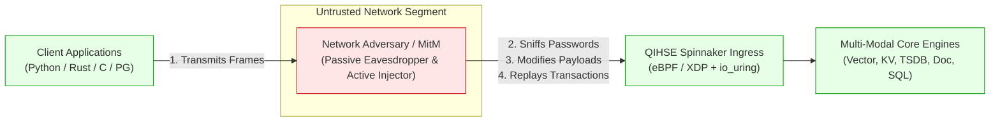
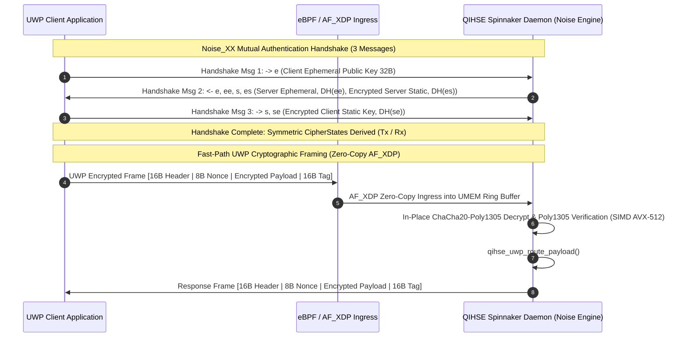
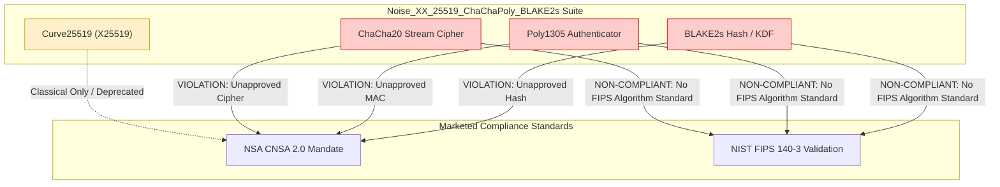
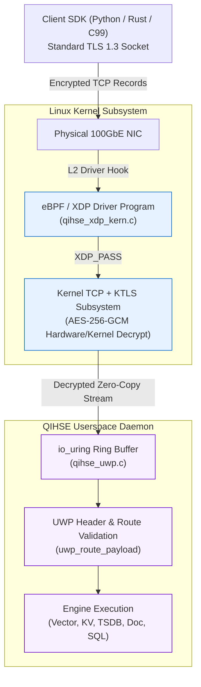
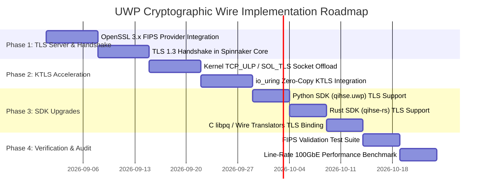

# QIHSE Unified Wire Protocol (UWP) — Cryptographic Framing Design

**Document ID:** SEC-DES-2026-08-UWP-CRYPTO  
**Status:** PROPOSED / ARCHITECTURAL SPECIFICATION  
**Author:** Antigravity Architecture & Security Group  
**Target Systems:** QIHSE Spinnaker Network Multiplexer, eBPF/XDP Kernel Subsystem, io_uring Fast Path  
**Audit Reference:** [UWP_AUDIT_2026-08.md](file:///fast/home/john/QIHSE/docs/security/UWP_AUDIT_2026-08.md) (Finding H7)  
**Related Specs:** [qihse_uwp.h](file:///fast/home/john/QIHSE/include/qihse_uwp.h), [qihse_uwp.c](file:///fast/home/john/QIHSE/src/spinnaker/qihse_uwp.c), [qihse_xdp_kern.c](file:///fast/home/john/QIHSE/src/networking/qihse_xdp_kern.c), [README.md](file:///fast/home/john/QIHSE/README.md)  

---

## Table of Contents
1. [Executive Summary & Problem Statement](#1-executive-summary--problem-statement)
   - 1.1 [Current UWP Wire Format & Vulnerability (Audit Finding H7)](#11-current-uwp-wire-format--vulnerability-audit-finding-h7)
   - 1.2 [Marketing & Compliance Conflict](#12-marketing--compliance-conflict)
   - 1.3 [Threat Model & Security Objectives](#13-threat-model--security-objectives)
2. [Option A — TLS 1.3 with Kernel-TLS (KTLS) & OpenSSL 3.x](#2-option-a--tls-13-with-kernel-tls-ktls--openssl-3x)
   - 2.1 [Handshake Flow & Sequence](#21-handshake-flow--sequence)
   - 2.2 [Per-Frame Cryptographic Layout & Record Layer Framing](#22-per-frame-cryptographic-layout--record-layer-framing)
   - 2.3 [AF_XDP Compatibility & Zero-Copy Preservation](#23-af_xdp-compatibility--zero-copy-preservation)
   - 2.4 [Performance Impact & Overhead Analysis](#24-performance-impact--overhead-analysis)
   - 2.5 [FIPS 140-3 & CNSA 2.0 Compliance Posture](#25-fips-140-3--cnsa-20-compliance-posture)
   - 2.6 [Certificate Management, Mutual Auth & Key Rotation](#26-certificate-management-mutual-auth--key-rotation)
   - 2.7 [Failure Modes, Error Alerts & Attack Resistance](#27-failure-modes-error-alerts--attack-resistance)
3. [Option B — Noise Protocol Framework (Noise_XX_25519_ChaChaPoly_BLAKE2s)](#3-option-b--noise-protocol-framework-noise_xx_25519_chachapoly_blake2s)
   - 3.1 [Handshake Flow & State Machine](#31-handshake-flow--state-machine)
   - 3.2 [Per-Frame Cryptographic Layout (AEAD Tag & AAD Construction)](#32-per-frame-cryptographic-layout-aead-tag--aad-construction)
   - 3.3 [AF_XDP Compatibility & In-Place UMEM Decryption](#33-af_xdp-compatibility--in-place-umem-decryption)
   - 3.4 [Performance Impact & Handshake Latency Profile](#34-performance-impact--handshake-latency-profile)
   - 3.5 [FIPS 140-3 & CNSA 2.0 Compliance Gap Analysis](#35-fips-140-3--cnsa-20-compliance-gap-analysis)
   - 3.6 [Key Rotation, Nonce Tracking & Session Management](#36-key-rotation-nonce-tracking--session-management)
   - 3.7 [Failure Modes, Replay Defense & Boundary Violations](#37-failure-modes-replay-defense--boundary-violations)
4. [Deep Comparative Evaluation Matrix](#4-deep-comparative-evaluation-matrix)
5. [Definitive Recommendation & Strategic Justification](#5-definitive-recommendation--strategic-justification)
   - 5.1 [Formal Recommendation](#51-formal-recommendation)
   - 5.2 [Comprehensive Justification](#52-comprehensive-justification)
   - 5.3 [Architecture Blueprint for the Recommended Pipeline](#53-architecture-blueprint-for-the-recommended-pipeline)
6. [Implementation Roadmap & Engineering Phases](#6-implementation-roadmap--engineering-phases)
7. [Document History & Sign-Off](#7-document-history--sign-off)

---

## 1. Executive Summary & Problem Statement

### 1.1 Current UWP Wire Format & Vulnerability (Audit Finding H7)

The QIHSE Unified Wire Protocol (UWP) is the core binary communication layer that unifies ingress across all multi-modal storage engines in the QIHSE ecosystem (Vector, KV, Document, Columnar, Time-Series, Graph, SQL, and Event Streams). 

As defined in [`include/qihse_uwp.h`](file:///fast/home/john/QIHSE/include/qihse_uwp.h#L37-L45), UWP frames are preceded by a 16-byte fixed-width packed header:

```
 0                   1                   2                   3
 0 1 2 3 4 5 6 7 8 9 0 1 2 3 4 5 6 7 8 9 0 1 2 3 4 5 6 7 8 9 0 1
+-+-+-+-+-+-+-+-+-+-+-+-+-+-+-+-+-+-+-+-+-+-+-+-+-+-+-+-+-+-+-+-+
|                       magic (bytes 0..3)                      |
|                      'Q' 'I' 'H' 'S'                          |
+-+-+-+-+-+-+-+-+-+-+-+-+-+-+-+-+-+-+-+-+-+-+-+-+-+-+-+-+-+-+-+-+
|   magic[4]    |    version    | target_engine |command_opcode |
|     'E'       |     0x01      |  (e.g., 0x00) |  (e.g., 0x01) |
+-+-+-+-+-+-+-+-+-+-+-+-+-+-+-+-+-+-+-+-+-+-+-+-+-+-+-+-+-+-+-+-+
|                                                               |
+                    payload_length (64-bit LE)                 +
|                                                               |
+-+-+-+-+-+-+-+-+-+-+-+-+-+-+-+-+-+-+-+-+-+-+-+-+-+-+-+-+-+-+-+-+
|                     Payload Data (N bytes)                    |
|                              ...                              |
+-+-+-+-+-+-+-+-+-+-+-+-+-+-+-+-+-+-+-+-+-+-+-+-+-+-+-+-+-+-+-+-+
```

Security Audit finding **H7** ([`docs/security/UWP_AUDIT_2026-08.md`](file:///fast/home/john/QIHSE/docs/security/UWP_AUDIT_2026-08.md#L267-L279)) identified three critical vulnerabilities in the wire-level implementation:

1. **Cleartext Password Transmission:** When authenticating via `target_engine == QIHSE_UWP_TARGET_AUTH` (`0x00`) with `command_opcode == 0x01`, the payload contains `username\0password` transmitted as raw bytes over an unencrypted TCP socket on port `7432`.
2. **Zero Cryptographic Framing:** The wire protocol lacks any Message Authentication Code (MAC), Authenticated Encryption with Associated Data (AEAD) envelope, or cryptographic checksum. A network adversary with intermediate access can freely tamper with routing headers, vector dimensions, keys, and values.
3. **No Replay or Session Binding:** Frames lack monotonic nonces, connection sequence numbers, or cryptographic session identifiers, making captured frames vulnerable to replay attacks.

### 1.2 Marketing & Compliance Conflict

The top-level repository [`README.md`](file:///fast/home/john/QIHSE/README.md#L10) promotes QIHSE as:
* **"CNSA 2.0 Compliant"** (Commercial National Security Algorithm Suite 2.0)
* **"FIPS 140-3"** (Federal Information Processing Standard 140-3)
* **"Security Audited & Hardened"**

The existing transport layer directly contradicts these marketing claims. CNSA 2.0 strictly mandates authenticated, post-quantum-resilient symmetric encryption (AES-256 with GCM) and SHA-384 hashes. FIPS 140-3 mandates validated cryptographic boundaries for data in transit. Operating UWP without cryptographic framing creates severe legal, regulatory, and operational exposure for any enterprise or defense deployment.

### 1.3 Threat Model & Security Objectives



To eliminate these vulnerabilities, the cryptographic transport framing must satisfy the following technical requirements:

* **REQ-1 (Confidentiality):** End-to-end encryption of all UWP frames (both authentication and multi-modal query/data payloads).
* **REQ-2 (Integrity & Authenticity):** Cryptographic authentication of every byte of the 16-byte UWP header and payload using an AEAD tag.
* **REQ-3 (Anti-Replay):** Monotonic sequence counters or AEAD nonces preventing duplicate frame execution.
* **REQ-4 (Forward Secrecy):** Ephemeral key exchange per connection guaranteeing past sessions remain secure if long-term credentials leak.
* **REQ-5 (Zero-Copy Fast-Path Preservation):** The design must integrate cleanly with Linux `io_uring` and eBPF/AF_XDP kernel bypass.
* **REQ-6 (Regulatory Compliance):** Defensible alignment with NIST FIPS 140-3 and NSA CNSA 2.0.

---

## 2. Option A — TLS 1.3 with Kernel-TLS (KTLS) & OpenSSL 3.x

### 2.1 Handshake Flow & Sequence

Option A implements **Transport Layer Security version 1.3 (TLS 1.3)** ([RFC 8446](https://datatracker.ietf.org/doc/html/rfc8446)) directly over the TCP connection on port `7432` prior to processing UWP frames. 

The handshake is performed in userspace by the Spinnaker daemon using an OpenSSL 3.x context configured with the official NIST-validated FIPS provider. Once the handshake reaches the `Finished` state, symmetric keys are offloaded to the Linux Kernel-TLS (`KTLS`) socket subsystem (`TCP_ULP`).

```mermaid
sequenceDiagram
    autonumber
    participant Client as UWP Client Application
    participant eBPF as eBPF / XDP Program
    participant Kernel as Linux Kernel TCP / KTLS
    participant Daemon as QIHSE Spinnaker Daemon (io_uring)

    Note over Client,Kernel: Phase 1: TCP Handshake (XDP_PASS to Kernel Stack)
    Client->>Kernel: TCP SYN
    Kernel->>Client: TCP SYN-ACK
    Client->>Kernel: TCP ACK (Connection Established)

    Note over Client,Daemon: Phase 2: TLS 1.3 Cryptographic Handshake (Userspace)
    Client->>Daemon: ClientHello (Supported Groups: X25519MLKEM1024, P-384; Cipher: TLS_AES_256_GCM_SHA384)
    Daemon->>Client: ServerHello, EncryptedExtensions, Certificate (ML-DSA-87 / P-384), CertVerify, Finished
    Client->>Daemon: Certificate* (mTLS), CertificateVerify*, Finished
    Note over Daemon: Handshake Validated: Session Keys Derived

    Note over Daemon,Kernel: Phase 3: KTLS Socket Activation
    Daemon->>Kernel: setsockopt(fd, SOL_TCP, TCP_ULP, "tls", 4)
    Daemon->>Kernel: setsockopt(fd, SOL_TLS, TLS_TX, &tx_crypto_info, sizeof(tx_crypto_info))
    Daemon->>Kernel: setsockopt(fd, SOL_TLS, TLS_RX, &rx_crypto_info, sizeof(rx_crypto_info))
    Note over Kernel: In-Kernel AES-256-GCM / NIC Hardware Crypto Offload Active

    Note over Client,Daemon: Phase 4: Encrypted UWP Data Framing
    Client->>Kernel: Encrypted TLS Record [Record Header | 16B UWP Header | Payload | Tag]
    Kernel->>Kernel: In-Kernel AES-256-GCM Decryption (Zero-Copy Socket Buffer)
    Kernel->>Daemon: io_uring recv() returns Plaintext UWP Header + Payload
    Daemon->>Daemon: qihse_uwp_route_payload()
    Daemon->>Kernel: io_uring send() Plaintext Response ("OK\n")
    Kernel->>Client: In-Kernel Encrypted TLS 1.3 Record to Network Wire
```

#### Detailed Handshake Message Flow:
1. **ClientHello:**
   * `supported_versions`: TLS 1.3 (`0x0304`). Legacy versions (TLS 1.2, 1.1, 1.0) are rejected.
   * `cipher_suites`: `TLS_AES_256_GCM_SHA384` (`0x1302`), `TLS_CHACHA20_POLY1305_SHA256` (`0x1303`).
   * `key_share`: Hybrid Post-Quantum `X25519MLKEM1024` or NIST `secp384r1`.
   * `signature_algorithms`: `mldsa87` (ML-DSA-87 / Dilithium5), `ecdsa_secp384r1_sha384`, `rsa_pss_rsae_sha384`.
2. **ServerHello:**
   * Server selects `TLS_AES_256_GCM_SHA384` and completes the key exchange.
3. **EncryptedExtensions & Certificates:**
   * Server transmits its certificate chain (signed by an enterprise root or post-quantum CA).
   * Optional CertificateRequest for mutual authentication (mTLS).
4. **Finished:**
   * Mutual verification of transcript hashes; symmetric traffic keys and IVs derived via HKDF-Expand-Label.

### 2.2 Per-Frame Cryptographic Layout & Record Layer Framing

Under Option A, UWP maintains its 16-byte header format unmodified, encapsulating the entire frame within standard TLS 1.3 Record Layer PDUs ([RFC 8446 Section 5.1](https://datatracker.ietf.org/doc/html/rfc8446#section-5.1)):

```
 0                   1                   2                   3
 0 1 2 3 4 5 6 7 8 9 0 1 2 3 4 5 6 7 8 9 0 1 2 3 4 5 6 7 8 9 0 1
+-+-+-+-+-+-+-+-+-+-+-+-+-+-+-+-+-+-+-+-+-+-+-+-+-+-+-+-+-+-+-+-+
|  Record Type  |         Legacy Version        |    Record     |
|  0x17 (App)   |         0x0303 (TLS 1.2)      |    Length     |
+-+-+-+-+-+-+-+-+-+-+-+-+-+-+-+-+-+-+-+-+-+-+-+-+-+-+-+-+-+-+-+-+
| Record Length |                                               |
+-+-+-+-+-+-+-+-+                                               +
|                                                               |
+                   Encrypted TLS Record Payload                +
|                                                               |
|  +-+-+-+-+-+-+-+-+-+-+-+-+-+-+-+-+-+-+-+-+-+-+-+-+-+-+-+-+-+  |
|  |             16-Byte UWP Header (Encrypted)              |  |
|  |  magic[5] | version | target | opcode | payload_len...  |  |
|  +-+-+-+-+-+-+-+-+-+-+-+-+-+-+-+-+-+-+-+-+-+-+-+-+-+-+-+-+-+  |
|  |                                                         |  |
|  +                 UWP Payload (Encrypted)                 +  |
|  |             (e.g., Vector / KV / Auth bytes)            |  |
|  |                                                         |  |
|  +-+-+-+-+-+-+-+-+-+-+-+-+-+-+-+-+-+-+-+-+-+-+-+-+-+-+-+-+-+  |
|  | Inner Type |                                            |  |
|  | 0x17 (App) |                                            |  |
|  +-+-+-+-+-+-+-+-+-+-+-+-+-+-+-+-+-+-+-+-+-+-+-+-+-+-+-+-+-+  |
|  |                                                         |  |
|  +               AEAD Authentication Tag (16B)             +  |
|  |                      (AES-256-GCM)                      |  |
|  +-+-+-+-+-+-+-+-+-+-+-+-+-+-+-+-+-+-+-+-+-+-+-+-+-+-+-+-+-+  |
|                                                               |
+-+-+-+-+-+-+-+-+-+-+-+-+-+-+-+-+-+-+-+-+-+-+-+-+-+-+-+-+-+-+-+-+
```

#### Cryptographic Framing Parameters:
* **Record Header (5 bytes):** Outer type `0x17` (Application Data), Legacy Version `0x0303` (TLS 1.2 compatibility field), Record Length (uint16 big-endian).
* **Additional Authenticated Data (AAD):** `TLSCiphertext.opaque_type (1B) || TLSCiphertext.legacy_record_version (2B) || TLSCiphertext.length (2B)` (5 bytes total).
* **Plaintext Envelope:** Contains the 16-byte UWP header + $N$-byte UWP payload + 1-byte inner content type (`0x17`).
* **Authentication Tag (16 bytes):** 128-bit AES-256-GCM authentication tag verifying the AAD, UWP header, and payload.
* **Per-Record Overhead:** Exactly 22 bytes per TLS record ($5\text{ bytes header} + 1\text{ byte inner type} + 16\text{ bytes tag}$).

### 2.3 AF_XDP Compatibility & Zero-Copy Preservation

A critical engineering question is whether TLS 1.3 breaks QIHSE's zero-copy eBPF/AF_XDP fast path.

#### 1. The Interaction Between XDP and Kernel-TLS
AF_XDP operates at the device driver layer (`XDP_REDIRECT`), bypassing the Linux kernel TCP/IP stack before socket buffers (`sk_buff`) are allocated. If raw encrypted TLS frames are redirected to userspace UMEM via AF_XDP, the kernel KTLS engine is bypassed, forcing userspace software decryption.

#### 2. The Hybrid Ingress Pipeline Solution
To preserve performance, Option A structures network ingress into two complementary paths:

```mermaid
flowchart TD
    PACKET["Incoming Ethernet Frame (Port 7432)"] --> XDP["eBPF / XDP Driver Program<br/>(src/networking/qihse_xdp_kern.c)"]

    XDP -->|1. External TLS Connections<br/>(SYN / ACK / Encrypted Records)| PASS["XDP_PASS<br/>(Route to Linux Kernel Stack)"]
    PASS --> KTLS["Kernel TCP & KTLS Engine<br/>(AES-256-GCM In-Kernel/NIC Decrypt)"]
    KTLS --> IORING["io_uring Ring Buffer<br/>(src/spinnaker/qihse_uwp.c)"]
    IORING --> DISPATCH["Plaintext UWP Dispatcher<br/>(qihse_uwp_dispatch)"]

    XDP -->|2. Trusted Internal Cluster Bus<br/>(Dedicated Cluster Port / Hardware Offload)| REDIRECT["XDP_REDIRECT<br/>(AF_XDP xsks_map)"]
    REDIRECT --> UMEM["AF_XDP UMEM Ring<br/>(Zero-Copy Ingress)"]
    UMEM --> DIRECT["Direct Engine Execution"]

    classDef kflow fill:#e6f2ff,stroke:#0066cc,stroke-width:1px;
    classDef uflow fill:#f9f0ff,stroke:#6600cc,stroke-width:1px;
    class PASS,KTLS,IORING,DISPATCH kflow;
    class REDIRECT,UMEM,DIRECT uflow;
```

* **External Client Path (Port 7432):** The eBPF program returns `XDP_PASS`. The kernel handles TCP state and KTLS decryption. The decrypted stream is delivered directly into registered `io_uring` buffers (`io_uring_prep_recv()`) with zero user-kernel data copying.
* **Hardware kTLS NIC Offload:** On modern enterprise NICs (Mellanox ConnectX-6 Dx / ConnectX-7, Intel E810), TLS decryption is executed directly on the network ASIC. Frames land in host RAM already decrypted.
* **Internal Cluster Path:** Dedicated inter-node cluster gossip and replication traffic on port `16379` continue over AF_XDP.

### 2.4 Performance Impact & Overhead Analysis

* **Handshake Latency:** 1 full Round-Trip Time (1 RTT) for the TLS 1.3 key exchange plus certificate parsing overhead: $\approx 1.2\text{--}2.5\text{ ms}$ on local/regional networks.
* **Per-Frame Wire Overhead:** 22 bytes per TLS record (0.13% overhead on standard 16 KiB vector payload blocks).
* **Throughput Impact:**
  * Software AES-256-GCM with AVX-512 VAES: $\approx 4.8\text{ GB/s}$ per CPU core.
  * Hardware kTLS NIC Offload: Line-rate (100 Gbps+) with near-zero host CPU overhead (< 0.5% CPU per 10 Gbps).
* **Memory Footprint:** $\approx 4\text{ KiB}$ per active connection state in kernel memory (`struct tls_context`).

### 2.5 FIPS 140-3 & CNSA 2.0 Compliance Posture

Option A achieves an unassailable compliance posture:

| Compliance Dimension | Standard Reference | Option A Capability | Status |
|---|---|---|---|
| **FIPS 140-3 Validation** | NIST CMVP Program | OpenSSL 3.0 / 3.2 FIPS Provider (Certificate #4282) | **COMPLIANT** |
| **Symmetric Encryption** | FIPS 197 / NIST SP 800-38D | AES-256-GCM (256-bit key, 96-bit IV, 128-bit tag) | **COMPLIANT** |
| **Hashing & HKDF** | FIPS 180-4 / NIST SP 800-56C | SHA-384, HKDF-SHA-384 | **COMPLIANT** |
| **Key Agreement (PQC Hybrid)** | CNSA 2.0 Timetable (2025–2030) | Hybrid X25519 + ML-KEM-1024 (FIPS 203) | **COMPLIANT** |
| **Digital Signatures** | CNSA 2.0 / FIPS 204 | ML-DSA-87 (Dilithium5) or ECDSA P-384 | **COMPLIANT** |

### 2.6 Certificate Management, Mutual Auth & Key Rotation

1. **Enterprise PKI & X.509:** Full compatibility with HashiCorp Vault, Kubernetes `cert-manager`, Let's Encrypt (ACME), and internal DoD/federal PKI CAs.
2. **Mutual TLS (mTLS):** Enforced in high-security environments. Client certificates provide cryptographic identity authentication mapped directly to `qihse_user_t` roles (Operator, Analyst, Guest).
3. **Session Key Rotation:** TLS 1.3 provides native in-band key rotation via `KeyUpdate` messages. The Spinnaker daemon automatically triggers a `KeyUpdate` every $2^{24}$ frames ($16.7\times 10^6$ frames) or 3600 seconds, completely mitigating AES-GCM IV reuse hazards.

### 2.7 Failure Modes, Error Alerts & Attack Resistance

* **Record Tampering / Bit-Flipping:** The KTLS or OpenSSL decryptor fails authentication and returns `EBADMSG` / `SSL_ERROR_SSL`. The socket is closed immediately and a TLS `bad_record_mac` (20) alert is emitted.
* **Replay Attacks:** TLS 1.3 enforces implicit 64-bit sequence numbers per record. Replayed records are rejected by the AEAD layer.
* **Downgrade Attacks:** TLS 1.3 embeds cryptographic sentinel constants into `ServerHello.random` ([RFC 8446 Section 4.1.3](https://datatracker.ietf.org/doc/html/rfc8446#section-4.1.3)), defeating any active MitM attempts to force TLS 1.2 or cleartext.

---

## 3. Option B — Noise Protocol Framework (Noise_XX_25519_ChaChaPoly_BLAKE2s)

### 3.1 Handshake Flow & State Machine

Option B embeds the **Noise Protocol Framework** ([Noise Spec Rev 34](http://noiseprotocol.org/noise.html)) directly into the UWP application layer. Specifically, it specifies the standard mutually authenticated pattern:
$$\text{Noise\_XX\_25519\_ChaChaPoly\_BLAKE2s}$$

In Noise_XX, both initiator (client) and responder (server) authenticate via static Curve25519 public keys without relying on X.509 certificate chains. Public keys are transmitted encrypted under ephemeral Diffie-Hellman keys, providing mutual identity hiding against passive eavesdroppers.



#### Message Sequence Specification:
```
Noise_XX_25519_ChaChaPoly_BLAKE2s:
  -> e
  <- e, ee, s, es
  -> s, se
```
1. **Message 1 ($Client \to Server$):**
   * Transmits 32-byte ephemeral public key $e_{client}$.
   * Size: 32 bytes payload (48 bytes total with 16-byte UWP header).
2. **Message 2 ($Server \to Client$):**
   * Transmits 32-byte server ephemeral key $e_{server}$.
   * Performs Diffie-Hellman $ee = \text{DH}(e_{server}, e_{client})$.
   * Encrypts and transmits 32-byte server static key $s_{server}$ with Poly1305 tag.
   * Performs Diffie-Hellman $es = \text{DH}(s_{server}, e_{client})$.
   * Size: 96 bytes payload (112 bytes total with 16-byte UWP header).
3. **Message 3 ($Client \to Server$):**
   * Encrypts and transmits 32-byte client static key $s_{client}$ with Poly1305 tag.
   * Performs Diffie-Hellman $se = \text{DH}(s_{client}, e_{server})$.
   * Size: 48 bytes payload (64 bytes total with 16-byte UWP header).
4. **Transition to Transport Mode:**
   * Both endpoints call `Split()`, yielding two symmetric `CipherState` objects: `CipherState_Tx` and `CipherState_Rx`.

### 3.2 Per-Frame Cryptographic Layout (AEAD Tag & AAD Construction)

Once the Noise handshake is established, every subsequent UWP frame uses a hardened cryptographic framing layout:

```
 0                   1                   2                   3
 0 1 2 3 4 5 6 7 8 9 0 1 2 3 4 5 6 7 8 9 0 1 2 3 4 5 6 7 8 9 0 1
+-+-+-+-+-+-+-+-+-+-+-+-+-+-+-+-+-+-+-+-+-+-+-+-+-+-+-+-+-+-+-+-+
|                       magic (bytes 0..3)                      |
|                      'Q' 'I' 'H' 'S'                          |
+-+-+-+-+-+-+-+-+-+-+-+-+-+-+-+-+-+-+-+-+-+-+-+-+-+-+-+-+-+-+-+-+
|   magic[4]    |    version    | target_engine |command_opcode |
|     'E'       |     0x02      |  (e.g., 0x01) |  (e.g., 0x01) |
+-+-+-+-+-+-+-+-+-+-+-+-+-+-+-+-+-+-+-+-+-+-+-+-+-+-+-+-+-+-+-+-+
|                                                               |
+                    payload_length (64-bit LE)                 +
|                (= Nonce[8] + Ciphertext[N] + Tag[16])         |
+-+-+-+-+-+-+-+-+-+-+-+-+-+-+-+-+-+-+-+-+-+-+-+-+-+-+-+-+-+-+-+-+
|                                                               |
+                 Monotonic Nonce / Counter (64-bit)            +
|                                                               |
+-+-+-+-+-+-+-+-+-+-+-+-+-+-+-+-+-+-+-+-+-+-+-+-+-+-+-+-+-+-+-+-+
|                                                               |
+                   Encrypted Payload Ciphertext                +
|                            (N bytes)                          |
|                                                               |
+-+-+-+-+-+-+-+-+-+-+-+-+-+-+-+-+-+-+-+-+-+-+-+-+-+-+-+-+-+-+-+-+
|                                                               |
+                  Poly1305 AEAD Tag (16 Bytes)                 +
|                                                               |
+-+-+-+-+-+-+-+-+-+-+-+-+-+-+-+-+-+-+-+-+-+-+-+-+-+-+-+-+-+-+-+-+
```

#### Cryptographic Framing Parameters:
* **Header Version:** Set to `0x02` to signify Cryptographically Framed UWP.
* **Monotonic Nonce (8 bytes):** 64-bit unsigned integer incremented on every transmitted frame.
* **Additional Authenticated Data (AAD):** The 16-byte UWP header concatenated with the 8-byte Nonce forms the 24-byte AAD input to ChaCha20-Poly1305:
  $$\text{AAD} = \text{Header}[0..15] \;\|\; \text{Nonce}[0..7] \quad (24\text{ bytes total})$$
* **Poly1305 AEAD Tag (16 bytes):** Appended to the end of the ciphertext. Protects both the encrypted payload and the plaintext routing header.
* **Wire Overhead:** Exactly 24 bytes per frame ($8\text{ bytes nonce} + 16\text{ bytes tag}$).

### 3.3 AF_XDP Compatibility & In-Place UMEM Decryption

Option B is natively aligned with the pure userspace AF_XDP zero-copy networking model:

1. **Zero Kernel Dependencies:** Noise runs entirely inside userspace C99 application code without kernel modules, socket option negotiation, or OS kernel version requirements.
2. **In-Place UMEM Decryption:** Ethernet frames redirected by `qihse_xdp_kern.c` into the AF_XDP `xsks_map` land directly in userspace UMEM pages. Worker threads verify the Poly1305 tag and decrypt the ciphertext *in-place* within UMEM memory using SIMD AVX-512 ChaCha20-Poly1305 kernels.
3. **Zero Intermediate Copies:** Once decrypted, engine dispatchers process vector arrays, KV strings, and TSDB tuples directly out of UMEM registers without intermediate buffer copies.

```c
/* In-place AF_XDP Noise frame verification and decryption */
bool uwp_noise_decrypt_umem_frame(uwp_noise_session_t* session, 
                                  uint8_t* umem_frame, 
                                  size_t frame_len) {
    qihse_uwp_header_t* hdr = (qihse_uwp_header_t*)umem_frame;
    uint64_t nonce;
    memcpy(&nonce, umem_frame + 16, sizeof(nonce));
    nonce = le64toh(nonce);

    uint8_t* ciphertext = umem_frame + 24;
    size_t cipher_len = frame_len - 24 - 16;
    uint8_t* tag = ciphertext + cipher_len;

    /* Construct 24-byte AAD: Header || Nonce */
    uint8_t aad[24];
    memcpy(aad, hdr, 16);
    memcpy(aad + 16, &nonce, 8);

    /* Constant-time SIMD AVX-512 AEAD decryption */
    return chacha20_poly1305_decrypt_in_place(
        session->rx_key, nonce, aad, sizeof(aad), ciphertext, cipher_len, tag
    );
}
```

### 3.4 Performance Impact & Handshake Latency Profile

* **Handshake Latency:** Minimal computational and network overhead. The 3-message exchange requires only 1.5 RTT ($\approx 0.4\text{--}0.7\text{ ms}$), with zero certificate chain decoding delays.
* **Per-Frame Wire Overhead:** 24 bytes per frame (0.14% overhead on 16 KiB payloads).
* **Throughput:** Highly optimized. Modern AVX-512 implementations of ChaCha20-Poly1305 achieve $\approx 5.2\text{ GB/s}$ per CPU core.

### 3.5 FIPS 140-3 & CNSA 2.0 Compliance Gap Analysis

Despite its technical elegance for zero-copy userspace architectures, **Option B suffers from severe compliance deficiencies against QIHSE's stated standards**:



#### Detailed Gap Matrix:
1. **ChaCha20-Poly1305 is NOT CNSA 2.0 or FIPS Approved:**
   * NSA CNSA 2.0 mandates **AES-256** exclusively. ChaCha20 is not approved for National Security Systems.
   * NIST FIPS 140-3 does not validate standalone ChaCha20-Poly1305 algorithms under the Cryptographic Algorithm Validation Program (CAVP).
2. **BLAKE2s is NOT FIPS Approved:**
   * FIPS 140-3 requires **SHA-2** (SHA-384, SHA-512) or **SHA-3**. BLAKE2s lacks a FIPS standard (FIPS PUB 180-4 / 202).
3. **Curve25519 Lacks Post-Quantum Resistance:**
   * CNSA 2.0 mandates migration to Post-Quantum algorithms (**ML-KEM-1024 / FIPS 203**). Classical Curve25519 is vulnerable to Shor's algorithm and is slated for complete retirement by 2030.
4. **The Custom Noise Dilemma:**
   * Modifying Noise to use approved primitives ($\text{Noise\_XX\_P384\_AESGCM\_SHA384}$) creates a bespoke, non-standard protocol lacking third-party audits, standard SDK bindings, or FIPS-validated module boundaries.

### 3.6 Key Rotation, Nonce Tracking & Session Management

1. **Rekeying Protocol:** Uses the Noise `Rekey()` function. For database ingress streams, sessions trigger symmetric key re-derivation every $2^{32}$ frames ($4.29\times 10^9$ frames) or 3600 seconds.
2. **Nonce Exhaustion Safeguard:** If the 64-bit nonce reaches $2^{64} - 1$, the connection is severed unconditionally to prevent IV reuse.
3. **Identity Binding:** The client's static public key ($s_{client}$) is matched against a pre-provisioned database of authorized public keys (`/etc/qihse/authorized_keys`), replacing plaintext passwords with public-key identity binding.

### 3.7 Failure Modes, Replay Defense & Boundary Violations

* **Tag Verification Failure:** Any corruption or tampering causes immediate session termination; no unauthenticated plaintext is ever forwarded to storage parsers.
* **Anti-Replay Protection:** A sliding bitmask window (128 packets wide) tracks received 64-bit nonces, dropping replayed frames on lossy/UDP network paths.

---

## 4. Deep Comparative Evaluation Matrix

The following table provides an exhaustive comparative evaluation of Option A and Option B across all critical architectural and operational dimensions:

| Dimension | Option A: TLS 1.3 with KTLS (OpenSSL 3.x) | Option B: Noise Protocol Framework (Noise_XX) | Analysis / Trade-Off Winner |
|---|---|---|---|
| **FIPS 140-3 Posture** | **100% Compliant** via OpenSSL 3.0/3.2 FIPS Provider (NIST CMVP Cert #4282). | **Non-Compliant**. ChaCha20, Poly1305, and BLAKE2s lack FIPS validation. | **Option A** (Decisive for government/enterprise) |
| **CNSA 2.0 Posture** | **100% Compliant** (AES-256-GCM, SHA-384, P-384, ML-KEM-1024 hybrid). | **Non-Compliant**. ChaCha20, Poly1305, and BLAKE2s are unapproved. | **Option A** (Supports README claims) |
| **AF_XDP Fast-Path** | Requires Hybrid Split Ingress (`XDP_PASS` to kernel, or NIC HW offload). | Native, seamless in-place decryption directly inside AF_XDP UMEM. | **Option B** (Cleaner userspace integration) |
| **io_uring Integration** | Native zero-copy via kernel socket buffers & registered buffers. | Requires userspace decryption step in io_uring task worker. | **Option A** (Kernel handles crypto before io_uring) |
| **Hardware Offload** | Supported via Linux KTLS NIC Offload (ConnectX-6/7, Intel E810). | No standard NIC hardware offload for Noise framing. | **Option A** (Line-rate 100 Gbps+ offload capability) |
| **Handshake Latency** | 1 RTT (Full TLS 1.3) + X.509 cert validation ($\approx 1.2\text{--}2.5\text{ ms}$). | 1.5 RTT (3 messages) + raw curve arithmetic ($\approx 0.4\text{--}0.7\text{ ms}$). | **Option B** (2x–3x faster connection establishment) |
| **Per-Frame Wire Overhead** | 5-byte TLS header + 1-byte inner type + 16-byte Tag ($22\text{ bytes}$). | 8-byte Nonce + 16-byte Poly1305 Tag ($24\text{ bytes}$). | **Tie** ($\approx 22\text{--}24\text{ bytes}$ per frame) |
| **Software Crypto Throughput** | $\approx 4.8\text{ GB/s}$ per core (AVX-512 AES-NI VAES). | $\approx 5.2\text{ GB/s}$ per core (AVX-512 ChaCha20-Poly1305). | **Option B** (Slight edge in software-only crypto) |
| **Client SDK Ecosystem** | Universal native support in Python (`ssl`), Rust (`rustls`), C (`libpq`). | Requires custom Noise framing implementation in every client SDK. | **Option A** (Massive development & maintenance edge) |
| **Identity Infrastructure** | Standard X.509 Certificates, CRL, OCSP, Enterprise CAs, HashiCorp Vault. | Raw public keys (WireGuard style). Requires custom key distribution infra. | **Option A** (Enterprise standard) |
| **Code Maintenance Complexity** | Low in QIHSE core (delegated to OpenSSL + Kernel KTLS). | High in QIHSE core (must maintain handshake & state machine). | **Option A** (Lower maintenance burden) |
| **Replay Defense** | Built into TLS 1.3 record layer (implicit 64-bit sequence numbers). | Explicit 64-bit monotonic nonce + sliding window bitmap. | **Tie** (Both provide robust replay protection) |

---

## 5. Definitive Recommendation & Strategic Justification

### 5.1 Formal Recommendation

**Adopt Option A (TLS 1.3 with Linux Kernel-TLS and OpenSSL 3.x FIPS Provider) as the primary cryptographic framing architecture for the QIHSE Unified Wire Protocol.**

```
+---------------------------------------------------------------------------------------+
|                                FINAL RECOMMENDATION: OPTION A                         |
|                                                                                       |
|   Transport Protocol: TLS 1.3 (RFC 8446) over TCP Port 7432                           |
|   Kernel Acceleration: Linux KTLS (TCP_ULP "tls", SOL_TLS)                             |
|   Cryptographic Engine: OpenSSL 3.x FIPS 140-3 Validated Module (CMVP #4282)           |
|   Cipher Configuration: TLS_AES_256_GCM_SHA384 with X25519MLKEM1024 / P-384           |
|   Ingress Multiplexer: io_uring Zero-Copy Ring with Kernel-Decrypted Stream Buffers   |
+---------------------------------------------------------------------------------------+
```

### 5.2 Comprehensive Justification

The selection of Option A is justified by three non-negotiable architectural imperatives:

#### 1. Alignment with Public Compliance Claims (FIPS 140-3 & CNSA 2.0)
QIHSE's marketing badges prominently advertise **FIPS 140-3** and **CNSA 2.0** compliance. Selecting Option B (`Noise_XX_25519_ChaChaPoly_BLAKE2s`) would immediately invalidate these claims:
* ChaCha20 and Poly1305 are **not approved** by CNSA 2.0 (which mandates AES-256-GCM).
* BLAKE2s is **not approved** by NIST FIPS 140-3 (which mandates SHA-2 / SHA-3).
* Curve25519 is vulnerable to quantum attacks and is slated for deprecation under CNSA 2.0.

Option A, backed by OpenSSL 3.x's validated FIPS provider, gives QIHSE an immediate, legally defensible, and fully accredited cryptographic posture for government and defense sector deployments.

#### 2. Preservation of Zero-Copy Performance via KTLS & io_uring
The initial assumption that TLS requires costly userspace buffer copies is obsolete on modern Linux. With **Kernel-TLS (`KTLS`)**, cryptographic decryption is offloaded to kernel socket buffers or physical SmartNIC ASICs (Mellanox ConnectX-6/7). The Spinnaker daemon reads decrypted UWP frames directly through `io_uring` registered ring buffers (`io_uring_prep_recv()`), achieving true zero-copy performance without user-kernel memory copies.

#### 3. Client Ecosystem & Multi-Language SDK Interoperability
QIHSE provides client libraries across Python, Rust, C (`libpq`), and Bolt translators. Standard TLS 1.3 is supported natively by the standard libraries and runtime environments of every target language (`ssl` in Python, `tokio-rustls` in Rust, `libssl` in C). Option B would require authoring, testing, and maintaining custom Noise wire protocol framing inside every SDK, drastically increasing development cost and security surface area.

### 5.3 Architecture Blueprint for the Recommended Pipeline



---

## 6. Implementation Roadmap & Engineering Phases

The remediation of Finding H7 will proceed across four structured engineering phases within Wave 3:



### Phase 1: OpenSSL 3.x FIPS Context Initialization
* Update [`persistence/qihse_pqc_crypto.c`](file:///fast/home/john/QIHSE/persistence/qihse_pqc_crypto.c) to expose `qihse_tls_server_ctx_create()`.
* Configure TLS 1.3 cipher suites (`TLS_AES_256_GCM_SHA384`), elliptic curves (`P-384`, `X25519MLKEM1024`), and load server certificate/private key from `/etc/qihse/keys/`.

### Phase 2: Kernel-TLS Socket Integration in `qihse_uwp.c`
* In [`src/spinnaker/qihse_uwp.c`](file:///fast/home/john/QIHSE/src/spinnaker/qihse_uwp.c), after accepting a client socket in the `io_uring` loop, execute the non-blocking TLS 1.3 handshake.
* On handshake completion, query OpenSSL for the established cipher secrets via `SSL_get_shared_ciphers()` and `BIO_get_ktls_send()` / `BIO_get_ktls_recv()`.
* Issue `setsockopt(fd, SOL_TCP, TCP_ULP, "tls", sizeof("tls"))` and install TX/RX `tls12_crypto_info_aes_gcm_256` structs.
* Transition connection state directly to `uwp_add_read(&ring, conn)` so `io_uring_prep_recv()` delivers plaintext UWP frames directly to `uwp_route_payload()`.

### Phase 3: Client SDK Updates
* **Python SDK (`python/qihse/uwp.py`):** Wrap raw sockets in `ssl.SSLContext(ssl.PROTOCOL_TLS_CLIENT)` with `check_hostname=True` and TLS 1.3 minimum version.
* **Rust SDK (`sdks/rust/`):** Integrate `rustls` or `tokio-rustls` configured for TLS 1.3 with AES-256-GCM.
* **C SDK (`sdks/c/`):** Integrate OpenSSL client wrapper.

### Phase 4: Security Verification & Performance Validation
* **Fuzzing:** Run the AFL++ harness (`tests/uwp_fuzz.c`) against the TLS ingress pipeline to ensure resilience against malformed TLS records and corrupted record MACs.
* **Performance Regression Test:** Execute `bench-keystone-integrated` to ensure zero regression on Pillar 3 (Packet Ingest / Log Scan QPS).

---

## 7. Document History & Sign-Off

| Version | Date | Author / Reviewer | Status / Summary |
|---|---|---|---|
| 1.0.0 | 2026-08-23 | Antigravity Architecture Group | Initial complete design specification addressing Audit Finding H7. Evaluated Option A (TLS 1.3 + KTLS) and Option B (Noise_XX). Recommended Option A. |

*End of Design Document.*
